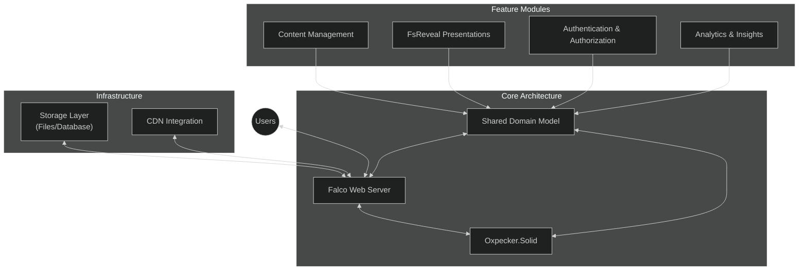

# FlightDeck Architecture: Vision and Overview

## Executive Summary

This document outlines the architectural vision for evolving FlightDeck from a static site generator to a dynamic web application platform built on Falco. The new architecture integrates reactive client components through Oxpecker.Solid and incorporates FsReveal for dynamic presentation management while maintaining a fully F# codebase from server to client.

## Architectural Vision

The evolved FlightDeck architecture creates a cohesive full-stack F# solution that leverages:

1. **Falco Server**: A lightweight, functional-first web framework that replaces static generation
2. **Oxpecker.Solid**: F# bindings for the Solid.js reactive UI library
3. **Shared Domain Model**: Type-safe contracts between client and server
4. **FsReveal Integration**: Dynamic presentation creation and delivery

## Key Benefits

1. **Unified Language**: End-to-end F# provides consistent development experience and type safety across the entire stack.

2. **Dynamic Capabilities**: Moving from static generation to a Falco server enables dynamic content rendering, API endpoints, and real-time features.

3. **Reactive Client**: Oxpecker.Solid provides a lightweight, high-performance reactive UI framework without the overhead of React.

4. **Presentation Integration**: FsReveal allows for presentation management directly within the FlightDeck platform.

5. **Progressive Enhancement**: Ability to start simple and add complexity only where needed.

6. **Type Safety**: Shared domain models ensure type-safe contracts between client and server components.

## Evolution Strategy

The architectural shift from static site generation to a full-stack Falco application follows a progressive approach:

1. **Foundation**: Establish the core Falco server infrastructure and shared domain model.

2. **Content Migration**: Convert static generators to Falco handlers while maintaining URL structures.

3. **Reactive Enhancement**: Integrate Oxpecker.Solid components where dynamic behavior is required.

4. **FsReveal Integration**: Incorporate presentation capabilities through FsReveal.

5. **Feature Expansion**: Add additional dynamic capabilities leveraging the new architecture.

## Documentation Structure

This architectural documentation is organized into the following sections:

1. **Falco Core Architecture**: Detailed explanation of the Falco server architecture.

2. **Shared Domain Model**: Guide to creating and leveraging shared types.

3. **Oxpecker.Solid Integration**: Implementation of reactive client components.

4. **FsReveal Integration**: Incorporating presentation capabilities.

5. **Build and Deployment**: Build pipeline and deployment strategies.

Each section provides comprehensive guidance, examples, and implementation details to facilitate the architectural transition.

## Conclusion

This architectural evolution transforms FlightDeck from a static site generator to a dynamic, interactive web application platform while maintaining the benefits of a purely functional F# codebase. The integration of Falco, Oxpecker.Solid, and FsReveal creates a cohesive, type-safe architecture that enables progressive enhancement of features while preserving performance and developer experience.
