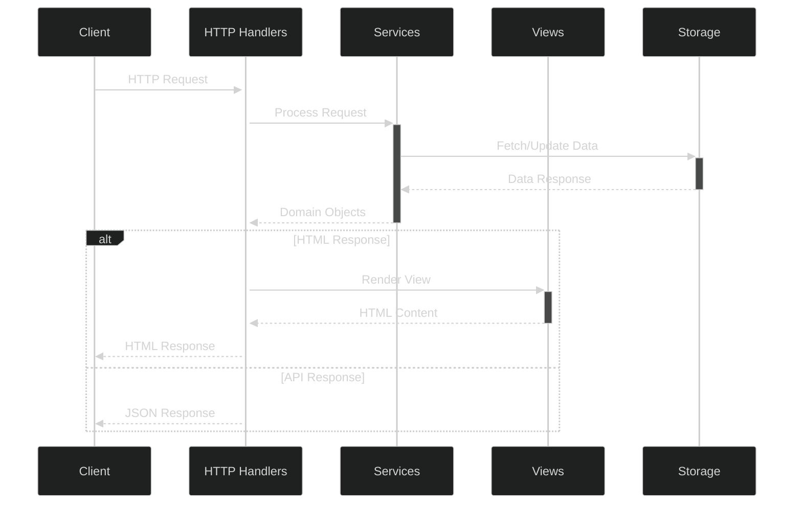

# Falco Core Architecture

## Introduction

This document details the core architecture for the FlightDeck platform based on Falco, a lightweight, functional-first web framework for F#. This architecture replaces the static site generation approach with a dynamic server capable of handling both content rendering and API requests while maintaining the performance benefits of the original design.

## Architectural Components

### Server Structure

The Falco core architecture consists of the following key components:


### Request Processing Flow

The request processing flow in Falco follows a clean, functional pipeline:



## Implementation Guide

### Core Project Structure

```
src/
├── FlightDeck.Core/
│   ├── Domain.fs       # Domain types
│   ├── Services.fs     # Business logic
│   └── Storage.fs      # Data access functions
│
├── FlightDeck.Web/
│   ├── Program.fs      # Application entry point
│   ├── Handlers.fs     # HTTP handlers
│   ├── Views.fs        # HTML rendering
│   ├── Endpoints.fs    # URL definitions
│   └── Error.fs        # Error handling
│
└── FlightDeck.Shared/  # Shared client/server code
    └── Domain.fs       # Shared domain types
```

### Entry Point (Program.fs)

```fsharp
module FlightDeck.Web.Program

open System
open Falco
open Falco.Routing
open Falco.HostBuilder
open Microsoft.AspNetCore.Builder
open Microsoft.Extensions.DependencyInjection
open FlightDeck.Web.Endpoints

// Configure services
let configureServices (services: IServiceCollection) =
    services
        .AddSingleton<IStorageProvider, FileSystemStorageProvider>()
        .AddSingleton<IContentService, ContentService>()
        // Add other services
        .AddFalco() |> ignore

// Configure middleware
let configureApp (endpoints: HttpEndpoint list) (app: IApplicationBuilder) =
    app.UseFalco(endpoints)
       .UseStaticFiles()
       .UseFalcoExceptionHandler(Error.serverError)
       |> ignore

// Define application
[<EntryPoint>]
let main args =
    webHost args {
        configure configureServices
        configure (configureApp endpoints)
    }
    0
```

### Endpoints Configuration (Endpoints.fs)

```fsharp
module FlightDeck.Web.Endpoints

open Falco.Routing
open FlightDeck.Web.Handlers

// Define all application endpoints
let endpoints = [
    // Content pages
    get "/" contentHome
    get "/content/{slug}" contentPage
    
    // API endpoints
    post "/api/content" createContent
    put "/api/content/{id}" updateContent
    delete "/api/content/{id}" deleteContent
    
    // Admin interface
    get "/admin" adminDashboard
    get "/admin/content" adminContent
    get "/admin/settings" adminSettings
    
    // Presentations (FsReveal integration)
    get "/presentations" presentationsList
    get "/presentations/{id}" viewPresentation
    post "/presentations" createPresentation
]
```

### HTTP Handlers (Handlers.fs)

```fsharp
module FlightDeck.Web.Handlers

open Falco
open Falco.Markup
open FlightDeck.Core.Domain
open FlightDeck.Core.Services
open FlightDeck.Web.Views

// Content handlers
let contentHome : HttpHandler =
    fun ctx ->
        let contentService = ctx.GetService<IContentService>()
        let content = contentService.GetHomePage()
        
        match content with
        | Some page -> 
            Views.renderPage page
            |> Response.ofHtml
            |> fun handler -> handler ctx
        | None -> 
            Response.withStatusCode 404
            >> Error.notFound
            |> fun handler -> handler ctx

let contentPage : HttpHandler =
    Request.mapRoute (fun route -> 
        let slug = route.GetString "slug" ""
        slug)
        (fun slug ctx ->
            let contentService = ctx.GetService<IContentService>()
            let content = contentService.GetPageBySlug(slug)
            
            match content with
            | Some page -> 
                Views.renderPage page
                |> Response.ofHtml
                |> fun handler -> handler ctx
            | None -> 
                Response.withStatusCode 404
                >> Error.notFound
                |> fun handler -> handler ctx)

// API handlers
let createContent : HttpHandler =
    Request.bindJson<CreateContentRequest> (fun request ctx ->
        let contentService = ctx.GetService<IContentService>()
        
        try
            let content = contentService.CreateContent(request)
            Response.ofJson content ctx
        with ex ->
            Response.withStatusCode 500
            >> Response.ofJson {| error = ex.Message |}
            |> fun handler -> handler ctx)

// More handlers for other endpoints...
```

### View Rendering (Views.fs)

```fsharp
module FlightDeck.Web.Views

open Falco.Markup
open FlightDeck.Core.Domain

// Master layout
let masterLayout (title: string) (content: XmlNode list) =
    Elem.html [ Attr.lang "en" ] [
        Elem.head [] [
            Elem.meta [ Attr.charset "utf-8" ]
            Elem.meta [ Attr.name "viewport"; Attr.content "width=device-width, initial-scale=1.0" ]
            Elem.title [] [ Text.raw title ]
            Elem.link [ Attr.rel "stylesheet"; Attr.href "/css/styles.css" ]
        ]
        Elem.body [] [
            Elem.header [ Attr.class' "site-header" ] [
                Elem.div [ Attr.class' "container" ] [
                    Elem.a [ Attr.href "/"; Attr.class' "site-logo" ] [ Text.raw "FlightDeck" ]
                    Elem.nav [ Attr.class' "site-nav" ] [
                        Elem.a [ Attr.href "/content/about" ] [ Text.raw "About" ]
                        Elem.a [ Attr.href "/content/blog" ] [ Text.raw "Blog" ]
                        Elem.a [ Attr.href "/presentations" ] [ Text.raw "Presentations" ]
                        Elem.a [ Attr.href "/admin" ] [ Text.raw "Admin" ]
                    ]
                ]
            ]
            Elem.main [ Attr.class' "container" ] content
            Elem.footer [ Attr.class' "site-footer" ] [
                Elem.div [ Attr.class' "container" ] [
                    Text.raw "© 2025 FlightDeck"
                ]
            ]
            
            // Script for reactive components
            Elem.script [ Attr.src "/js/app.js"; Attr.defer ] []
        ]
    ]

// Page rendering
let renderPage (page: ContentPage) =
    masterLayout page.Title [
        Elem.article [ Attr.class' "page-content" ] [
            Elem.h1 [] [ Text.raw page.Title ]
            
            // Render content based on format
            match page.Format with
            | ContentFormat.Markdown ->
                Elem.div [ 
                    Attr.class' "markdown-content"
                    Attr.id $"content-{page.Id}"
                    Attr.data "content-id" page.Id
                ] [ Text.raw page.RenderedContent ]
            | ContentFormat.Html ->
                Elem.div [ 
                    Attr.class' "html-content"
                    Attr.id $"content-{page.Id}"
                    Attr.data "content-id" page.Id
                ] [ Text.raw page.Content ]
            
            // Metadata
            Elem.div [ Attr.class' "page-meta" ] [
                Elem.span [ Attr.class' "page-date" ] [ Text.raw (page.UpdatedAt.ToString("yyyy-MM-dd")) ]
                Elem.span [ Attr.class' "page-author" ] [ Text.raw page.Author ]
            ]
        ]
    ]

// Admin dashboard
let renderAdminDashboard (stats: DashboardStats) =
    masterLayout "Admin Dashboard" [
        Elem.div [ Attr.class' "admin-header" ] [
            Elem.h1 [] [ Text.raw "Admin Dashboard" ]
        ]
        
        Elem.div [ 
            Attr.id "admin-app" 
            Attr.data "stats" (System.Text.Json.JsonSerializer.Serialize(stats))
        ] []  // Mount point for Oxpecker.Solid admin app
    ]

// More view functions...
```

### Core Domain Model (Domain.fs)

```fsharp
module FlightDeck.Core.Domain

open System

// Content types
type ContentFormat =
    | Markdown
    | Html

type ContentStatus =
    | Draft
    | Published
    | Archived

type ContentPage = {
    Id: string
    Slug: string
    Title: string
    Description: string option
    Content: string
    RenderedContent: string
    Format: ContentFormat
    Status: ContentStatus
    CreatedAt: DateTime
    UpdatedAt: DateTime
    Author: string
    Tags: string list
}

// Request/response types
type CreateContentRequest = {
    Title: string
    Slug: string option
    Description: string option
    Content: string
    Format: ContentFormat
    Tags: string list
}

type UpdateContentRequest = {
    Id: string
    Title: string option
    Slug: string option
    Description: string option
    Content: string option
    Format: ContentFormat option
    Status: ContentStatus option
    Tags: string list option
}

// Dashboard statistics
type DashboardStats = {
    TotalPages: int
    PublishedPages: int
    DraftPages: int
    RecentEdits: {| Title: string; Id: string; UpdatedAt: DateTime |} list
}

// Other domain types for different features...
```

### Business Services (Services.fs)

```fsharp
module FlightDeck.Core.Services

open System
open FlightDeck.Core.Domain
open FlightDeck.Core.Storage

// Content service interface
type IContentService =
    abstract member GetHomePage: unit -> ContentPage option
    abstract member GetPageBySlug: string -> ContentPage option
    abstract member GetPageById: string -> ContentPage option
    abstract member GetAllPages: unit -> ContentPage list
    abstract member CreateContent: CreateContentRequest -> ContentPage
    abstract member UpdateContent: UpdateContentRequest -> ContentPage option
    abstract member DeleteContent: string -> bool
    abstract member GetDashboardStats: unit -> DashboardStats

// Implementation
type ContentService(storage: IStorageProvider) =
    
    let renderMarkdown (content: string) =
        // Use a Markdown library to render to HTML
        // For example, with Markdig:
        let pipeline = Markdig.MarkdownPipelineBuilder().UseAdvancedExtensions().Build()
        Markdig.Markdown.ToHtml(content, pipeline)
    
    interface IContentService with
        member _.GetHomePage() =
            storage.GetPageBySlug("home")
            
        member _.GetPageBySlug(slug) =
            storage.GetPageBySlug(slug)
            
        member _.GetPageById(id) =
            storage.GetPageById(id)
            
        member _.GetAllPages() =
            storage.GetAllPages()
            
        member _.CreateContent(request) =
            let id = Guid.NewGuid().ToString()
            let slug = request.Slug |> Option.defaultValue (request.Title.ToLower().Replace(" ", "-"))
            let now = DateTime.UtcNow
            
            let rendered = 
                match request.Format with
                | ContentFormat.Markdown -> renderMarkdown request.Content
                | ContentFormat.Html -> request.Content
            
            let page = {
                Id = id
                Slug = slug
                Title = request.Title
                Description = request.Description
                Content = request.Content
                RenderedContent = rendered
                Format = request.Format
                Status = ContentStatus.Draft
                CreatedAt = now
                UpdatedAt = now
                Author = "System" // Would come from auth
                Tags = request.Tags
            }
            
            storage.SavePage(page)
            page
            
        // Other method implementations...
```

### Storage Layer (Storage.fs)

```fsharp
module FlightDeck.Core.Storage

open System
open System.IO
open System.Text.Json
open FlightDeck.Core.Domain

// Storage provider interface
type IStorageProvider =
    abstract member GetPageBySlug: string -> ContentPage option
    abstract member GetPageById: string -> ContentPage option
    abstract member GetAllPages: unit -> ContentPage list
    abstract member SavePage: ContentPage -> unit
    abstract member DeletePage: string -> bool

// File system implementation
type FileSystemStorageProvider(contentDir: string) =
    
    do 
        if not (Directory.Exists contentDir) then
            Directory.CreateDirectory contentDir |> ignore
    
    let getPagePath id = Path.Combine(contentDir, $"{id}.json")
    
    let slugIndex = 
        // Load or create slug index mapping slugs to ids
        let indexPath = Path.Combine(contentDir, "_slugindex.json")
        if File.Exists indexPath then
            JsonSerializer.Deserialize<Map<string, string>>(File.ReadAllText(indexPath))
        else
            Map.empty
    
    let saveSlugIndex (index: Map<string, string>) =
        let indexPath = Path.Combine(contentDir, "_slugindex.json")
        File.WriteAllText(indexPath, JsonSerializer.Serialize(index))
    
    let loadPage id =
        let path = getPagePath id
        if File.Exists path then
            JsonSerializer.Deserialize<ContentPage>(File.ReadAllText(path)) |> Some
        else
            None
    
    interface IStorageProvider with
        member _.GetPageBySlug(slug) =
            match Map.tryFind slug slugIndex with
            | Some id -> loadPage id
            | None -> None
            
        member _.GetPageById(id) =
            loadPage id
            
        member _.GetAllPages() =
            Directory.GetFiles(contentDir, "*.json")
            |> Array.filter (fun f -> not (f.EndsWith("_slugindex.json")))
            |> Array.choose (fun f -> 
                try 
                    File.ReadAllText(f) 
                    |> JsonSerializer.Deserialize<ContentPage> 
                    |> Some
                with _ -> None)
            |> Array.toList
            
        member _.SavePage(page) =
            let path = getPagePath page.Id
            File.WriteAllText(path, JsonSerializer.Serialize(page))
            
            // Update slug index
            let updatedIndex = slugIndex |> Map.add page.Slug page.Id
            saveSlugIndex updatedIndex
            
        member _.DeletePage(id) =
            match loadPage id with
            | Some page ->
                let path = getPagePath id
                if File.Exists path then
                    File.Delete path
                    
                    // Update slug index
                    let updatedIndex = slugIndex |> Map.remove page.Slug
                    saveSlugIndex updatedIndex
                    
                    true
                else
                    false
            | None -> false
```

### Error Handling (Error.fs)

```fsharp
module FlightDeck.Web.Error

open Falco
open Falco.Markup

// Not found (404) handler
let notFound : HttpHandler =
    fun ctx ->
        let html =
            Elem.html [ Attr.lang "en" ] [
                Elem.head [] [
                    Elem.meta [ Attr.charset "utf-8" ]
                    Elem.meta [ Attr.name "viewport"; Attr.content "width=device-width, initial-scale=1.0" ]
                    Elem.title [] [ Text.raw "Not Found - FlightDeck" ]
                    Elem.link [ Attr.rel "stylesheet"; Attr.href "/css/styles.css" ]
                ]
                Elem.body [] [
                    Elem.div [ Attr.class' "error-container" ] [
                        Elem.h1 [] [ Text.raw "404" ]
                        Elem.h2 [] [ Text.raw "Page Not Found" ]
                        Elem.p [] [ Text.raw "The page you are looking for could not be found." ]
                        Elem.a [ Attr.href "/"; Attr.class' "button" ] [ Text.raw "Go Home" ]
                    ]
                ]
            ]
        
        Response.withStatusCode 404
        >> Response.ofHtml html
        |> fun handler -> handler ctx

// Server error (500) handler
let serverError : HttpHandler =
    fun ctx ->
        let html =
            Elem.html [ Attr.lang "en" ] [
                Elem.head [] [
                    Elem.meta [ Attr.charset "utf-8" ]
                    Elem.meta [ Attr.name "viewport"; Attr.content "width=device-width, initial-scale=1.0" ]
                    Elem.title [] [ Text.raw "Server Error - FlightDeck" ]
                    Elem.link [ Attr.rel "stylesheet"; Attr.href "/css/styles.css" ]
                ]
                Elem.body [] [
                    Elem.div [ Attr.class' "error-container" ] [
                        Elem.h1 [] [ Text.raw "500" ]
                        Elem.h2 [] [ Text.raw "Server Error" ]
                        Elem.p [] [ Text.raw "Something went wrong. Please try again later." ]
                        Elem.a [ Attr.href "/"; Attr.class' "button" ] [ Text.raw "Go Home" ]
                    ]
                ]
            ]
        
        Response.withStatusCode 500
        >> Response.ofHtml html
        |> fun handler -> handler ctx
```

## Performance Considerations

### Response Caching

Falco allows for HTTP response caching to maintain performance similar to static site generation:

```fsharp
open Microsoft.AspNetCore.Http
open Microsoft.Net.Http.Headers

// Add cache headers to responses
let withCaching (durationInSeconds: int) (handler: HttpHandler) : HttpHandler =
    fun ctx ->
        ctx.Response.GetTypedHeaders().CacheControl <-
            CacheControlHeaderValue(
                Public = true,
                MaxAge = TimeSpan.FromSeconds(float durationInSeconds))
        
        handler ctx

// Use in handlers
let cachedContentPage : HttpHandler =
    contentPage |> withCaching 3600  // Cache for 1 hour
```

### Static Asset Handling

Static assets should be served efficiently:

```fsharp
// In Program.fs configuration
let configureApp (endpoints: HttpEndpoint list) (app: IApplicationBuilder) =
    app.UseStaticFiles(StaticFileOptions(
            OnPrepareResponse = fun ctx ->
                ctx.Context.Response.Headers.Add(
                    HeaderNames.CacheControl, 
                    "public, max-age=31536000")  // Cache for 1 year
        ))
        .UseFalco(endpoints)
        |> ignore
```

## Security Implementation

### Content Security Policy

Implement a robust Content Security Policy:

```fsharp
// Middleware to add security headers
let securityHeaders (next: RequestDelegate) (ctx: HttpContext) =
    // Add Content-Security-Policy header
    ctx.Response.Headers.Add("Content-Security-Policy", 
        "default-src 'self'; script-src 'self'; style-src 'self'; img-src 'self' data:;")
    
    // Add other security headers
    ctx.Response.Headers.Add("X-Frame-Options", "DENY")
    ctx.Response.Headers.Add("X-Content-Type-Options", "nosniff")
    ctx.Response.Headers.Add("Referrer-Policy", "strict-origin-when-cross-origin")
    
    next.Invoke(ctx)

// In Program.fs configuration
let configureApp (endpoints: HttpEndpoint list) (app: IApplicationBuilder) =
    app.Use(securityHeaders)
       .UseStaticFiles()
       .UseFalco(endpoints)
       |> ignore
```

## Conclusion

This Falco-based architecture provides a solid foundation for the FlightDeck platform, combining the performance benefits of static site generation with the flexibility of dynamic content rendering and API endpoints. The modular, functional approach ensures code remains maintainable and testable while enabling a smooth transition from the previous architecture.

By leveraging Falco's lightweight nature and the functional programming paradigm of F#, the architecture maintains excellent performance characteristics while opening up new possibilities for dynamic features and interactive components.
