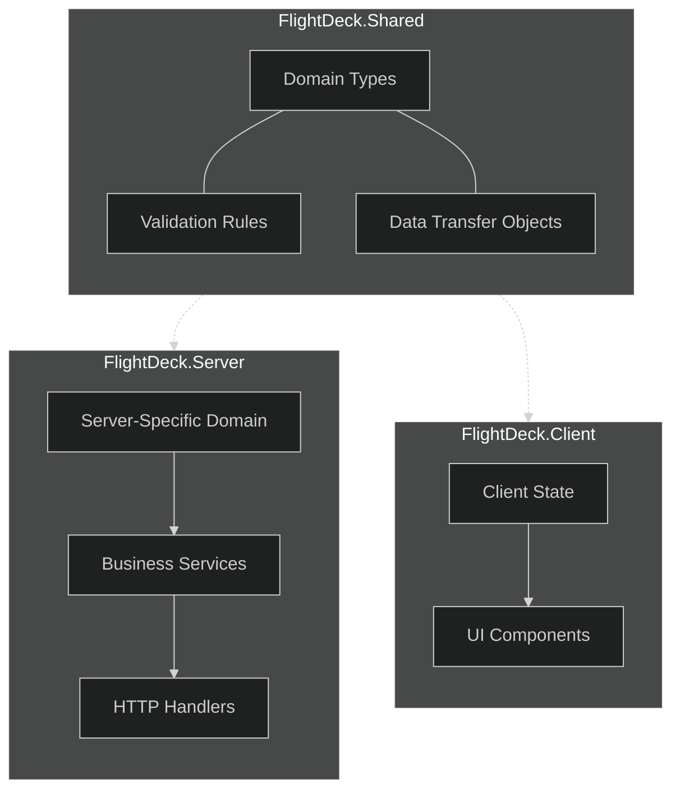
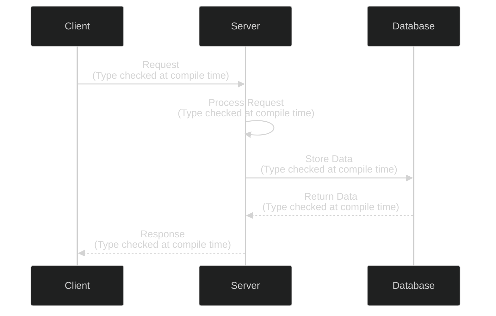
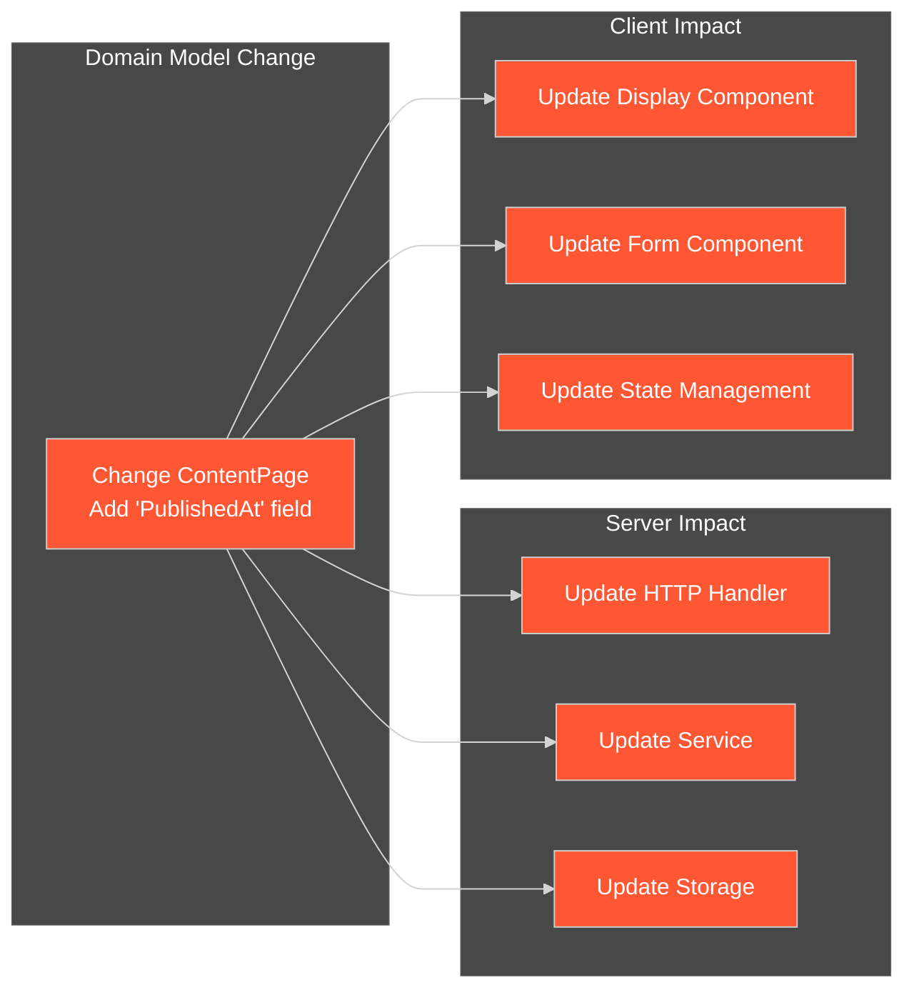
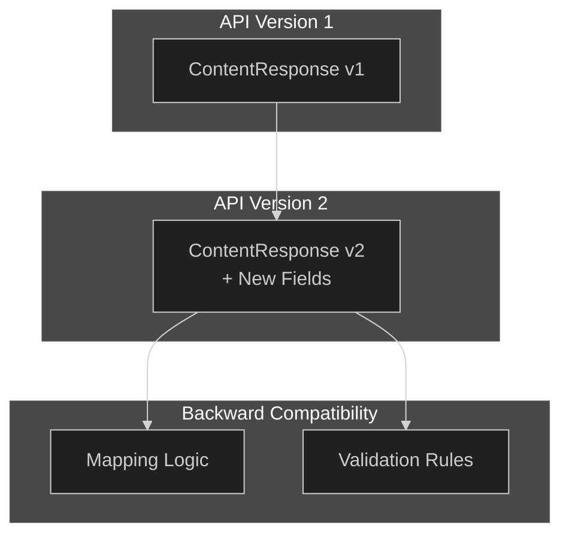

# Shared Domain Model

## Introduction

The Shared Domain Model is a foundational architectural pattern for the FlightDeck platform. It establishes a single source of truth for domain types that are used across both server and client codebases. This approach ensures type safety, consistency, and improved developer experience throughout the application stack.

## Core Concepts

The Shared Domain Model follows several key principles:

1. **Define Once, Use Everywhere**: Domain types are defined in a shared project accessible to both server and client code.

2. **Full Type Safety**: F#'s strong type system ensures consistency across application layers.

3. **Contract Definition**: The shared types serve as explicit contracts between client and server components.

4. **Validation Logic Reuse**: Validation rules can be defined once and applied in multiple contexts.

## Architectural Structure



## Implementation Guide

### Project Structure

```
src/
├── FlightDeck.Shared/       # Shared types
│   ├── Domain.fs            # Core domain types
│   ├── Validation.fs        # Validation logic
│   └── Contracts.fs         # API contracts
│
├── FlightDeck.Server/       # Server-specific code
│   └── ...
│
└── FlightDeck.Client/       # Client-specific code
    └── ...
```

### Domain Types Definition

Domain types should be defined in a clear, consistent manner that captures the essential business concepts:

```fsharp
// FlightDeck.Shared/Domain.fs
module FlightDeck.Shared.Domain

open System

// ----- Core Domain Types -----

type ContentId = string
type SlugId = string
type UserId = string

// Content types
type ContentFormat =
    | Markdown
    | Html
    | ReStructuredText

type ContentStatus =
    | Draft
    | Published
    | Archived

type ContentMetadata = {
    Title: string
    Description: string option
    CreatedAt: DateTime
    UpdatedAt: DateTime
    Author: string
    Tags: string list
}

type ContentPage = {
    Id: ContentId
    Slug: SlugId
    Metadata: ContentMetadata
    Content: string
    Format: ContentFormat
    Status: ContentStatus
}

// User types
type UserRole =
    | Admin
    | Editor
    | Viewer

type User = {
    Id: UserId
    Email: string
    DisplayName: string
    Role: UserRole
    CreatedAt: DateTime
}

// Presentation types
type SlideId = string
type PresentationId = string

type SlideContent =
    | Text of string
    | Markdown of string
    | Code of string * language:string
    | Image of url:string * alt:string

type Slide = {
    Id: SlideId
    Title: string option
    Content: SlideContent list
    Notes: string option
    Order: int
}

type Presentation = {
    Id: PresentationId
    Title: string
    Description: string option
    Author: string
    CreatedAt: DateTime
    UpdatedAt: DateTime
    Slides: Slide list
    Theme: string
    IsPublic: bool
}
```

### API Contract Types

API contract types define the shape of requests and responses between client and server:

```fsharp
// FlightDeck.Shared/Contracts.fs
module FlightDeck.Shared.Contracts

open FlightDeck.Shared.Domain

// ----- Content API -----

// Request types
type CreateContentRequest = {
    Title: string
    Slug: string option
    Description: string option
    Content: string
    Format: ContentFormat
    Tags: string list
}

type UpdateContentRequest = {
    Id: ContentId
    Title: string option
    Slug: string option
    Description: string option
    Content: string option
    Format: ContentFormat option
    Status: ContentStatus option
    Tags: string list option
}

// Response types
type ContentResponse = {
    Id: ContentId
    Slug: SlugId
    Title: string
    Description: string option
    Content: string
    RenderedContent: string option
    Format: ContentFormat
    Status: ContentStatus
    CreatedAt: string
    UpdatedAt: string
    Author: string
    Tags: string list
}

type ContentListResponse = {
    Items: ContentResponse list
    TotalCount: int
    PageNumber: int
    PageSize: int
}

// ----- Presentation API -----

// Request types
type CreatePresentationRequest = {
    Title: string
    Description: string option
    Theme: string
    IsPublic: bool
}

type UpdatePresentationRequest = {
    Id: PresentationId
    Title: string option
    Description: string option
    Theme: string option
    IsPublic: bool option
}

type CreateSlideRequest = {
    PresentationId: PresentationId
    Title: string option
    Content: SlideContent list
    Notes: string option
    Order: int option
}

// Response types
type SlideResponse = {
    Id: SlideId
    Title: string option
    Content: SlideContent list
    Notes: string option
    Order: int
}

type PresentationResponse = {
    Id: PresentationId
    Title: string
    Description: string option
    Author: string
    CreatedAt: string
    UpdatedAt: string
    Slides: SlideResponse list
    Theme: string
    IsPublic: bool
}

// ----- Generic Response Types -----

type ApiErrorType =
    | ValidationError
    | NotFoundError
    | AuthorizationError
    | ServerError

type ApiError = {
    Type: ApiErrorType
    Message: string
    Details: string list option
}

type ApiResponse<'T> = {
    Success: bool
    Data: 'T option
    Errors: ApiError list option
}
```

### Validation Rules

Validation logic can be defined in the shared project and used on both client and server:

```fsharp
// FlightDeck.Shared/Validation.fs
module FlightDeck.Shared.Validation

open FlightDeck.Shared.Domain
open FlightDeck.Shared.Contracts

// Validation result type
type ValidationResult<'T> =
    | Valid of 'T
    | Invalid of string list

// String validators
module StringValidators =
    let notEmpty fieldName value =
        if System.String.IsNullOrWhiteSpace(value) then
            Invalid [$"{fieldName} cannot be empty"]
        else
            Valid value
            
    let maxLength fieldName maxLen value =
        if String.length value > maxLen then
            Invalid [$"{fieldName} cannot be longer than {maxLen} characters"]
        else
            Valid value
            
    let matches fieldName pattern value =
        if System.Text.RegularExpressions.Regex.IsMatch(value, pattern) then
            Valid value
        else
            Invalid [$"{fieldName} has an invalid format"]

// Content validators
module ContentValidators =
    let validateCreateRequest (request: CreateContentRequest) =
        let titleResult = 
            StringValidators.notEmpty "Title" request.Title
            |> Result.bind (StringValidators.maxLength "Title" 100)
            
        let slugResult =
            match request.Slug with
            | Some slug -> 
                StringValidators.notEmpty "Slug" slug
                |> Result.bind (StringValidators.matches "Slug" "^[a-z0-9-]+$")
            | None -> Valid None
            
        let contentResult = StringValidators.notEmpty "Content" request.Content
        
        match titleResult, slugResult, contentResult with
        | Valid title, Valid slug, Valid content ->
            Valid { request with Title = title; Slug = slug; Content = content }
        | result1, result2, result3 ->
            let errors = 
                [result1; result2; result3]
                |> List.choose (function
                    | Invalid errs -> Some errs
                    | Valid _ -> None)
                |> List.concat
            Invalid errors
            
    // Other validation functions for different request types...
```

### Using Shared Types on the Server

The server uses shared types to handle requests and generate responses:

```fsharp
// FlightDeck.Server/Handlers/ContentHandlers.fs
module FlightDeck.Server.Handlers.ContentHandlers

open Oxpecker
open Oxpecker.ViewEngine
open FlightDeck.Shared.Domain
open FlightDeck.Shared.Contracts
open FlightDeck.Shared.Validation
open FlightDeck.Server.Services

// Create content handler
let createContent : HttpHandler =
    bindJson<CreateContentRequest> (fun request ctx -> task {
        // Validate request using shared validation rules
        match ContentValidators.validateCreateRequest request with
        | Valid validRequest ->
            let contentService = ctx.GetService<IContentService>()
            
            try
                let! content = contentService.CreateContent(validRequest)
                
                // Map domain model to response using shared contract type
                let response: ApiResponse<ContentResponse> = {
                    Success = true
                    Data = Some {
                        Id = content.Id
                        Slug = content.Slug
                        Title = content.Metadata.Title
                        Description = content.Metadata.Description
                        Content = content.Content
                        RenderedContent = Some (contentService.RenderContent(content))
                        Format = content.Format
                        Status = content.Status
                        CreatedAt = content.Metadata.CreatedAt.ToString("o")
                        UpdatedAt = content.Metadata.UpdatedAt.ToString("o")
                        Author = content.Metadata.Author
                        Tags = content.Metadata.Tags
                    }
                    Errors = None
                }
                
                return! json response ctx
            with ex ->
                let errorResponse: ApiResponse<ContentResponse> = {
                    Success = false
                    Data = None
                    Errors = Some [{
                        Type = ApiErrorType.ServerError
                        Message = "Failed to create content"
                        Details = Some [ex.Message]
                    }]
                }
                
                return! (setStatusCode 500 >=> json errorResponse) ctx
        
        | Invalid errors ->
            let errorResponse: ApiResponse<ContentResponse> = {
                Success = false
                Data = None
                Errors = Some [{
                    Type = ApiErrorType.ValidationError
                    Message = "Validation failed"
                    Details = Some errors
                }]
            }
            
            return! (setStatusCode 400 >=> json errorResponse) ctx
    })
```

### Using Shared Types on the Client

The client uses the same types to make requests and handle responses:

```fsharp
// FlightDeck.Client/Api.fs
module FlightDeck.Client.Api

open Fable.SimpleHttp
open System.Text.Json
open FlightDeck.Shared.Domain
open FlightDeck.Shared.Contracts

// Fetch content
let getContent (slug: string) : Async<ApiResponse<ContentResponse>> =
    async {
        let! response = 
            Http.request $"/api/content/{slug}"
            |> Http.method GET
            |> Http.send
            
        return 
            JsonSerializer.Deserialize<ApiResponse<ContentResponse>>(
                response.responseText,
                JsonSerializerOptions(PropertyNameCaseInsensitive = true)
            )
    }

// Create content
let createContent (request: CreateContentRequest) : Async<ApiResponse<ContentResponse>> =
    async {
        // Client-side validation using shared validation rules
        match ContentValidators.validateCreateRequest request with
        | Invalid errors ->
            // Return immediate validation error without making API call
            return {
                Success = false
                Data = None
                Errors = Some [{
                    Type = ApiErrorType.ValidationError
                    Message = "Validation failed"
                    Details = Some errors
                }]
            }
            
        | Valid validRequest ->
            // Make API call with validated request
            let! response =
                Http.request "/api/content"
                |> Http.method POST
                |> Http.content (JsonContent validRequest)
                |> Http.send
                
            return
                JsonSerializer.Deserialize<ApiResponse<ContentResponse>>(
                    response.responseText,
                    JsonSerializerOptions(PropertyNameCaseInsensitive = true)
                )
    }
```

### Client Component Using Shared Types

Reactive components use shared types for type-safe data handling:

```fsharp
// FlightDeck.Client/Components/ContentEditor.fs
module FlightDeck.Client.Components.ContentEditor

open Oxpecker.Solid
open FlightDeck.Shared.Domain
open FlightDeck.Shared.Contracts
open FlightDeck.Client.Api

// Content editor component
let ContentEditor (props: {| initialContent: ContentResponse option |}) =
    // State using shared types
    let (title, setTitle) = createSignal(props.initialContent |> Option.map (fun c -> c.Title) |> Option.defaultValue "")
    let (content, setContent) = createSignal(props.initialContent |> Option.map (fun c -> c.Content) |> Option.defaultValue "")
    let (format, setFormat) = createSignal(props.initialContent |> Option.map (fun c -> c.Format) |> Option.defaultValue ContentFormat.Markdown)
    let (isSubmitting, setIsSubmitting) = createSignal(false)
    let (errors, setErrors) = createSignal([] : string list)
    
    // Form submission handler
    let handleSubmit (e: Browser.Types.Event) =
        e.preventDefault()
        setIsSubmitting(true)
        setErrors([])
        
        let request: CreateContentRequest = {
            Title = title()
            Slug = None // Generate from title
            Description = None
            Content = content()
            Format = format()
            Tags = []
        }
        
        async {
            let! response = createContent request
            
            setIsSubmitting(false)
            
            if response.Success then
                // Handle success
                console.log("Content created successfully")
            else
                // Handle errors
                let newErrors = 
                    response.Errors 
                    |> Option.map (fun errs -> 
                        errs 
                        |> List.collect (fun e -> 
                            match e.Details with
                            | Some details -> details
                            | None -> [e.Message]
                        )
                    )
                    |> Option.defaultValue []
                    
                setErrors(newErrors)
        } |> Async.StartImmediate
    
    // Render using proper DSL
    div [ class' "content-editor" ] [
        h2 [] [ text "Content Editor" ]
        
        Show(errors().Length > 0, fun () ->
            div [ class' "error-messages" ] [
                For(errors(), fun error ->
                    div [ class' "error" ] [ text error ]
                )
            ]
        )
        
        form [ onSubmit handleSubmit ] [
            div [ class' "form-group" ] [
                label [ for' "title" ] [ text "Title" ]
                input [ 
                    id "title"
                    type' "text"
                    value (title())
                    onInput (fun e -> setTitle(e.target?value))
                    required true
                ]
            ]
            
            div [ class' "form-group" ] [
                label [ for' "format" ] [ text "Format" ]
                select [
                    id "format"
                    onChange (fun e -> 
                        match e.target?value with
                        | "markdown" -> setFormat(ContentFormat.Markdown)
                        | "html" -> setFormat(ContentFormat.Html)
                        | "rst" -> setFormat(ContentFormat.ReStructuredText)
                        | _ -> ()
                    )
                ] [
                    option [ value "markdown"; selected (format() = ContentFormat.Markdown) ] [ text "Markdown" ]
                    option [ value "html"; selected (format() = ContentFormat.Html) ] [ text "HTML" ]
                    option [ value "rst"; selected (format() = ContentFormat.ReStructuredText) ] [ text "reStructuredText" ]
                ]
            ]
            
            div [ class' "form-group" ] [
                label [ for' "content" ] [ text "Content" ]
                textarea [
                    id "content"
                    value (content())
                    onInput (fun e -> setContent(e.target?value))
                    rows 10
                    required true
                ] []
            ]
            
            button [
                type' "submit"
                disabled (isSubmitting())
                class' "submit-button"
            ] [
                Show(isSubmitting(), fun () ->
                    text "Saving..."
                , fun () ->
                    text "Save Content"
                )
            ]
        ]
    ]
```

## Benefits of Shared Domain Model

### Type Safety Across the Stack

The shared domain model ensures that types are consistent between client and server. This prevents many common bugs:



### Refactoring Benefits

When domain types change, the compiler identifies all affected code:



### Contract Evolution

As your API evolves, the shared domain model provides clear documentation and validation:



## Practical Considerations

### Build Process Integration

To use shared F# code on both server and client, configure your build process:

1. **Server Build**: Reference the shared project directly.
2. **Client Build**: Compile shared F# code to JavaScript using Fable.

```fsharp
// build/Build.fs
Target.create "BuildShared" (fun _ ->
    // Build shared project for both server and client
    DotNet.build (fun opts -> 
        { opts with Configuration = DotNet.BuildConfiguration.Release }
    ) "src/FlightDeck.Shared/FlightDeck.Shared.fsproj"
)

Target.create "BuildServer" (fun _ ->
    DotNet.build (fun opts -> 
        { opts with Configuration = DotNet.BuildConfiguration.Release }
    ) "src/FlightDeck.Server/FlightDeck.Server.fsproj"
)

Target.create "BuildClient" (fun _ ->
    // Run Fable to compile client (including shared) to JS
    Npm.exec "run build:client" id
)

"BuildShared"
  ==> "BuildServer"
  ==> "BuildClient"
  ==> "Default"
```

### Version Management

When evolving shared types, maintain backward compatibility:

```fsharp
// Original type
type ContentPage = {
    Id: string
    Title: string
    Content: string
}

// Updated type with backward compatibility
type ContentPage = {
    Id: string
    Title: string
    Content: string
    // New field with default value for backward compatibility
    Description: string option
}
```

## Conclusion

The Shared Domain Model pattern is a cornerstone of the FlightDeck architecture. By defining domain types once and using them across the entire application stack, it ensures consistency, improves developer experience, and prevents many common bugs. The strong typing provided by F# enhances these benefits further, making the pattern especially effective for complex applications.

This approach is particularly valuable for the FlightDeck platform as it evolves from a static site generator to a dynamic application with client-side interactivity. The shared domain model provides a solid foundation for this evolution, ensuring that the core business concepts remain consistent across all aspects of the application.