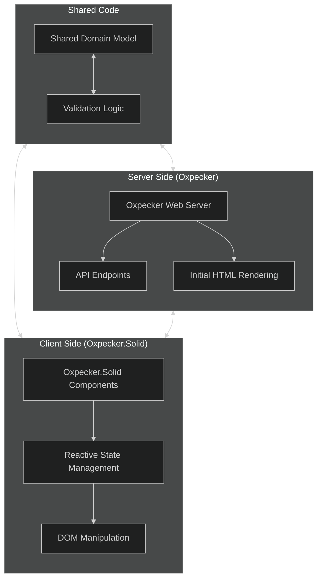

# Oxpecker.Solid Integration

## Introduction

This document details the integration of Oxpecker.Solid into the FlightDeck architecture to provide reactive UI components. Oxpecker.Solid is an F# binding for the Solid.js library, enabling the development of reactive components in F# that compile to efficient JavaScript. This approach allows for a fully F# application stack while providing modern, reactive UI capabilities.

## Architectural Overview

Oxpecker.Solid integrates into the FlightDeck architecture as follows:



## Implementation Guide

### Project Structure

```
src/
├── FlightDeck.Client/
│   ├── App.fs                # Main application component
│   ├── Components/           # Reusable UI components
│   │   ├── Header.fs
│   │   ├── Footer.fs
│   │   ├── ContentEditor.fs
│   │   └── ...
│   ├── Pages/                # Page components
│   │   ├── Home.fs
│   │   ├── ContentDetail.fs
│   │   └── Admin.fs
│   ├── Hooks/                # Custom reactive hooks
│   │   ├── UseAuth.fs
│   │   └── UseApi.fs
│   └── Api.fs                # API client
│
├── FlightDeck.Server/
│   └── ...                   # Server implementation
│
└── FlightDeck.Shared/
    └── ...                   # Shared domain model
```

### Build Configuration

To compile Oxpecker.Solid components with Fable, configure your build system:

```fsharp
// webpack.config.js
module.exports = {
    mode: "development",
    entry: "./src/FlightDeck.Client/App.fs.js",
    output: {
        path: path.join(__dirname, "./public/js"),
        filename: "app.js",
    },
    devtool: "source-map",
    module: {
        rules: [
            {
                test: /\.js$/,
                enforce: "pre",
                use: ["source-map-loader"],
            }
        ]
    }
}

// package.json
{
    "scripts": {
        "build": "dotnet fable src/FlightDeck.Client -o src/FlightDeck.Client --runWatch",
        "webpack": "webpack --watch"
    },
    "dependencies": {
        "solid-js": "^1.7.0"
    },
    "devDependencies": {
        "webpack": "^5.75.0",
        "webpack-cli": "^5.0.1",
        "source-map-loader": "^4.0.1"
    }
}
```

### Basic Components

Start with basic components before building more complex ones:

```fsharp
// FlightDeck.Client/Components/Header.fs
module FlightDeck.Client.Components.Header

open Oxpecker.Solid

type HeaderProps = {
    title: string
    isLoggedIn: bool
    userName: string option
    onLogout: unit -> unit
}

let Header (props: HeaderProps) =
    header [ class' "site-header" ] [
        div [ class' "container" ] [
            a [ href "/"; class' "site-logo" ] [ text props.title ]
            
            nav [ class' "main-nav" ] [
                ul [] [
                    li [] [ a [ href "/" ] [ text "Home" ] ]
                    li [] [ a [ href "/content" ] [ text "Content" ] ]
                    li [] [ a [ href "/presentations" ] [ text "Presentations" ] ]
                ]
            ]
            
            div [ class' "user-nav" ] [
                Show(props.isLoggedIn, 
                    // Logged in view
                    fun () ->
                        Fragment() [
                            span [ class' "user-name" ] [ 
                                text (props.userName |> Option.defaultValue "User") 
                            ]
                            button [ 
                                class' "logout-button"
                                onClick (fun _ -> props.onLogout())
                            ] [ text "Logout" ]
                        ]
                    ,
                    // Logged out view
                    fun () ->
                        a [ 
                            href "/login"
                            class' "login-button" 
                        ] [ text "Login" ]
                )
            ]
        ]
    ]
```

### Page Components

Build complete page components:

```fsharp
// FlightDeck.Client/Pages/ContentDetail.fs
module FlightDeck.Client.Pages.ContentDetail

open Oxpecker.Solid
open FlightDeck.Shared.Domain
open FlightDeck.Shared.Contracts
open FlightDeck.Client.Api
open FlightDeck.Client.Components

type ContentDetailMode =
    | View
    | Edit

let ContentDetailPage (props: {| contentId: string |}) =
    // State
    let (content, setContent) = createSignal(None: ContentResponse option)
    let (isLoading, setIsLoading) = createSignal(true)
    let (error, setError) = createSignal(None: string option)
    let (mode, setMode) = createSignal(ContentDetailMode.View)
    
    // Load content
    let loadContent () =
        async {
            setIsLoading(true)
            try
                let! response = Api.getContent props.contentId
                
                if response.Success && response.Data.IsSome then
                    setContent(response.Data)
                    setError(None)
                else
                    let errorMsg = 
                        response.Errors 
                        |> Option.bind (fun errs -> errs |> List.tryHead) 
                        |> Option.map (fun err -> err.Message)
                        |> Option.defaultValue "Content not found"
                    
                    setError(Some errorMsg)
            with ex ->
                setError(Some ex.Message)
            
            setIsLoading(false)
        } |> Async.StartImmediate
    
    // Load content on mount
    createEffect(fun () -> loadContent())
    
    // Handle content save
    let handleSave (savedContent: ContentResponse) =
        setContent(Some savedContent)
        setMode(ContentDetailMode.View)
    
    // Render
    div [ class' "content-detail-page" ] [
        Show(isLoading(), fun () ->
            div [ class' "loading" ] [ text "Loading content..." ]
        )
        
        Show(error().IsSome, fun () ->
            div [ class' "error" ] [
                h2 [] [ text "Error" ]
                p [] [ text (error() |> Option.defaultValue "") ]
                button [
                    class' "retry-button"
                    onClick (fun _ -> loadContent())
                ] [ text "Retry" ]
            ]
        )
        
        Show(not (isLoading()) && error().IsNone && content().IsSome, fun () ->
            Fragment() [
                // Content header
                div [ class' "content-header" ] [
                    h1 [] [ text (content().Value.Title) ]
                    
                    div [ class' "content-meta" ] [
                        span [ class' "content-date" ] [ 
                            text (
                                try
                                    let date = System.DateTime.Parse(content().Value.UpdatedAt)
                                    date.ToString("MMMM d, yyyy")
                                with _ ->
                                    content().Value.UpdatedAt
                            )
                        ]
                        
                        span [ class' "content-author" ] [ text (content().Value.Author) ]
                    ]
                    
                    div [ class' "content-actions" ] [
                        Match(mode(), fun () ->
                            | ContentDetailMode.View ->
                                button [
                                    class' "edit-button"
                                    onClick (fun _ -> setMode(ContentDetailMode.Edit))
                                ] [ text "Edit" ]
                            | ContentDetailMode.Edit ->
                                Fragment() []
                        )
                    ]
                ]
                
                // Content body
                Match(mode(), fun () ->
                    | ContentDetailMode.View ->
                        div [ 
                            class' (
                                match content().Value.Format with
                                | ContentFormat.Markdown -> "markdown-content"
                                | ContentFormat.Html -> "html-content"
                                | ContentFormat.ReStructuredText -> "rst-content"
                            )
                            // Use HTML from server-rendered content if available
                            dangerouslySetInnerHTML (
                                content().Value.RenderedContent 
                                |> Option.defaultValue content().Value.Content
                            )
                        ] []
                    | ContentDetailMode.Edit ->
                        ContentForm {
                            initialContent = content()
                            onSave = handleSave
                            onCancel = fun () -> setMode(ContentDetailMode.View)
                        }
                )
            ]
        )
    ]
```

### Main Application

Create the main application component:

```fsharp
// FlightDeck.Client/App.fs
module FlightDeck.Client.App

open Oxpecker.Solid
open Fable.Core.JsInterop
open Browser.Dom

// Import components
open FlightDeck.Client.Components
open FlightDeck.Client.Pages
open FlightDeck.Client.Hooks

// Simple router
type Route =
    | Home
    | ContentList
    | ContentDetail of id: string
    | ContentCreate
    | AdminDashboard
    | NotFound

let parseRoute (path: string) =
    let segments = 
        path.Split('/')
        |> Array.filter (not << System.String.IsNullOrEmpty)
        |> Array.toList
    
    match segments with
    | [] -> Home
    | ["content"] -> ContentList
    | ["content"; "create"] -> ContentCreate
    | ["content"; id] -> ContentDetail id
    | ["admin"] -> AdminDashboard
    | _ -> NotFound

// Main app component
let App() =
    // State
    let (currentRoute, setCurrentRoute) = createSignal(parseRoute window.location.pathname)
    let (user, isLoading, authError, login, logout) = useAuth()
    
    // Handle navigation
    let handleNavigation (e: Browser.Types.MouseEvent) =
        // Only handle clicks on links
        if e.target?tagName = "A" && e.target?href.StartsWith(window.location.origin) then
            e.preventDefault()
            let path = e.target?pathname
            
            // Update route
            window.history.pushState(null, "", path)
            setCurrentRoute(parseRoute path)
    
    // Listen for popstate events (browser back/forward)
    window.addEventListener("popstate", fun _ ->
        setCurrentRoute(parseRoute window.location.pathname)
    )
    
    // Render
    div [
        class' "app-container"
        onClick handleNavigation
    ] [
        // Header
        Header {
            title = "FlightDeck"
            isLoggedIn = user().IsSome
            userName = user() |> Option.map (fun u -> u.DisplayName)
            onLogout = logout
        }
        
        // Main content
        main [ class' "main-content" ] [
            Match(currentRoute(), fun () ->
                | Home -> HomePage()
                | ContentList -> ContentListPage()
                | ContentDetail id -> ContentDetailPage {| contentId = id |}
                | ContentCreate -> ContentCreatePage()
                | AdminDashboard -> AdminDashboardPage()
                | NotFound -> NotFoundPage()
            )
        ]
        
        // Footer
        Footer()
    ]

// Mount the app
let mountApp() =
    let container = document.getElementById("app")
    if not (isNull container) then
        Oxpecker.Solid.mount (container, App())

// Initialize
mountApp()
```

### Mounting in Oxpecker Views

Update your Oxpecker view to include the necessary mounting point:

```fsharp
// FlightDeck.Server/Views.fs
module FlightDeck.Server.Views

open Oxpecker.ViewEngine
open FlightDeck.Core.Domain

// Content detail page
let contentDetail (content: ContentPage) =
    masterLayout content.Metadata.Title [
        // Provide initial state for Oxpecker.Solid component
        div [
            _id "app"
            attr "data-content-id" content.Id
            attr "data-initial-content" (System.Text.Json.JsonSerializer.Serialize(content))
        ] []
        
        // Add reactive script
        script [
            _src "/js/app.js"
            _type "module"
            _defer
        ] []
    ]
    |> htmlView
```

## Advanced Features

### Server-Client Synchronization

For real-time updates between server and client:

```fsharp
// FlightDeck.Client/Hooks/UseRealtime.fs
module FlightDeck.Client.Hooks.UseRealtime

open Oxpecker.Solid
open FlightDeck.Shared.Domain
open FlightDeck.Shared.Contracts

// Hook for real-time content updates
let useContentUpdates (contentId: string) =
    // State
    let (latestContent, setLatestContent) = createSignal(None: ContentResponse option)
    let (isConnected, setIsConnected) = createSignal(false)
    
    // Event source for Server-Sent Events
    createEffect(fun () ->
        let eventSource = new Browser.WebApis.EventSource($"/api/content/{contentId}/updates")
        
        // Handle connection open
        eventSource.onopen <- fun _ -> setIsConnected(true)
        
        // Handle connection close/error
        eventSource.onerror <- fun _ -> setIsConnected(false)
        
        // Handle content updates
        eventSource.addEventListener("content-update", fun e ->
            let data = Fable.Core.JS.JSON.parse(e?data) |> unbox<ContentResponse>
            setLatestContent(Some data)
        )
        
        // Clean up on component unmount
        onCleanup (fun () -> eventSource.close())
    )
    
    // Return state
    latestContent, isConnected
```

### Lazy-Loaded Components

For better performance, lazy-load components:

```fsharp
// FlightDeck.Client/App.fs (updated)
module FlightDeck.Client.App

open Oxpecker.Solid
open Fable.Core
open Browser.Dom

// Lazy-loaded components
[<Import("lazy", from="solid-js")>]
let lazyComponent : (unit -> 'T) -> 'T = jsNative

// Lazy-loaded pages
let AdminDashboardLazy = lazyComponent (fun () -> 
    importDynamic "./Pages/AdminDashboard.fs" 
    |> Promise.map (fun m -> m?AdminDashboardPage)
)

// Main app component with lazy loading
let App() =
    // State and other code...
    
    // Render with lazy loading
    div [ class' "app-container" ] [
        // Header component...
        
        // Main content with lazy loading
        main [ class' "main-content" ] [
            Match(currentRoute(), fun () ->
                | Home -> HomePage()
                | ContentList -> ContentListPage()
                | ContentDetail id -> ContentDetailPage {| contentId = id |}
                | ContentCreate -> ContentCreatePage()
                | AdminDashboard -> 
                    Suspense {
                        fallback = div [ class' "loading" ] [ text "Loading admin dashboard..." ]
                        children = [| AdminDashboardLazy() |]
                    }
                | NotFound -> NotFoundPage()
            )
        ]
        
        // Footer component...
    ]
```

### Custom Reactive Hooks

Create custom hooks for common patterns:

```fsharp
// FlightDeck.Client/Hooks/UseForm.fs
module FlightDeck.Client.Hooks.UseForm

open Oxpecker.Solid

// Generic form state hook
let useForm<'T> (initialValues: 'T) (validate: 'T -> Result<'T, Map<string, string list>>) =
    // State
    let (values, setValues) = createSignal(initialValues)
    let (errors, setErrors) = createSignal(Map.empty<string, string list>)
    let (isSubmitting, setIsSubmitting) = createSignal(false)
    let (isDirty, setIsDirty) = createSignal(false)
    
    // Set a single field value
    let setField<'F> (fieldName: string) (value: 'F) =
        let newValues = 
            values() 
            |> (fun v -> 
                let record = v :> obj :?> {| |}
                let props = record.GetType().GetProperties()
                
                let prop = props |> Array.find (fun p -> p.Name = fieldName)
                prop.SetValue(record, value)
                
                record :?> 'T
            )
        
        setValues(newValues)
        setIsDirty(true)
        
        // Clear field error when value changes
        if errors() |> Map.containsKey fieldName then
            setErrors(errors() |> Map.remove fieldName)
    
    // Validate the form
    let validateForm () =
        match validate(values()) with
        | Ok validValues ->
            setValues(validValues)
            setErrors(Map.empty)
            true
        | Error validationErrors ->
            setErrors(validationErrors)
            false
    
    // Reset the form
    let resetForm () =
        setValues(initialValues)
        setErrors(Map.empty)
        setIsDirty(false)
    
    // Return state and functions
    values, setValues, errors, isSubmitting, setIsSubmitting, isDirty, setField, validateForm, resetForm
```

## Performance Optimizations

### Component Memoization

Use memoization to prevent unnecessary re-renders:

```fsharp
// FlightDeck.Client/Components/ContentList.fs
module FlightDeck.Client.Components.ContentList

open Oxpecker.Solid
open FlightDeck.Shared.Contracts

// Content list item component (memoized)
let ContentListItem = memo (fun (props: {| content: ContentResponse; onClick: ContentResponse -> unit |}) ->
    li [ 
        class' "content-item"
        onClick (fun _ -> props.onClick props.content)
    ] [
        div [ class' "content-title" ] [ text props.content.Title ]
        
        div [ class' "content-meta" ] [
            span [ class' "content-date" ] [ 
                text (
                    try
                        let date = System.DateTime.Parse(props.content.UpdatedAt)
                        date.ToString("MM/dd/yyyy")
                    with _ ->
                        props.content.UpdatedAt
                )
            ]
            
            span [ class' "content-author" ] [ text props.content.Author ]
        ]
        
        div [ class' "content-description" ] [
            text (props.content.Description |> Option.defaultValue "")
        ]
    ]
)

// Content list component
let ContentList (props: {| items: ContentResponse list; onSelectItem: ContentResponse -> unit |}) =
    ul [ class' "content-list" ] [
        For(props.items, fun item ->
            ContentListItem {| 
                content = item
                onClick = props.onSelectItem
            |}
        )
    ]
```

### Signals vs. Stores

For complex state, use stores instead of individual signals:

```fsharp
// FlightDeck.Client/Pages/AdminDashboard.fs
module FlightDeck.Client.Pages.AdminDashboard

open Oxpecker.Solid
open FlightDeck.Shared.Domain
open FlightDeck.Shared.Contracts
open FlightDeck.Client.Api

// Dashboard state type
type DashboardState = {
    Stats: DashboardStats option
    ContentList: ContentResponse list
    IsLoading: bool
    Error: string option
}

// Dashboard page component
let AdminDashboardPage() =
    // Use createStore for complex state
    let (state, setState) = createStore({
        Stats = None
        ContentList = []
        IsLoading = true
        Error = None
    })
    
    // Load dashboard data
    let loadDashboard() =
        async {
            // Set loading state
            setState(fun s -> {s with IsLoading = true})
            
            try
                // Load dashboard stats
                let! statsResponse = Api.getDashboardStats()
                
                if statsResponse.Success && statsResponse.Data.IsSome then
                    setState(fun s -> {s with Stats = statsResponse.Data})
                
                // Load recent content
                let! contentResponse = Api.getContentList { PageNumber = 1; PageSize = 10 }
                
                if contentResponse.Success then
                    setState(fun s -> {
                        s with 
                        ContentList = contentResponse.Items
                        Error = None
                    })
                else
                    let errorMsg = 
                        contentResponse.Errors 
                        |> Option.bind (fun errs -> errs |> List.tryHead) 
                        |> Option.map (fun err -> err.Message)
                        |> Option.defaultValue "Failed to load content"
                    
                    setState(fun s -> {s with Error = Some errorMsg})
            with ex ->
                setState(fun s -> {s with Error = Some ex.Message})
            
            // Set loading complete
            setState(fun s -> {s with IsLoading = false})
        } |> Async.StartImmediate
    
    // Load data on mount
    createEffect(fun () -> loadDashboard())
    
    // Render
    div [ class' "admin-dashboard" ] [
        h1 [] [ text "Admin Dashboard" ]
        
        Show(state.IsLoading, fun () ->
            div [ class' "loading" ] [ text "Loading dashboard..." ]
        )
        
        Show(state.Error.IsSome, fun () ->
            div [ class' "error" ] [
                p [] [ text (state.Error |> Option.defaultValue "") ]
                button [
                    class' "retry-button"
                    onClick (fun _ -> loadDashboard())
                ] [ text "Retry" ]
            ]
        )
        
        Show(state.Stats.IsSome, fun () ->
            div [ class' "stats-panel" ] [
                div [ class' "stat-card" ] [
                    div [ class' "stat-title" ] [ text "Total Pages" ]
                    div [ class' "stat-value" ] [ text (string state.Stats.Value.TotalPages) ]
                ]
                
                div [ class' "stat-card" ] [
                    div [ class' "stat-title" ] [ text "Published Pages" ]
                    div [ class' "stat-value" ] [ text (string state.Stats.Value.PublishedPages) ]
                ]
                
                div [ class' "stat-card" ] [
                    div [ class' "stat-title" ] [ text "Draft Pages" ]
                    div [ class' "stat-value" ] [ text (string state.Stats.Value.DraftPages) ]
                ]
            ]
        )
        
        div [ class' "content-panel" ] [
            h2 [] [ text "Recent Content" ]
            
            Show(not state.IsLoading && state.ContentList.Length > 0, fun () ->
                table [ class' "content-table" ] [
                    thead [] [
                        tr [] [
                            th [] [ text "Title" ]
                            th [] [ text "Status" ]
                            th [] [ text "Updated" ]
                            th [] [ text "Actions" ]
                        ]
                    ]
                    tbody [] [
                        For(state.ContentList, fun content ->
                            tr [] [
                                td [] [ text content.Title ]
                                td [] [ text (string content.Status) ]
                                td [] [ 
                                    text (
                                        try
                                            let date = System.DateTime.Parse(content.UpdatedAt)
                                            date.ToString("MM/dd/yyyy")
                                        with _ ->
                                            content.UpdatedAt
                                    )
                                ]
                                td [] [
                                    a [ 
                                        href $"/content/{content.Id}"
                                        class' "view-button" 
                                    ] [ text "View" ]
                                    
                                    a [ 
                                        href $"/admin/content/edit/{content.Id}"
                                        class' "edit-button" 
                                    ] [ text "Edit" ]
                                ]
                            ]
                        )
                    ]
                ]
            )
        ]
    ]
```

## Integration with Oxpecker Server

### Initial State Injection

To avoid initial loading flashes, inject initial state from the server:

```fsharp
// FlightDeck.Server/Handlers/ContentHandlers.fs
module FlightDeck.Server.Handlers.ContentHandlers

open Oxpecker
open Oxpecker.ViewEngine
open FlightDeck.Core.Domain
open FlightDeck.Shared.Contracts
open FlightDeck.Server.Views

// View content handler with initial state
let viewContent : HttpHandler =
    routef (fun contentId ctx -> task {
        let contentService = ctx.GetService<IContentService>()
        let! content = contentService.GetPageById(contentId)
        
        match content with
        | Some page ->
            // Convert to response type for client
            let response: ContentResponse = {
                Id = page.Id
                Slug = page.Slug
                Title = page.Metadata.Title
                Description = page.Metadata.Description
                Content = page.Content
                RenderedContent = Some (contentService.RenderContent(page))
                Format = page.Format
                Status = page.Status
                CreatedAt = page.Metadata.CreatedAt.ToString("o")
                UpdatedAt = page.Metadata.UpdatedAt.ToString("o")
                Author = page.Metadata.Author
                Tags = page.Metadata.Tags
            }
            
            // Inject initial state into HTML
            let initialState = System.Text.Json.JsonSerializer.Serialize(
                {
                    Success = true
                    Data = Some response
                    Errors = None
                }, 
                System.Text.Json.JsonSerializerOptions(PropertyNamingPolicy = System.Text.Json.JsonNamingPolicy.CamelCase)
            )
            
            return! contentDetail page initialState ctx
        | None ->
            return! (setStatusCode 404 >=> Error.notFound) ctx
    })
```

### Server-Sent Events

For real-time updates:

```fsharp
// FlightDeck.Server/Handlers/RealtimeHandlers.fs
module FlightDeck.Server.Handlers.RealtimeHandlers

open System.Threading.Tasks
open Microsoft.AspNetCore.Http
open Oxpecker
open FlightDeck.Core.Services
open FlightDeck.Shared.Contracts

// Content updates SSE handler
let contentUpdates : HttpHandler =
    routef (fun contentId ctx -> task {
        // Set up SSE headers
        ctx.Response.Headers.Add("Content-Type", "text/event-stream")
        ctx.Response.Headers.Add("Cache-Control", "no-cache")
        ctx.Response.Headers.Add("Connection", "keep-alive")
        
        // Get services
        let contentService = ctx.GetService<IContentService>()
        let notificationService = ctx.GetService<INotificationService>()
        
        // Create a cancellation token source linked to the request abort token
        let cts = CancellationTokenSource.CreateLinkedTokenSource(ctx.RequestAborted)
        
        // Subscribe to content updates
        let subscription = 
            notificationService.SubscribeToContentUpdates contentId
            (fun updatedContent ->
                // Convert to response
                let response = contentService.MapToContentResponse updatedContent
                
                // Write SSE event
                let data = 
                    System.Text.Json.JsonSerializer.Serialize(
                        response,
                        System.Text.Json.JsonSerializerOptions(PropertyNamingPolicy = System.Text.Json.JsonNamingPolicy.CamelCase)
                    )
                
                let eventData = $"event: content-update\ndata: {data}\n\n"
                task {
                    do! ctx.Response.WriteAsync(eventData, cts.Token)
                    do! ctx.Response.Body.FlushAsync(cts.Token)
                } |> ignore
            )
        
        // Create a task that completes when the client disconnects
        let tcs = TaskCompletionSource()
        
        // Register cleanup when client disconnects
        ctx.RequestAborted.Register(fun () -> 
            subscription.Dispose()
            tcs.SetResult()
        ) |> ignore
        
        // Return the task that completes when the client disconnects
        return! tcs.Task
    })
```

## Conclusion

Integrating Oxpecker.Solid into the FlightDeck architecture provides a powerful way to add reactive UI components while maintaining a fully F# codebase. This approach combines the performance and developer experience benefits of Oxpecker on the server with the reactive capabilities of Solid.js on the client.

By leveraging the shared domain model, you can ensure type safety across the entire stack and create a seamless development experience. The functional programming paradigm of F# works particularly well with Solid.js's reactive model, allowing for clean, composable UI components.

This integration strategy allows for progressive enhancement of the FlightDeck platform, adding reactivity only where needed while maintaining the performance benefits of server-rendered content for the majority of the application.

```

### Reactive State Management

Oxpecker.Solid provides reactive primitives for state management:

```fsharp
// FlightDeck.Client/Hooks/UseAuth.fs
module FlightDeck.Client.Hooks.UseAuth

open Oxpecker.Solid
open FlightDeck.Shared.Domain
open FlightDeck.Client.Api

// Authentication state hook
let useAuth () =
    // State
    let (user, setUser) = createSignal(None: User option)
    let (isLoading, setIsLoading) = createSignal(true)
    let (error, setError) = createSignal(None: string option)
    
    // Check session on mount
    createEffect(fun () ->
        async {
            setIsLoading(true)
            try
                let! response = Api.getCurrentUser()
                
                if response.Success && response.Data.IsSome then
                    setUser(response.Data)
                else
                    setUser(None)
                    
                setError(None)
            with ex ->
                setUser(None)
                setError(Some ex.Message)
                
            setIsLoading(false)
        } |> Async.StartImmediate
    )
    
    // Login function
    let login (email: string) (password: string) =
        async {
            setIsLoading(true)
            try
                let! response = Api.login { Email = email; Password = password }
                
                if response.Success && response.Data.IsSome then
                    setUser(response.Data)
                    setError(None)
                    true
                else
                    let errorMsg = 
                        response.Errors 
                        |> Option.bind (fun errs -> errs |> List.tryHead) 
                        |> Option.map (fun err -> err.Message)
                        |> Option.defaultValue "Login failed"
                    
                    setError(Some errorMsg)
                    false
            with ex ->
                setError(Some ex.Message)
                false
                
            |> fun result ->
                setIsLoading(false)
                result
        }
    
    // Logout function
    let logout () =
        async {
            try
                let! response = Api.logout()
                setUser(None)
            with _ ->
                // Still clear user even if API call fails
                setUser(None)
        } |> Async.StartImmediate
    
    // Return state and functions
    user, isLoading, error, login, logout
```

### Form Handling

Create components for form handling:

```fsharp
// FlightDeck.Client/Components/ContentForm.fs
module FlightDeck.Client.Components.ContentForm

open Oxpecker.Solid
open FlightDeck.Shared.Domain
open FlightDeck.Shared.Contracts
open FlightDeck.Shared.Validation
open FlightDeck.Client.Api

type ContentFormProps = {
    initialContent: ContentResponse option
    onSave: ContentResponse -> unit
    onCancel: unit -> unit
}

let ContentForm (props: ContentFormProps) =
    // Form state
    let (title, setTitle) = createSignal(props.initialContent |> Option.map (fun c -> c.Title) |> Option.defaultValue "")
    let (content, setContent) = createSignal(props.initialContent |> Option.map (fun c -> c.Content) |> Option.defaultValue "")
    let (format, setFormat) = createSignal(props.initialContent |> Option.map (fun c -> c.Format) |> Option.defaultValue ContentFormat.Markdown)
    let (description, setDescription) = createSignal(props.initialContent |> Option.bind (fun c -> c.Description) |> Option.defaultValue "")
    let (isSubmitting, setIsSubmitting) = createSignal(false)
    let (formErrors, setFormErrors) = createSignal(Map.empty<string, string list>)
    
    // Format options
    let formatOptions = [
        ContentFormat.Markdown, "Markdown"
        ContentFormat.Html, "HTML"
        ContentFormat.ReStructuredText, "reStructuredText"
    ]
    
    // Field error helper
    let getFieldErrors fieldName =
        formErrors() 
        |> Map.tryFind fieldName 
        |> Option.defaultValue []
    
    // Validation
    let validateForm () =
        let validationResult = 
            if props.initialContent.IsSome then
                // Update existing content
                ContentValidators.validateUpdateRequest {
                    Id = props.initialContent.Value.Id
                    Title = Some (title())
                    Slug = None
                    Description = if System.String.IsNullOrWhiteSpace(description()) then None else Some (description())
                    Content = Some (content())
                    Format = Some (format())
                    Status = None
                    Tags = None
                }
            else
                // Create new content
                ContentValidators.validateCreateRequest {
                    Title = title()
                    Slug = None
                    Description = if System.String.IsNullOrWhiteSpace(description()) then None else Some (description())
                    Content = content()
                    Format = format()
                    Tags = []
                }
        
        match validationResult with
        | Valid _ -> true
        | Invalid errors ->
            // Group errors by field
            let errorMap =
                errors
                |> List.fold (fun map error ->
                    let fieldName = 
                        if error.StartsWith("Title ") then "title"
                        elif error.StartsWith("Content ") then "content"
                        elif error.StartsWith("Description ") then "description"
                        else "general"
                    
                    map |> Map.add fieldName (
                        map 
                        |> Map.tryFind fieldName 
                        |> Option.defaultValue [] 
                        |> fun list -> error :: list
                    )
                ) Map.empty
            
            setFormErrors(errorMap)
            false
    
    // Form submission
    let handleSubmit (e: Browser.Types.Event) =
        e.preventDefault()
        
        if validateForm() then
            setIsSubmitting(true)
            
            async {
                try
                    let! result =
                        if props.initialContent.IsSome then
                            // Update existing content
                            let request: UpdateContentRequest = {
                                Id = props.initialContent.Value.Id
                                Title = Some (title())
                                Slug = None  // Keep existing slug
                                Description = if System.String.IsNullOrWhiteSpace(description()) then None else Some (description())
                                Content = Some (content())
                                Format = Some (format())
                                Status = None  // Keep existing status
                                Tags = None  // Keep existing tags
                            }
                            
                            Api.updateContent request
                        else
                            // Create new content
                            let request: CreateContentRequest = {
                                Title = title()
                                Slug = None  // Generate from title
                                Description = if System.String.IsNullOrWhiteSpace(description()) then None else Some (description())
                                Content = content()
                                Format = format()
                                Tags = []
                            }
                            
                            Api.createContent request
                    
                    setIsSubmitting(false)
                    
                    if result.Success && result.Data.IsSome then
                        // Call onSave callback with saved content
                        props.onSave(result.Data.Value)
                    else
                        // Handle API errors
                        let errorMap =
                            result.Errors
                            |> Option.map (fun errors ->
                                errors
                                |> List.fold (fun map error ->
                                    map |> Map.add "api" (
                                        map 
                                        |> Map.tryFind "api" 
                                        |> Option.defaultValue [] 
                                        |> fun list -> error.Message :: list
                                    )
                                ) Map.empty
                            )
                            |> Option.defaultValue (Map.add "api" ["An unknown error occurred"] Map.empty)
                        
                        setFormErrors(errorMap)
                with ex ->
                    setIsSubmitting(false)
                    setFormErrors(Map.add "api" [ex.Message] Map.empty)
            } |> Async.StartImmediate
    
    // Reset form
    let resetForm () =
        setTitle(props.initialContent |> Option.map (fun c -> c.Title) |> Option.defaultValue "")
        setContent(props.initialContent |> Option.map (fun c -> c.Content) |> Option.defaultValue "")
        setFormat(props.initialContent |> Option.map (fun c -> c.Format) |> Option.defaultValue ContentFormat.Markdown)
        setDescription(props.initialContent |> Option.bind (fun c -> c.Description) |> Option.defaultValue "")
        setFormErrors(Map.empty)
    
    // Render form
    form [ 
        class' "content-form"
        onSubmit handleSubmit 
    ] [
        // API Errors
        Show(formErrors() |> Map.containsKey "api", fun () ->
            div [ class' "error-summary" ] [
                For(getFieldErrors "api", fun error ->
                    div [ class' "error-message" ] [ text error ]
                )
            ]
        )
        
        // Title field
        div [ classList [ "form-group", true; "has-error", getFieldErrors "title" |> List.isEmpty |> not ] ] [
            label [ for' "title" ] [ text "Title" ]
            input [ 
                id "title"
                type' "text"
                value (title())
                onInput (fun e -> setTitle(e.target?value))
                required true
            ]
            
            Show(getFieldErrors "title" |> List.isEmpty |> not, fun () ->
                div [ class' "field-errors" ] [
                    For(getFieldErrors "title", fun error ->
                        div [ class' "error-message" ] [ text error ]
                    )
                ]
            )
        ]
        
        // Description field
        div [ classList [ "form-group", true; "has-error", getFieldErrors "description" |> List.isEmpty |> not ] ] [
            label [ for' "description" ] [ text "Description (optional)" ]
            textarea [
                id "description"
                value (description())
                onInput (fun e -> setDescription(e.target?value))
                rows 2
            ] []
            
            Show(getFieldErrors "description" |> List.isEmpty |> not, fun () ->
                div [ class' "field-errors" ] [
                    For(getFieldErrors "description", fun error ->
                        div [ class' "error-message" ] [ text error ]
                    )
                ]
            )
        ]
        
        // Format field
        div [ classList [ "form-group", true; "has-error", getFieldErrors "format" |> List.isEmpty |> not ] ] [
            label [ for' "format" ] [ text "Format" ]
            select [
                id "format"
                onChange (fun e -> 
                    match e.target?value with
                    | "markdown" -> setFormat(ContentFormat.Markdown)
                    | "html" -> setFormat(ContentFormat.Html)
                    | "rst" -> setFormat(ContentFormat.ReStructuredText)
                    | _ -> ()
                )
            ] [
                For(formatOptions, fun (format, label) ->
                    option [ 
                        value (
                            match format with
                            | ContentFormat.Markdown -> "markdown"
                            | ContentFormat.Html -> "html"
                            | ContentFormat.ReStructuredText -> "rst"
                        )
                        selected (format() = format)
                    ] [ text label ]
                )
            ]
        ]
        
        // Content field
        div [ classList [ "form-group", true; "has-error", getFieldErrors "content" |> List.isEmpty |> not ] ] [
            label [ for' "content" ] [ text "Content" ]
            textarea [
                id "content"
                value (content())
                onInput (fun e -> setContent(e.target?value))
                rows 15
                required true
            ] []
            
            Show(getFieldErrors "content" |> List.isEmpty |> not, fun () ->
                div [ class' "field-errors" ] [
                    For(getFieldErrors "content", fun error ->
                        div [ class' "error-message" ] [ text error ]
                    )
                ]
            )
        ]
        
        // Form buttons
        div [ class' "form-actions" ] [
            button [
                type' "button"
                class' "cancel-button"
                onClick (fun _ -> props.onCancel())
                disabled (isSubmitting())
            ] [ text "Cancel" ]
            
            button [
                type' "button"
                class' "reset-button"
                onClick (fun _ -> resetForm())
                disabled (isSubmitting())
            ] [ text "Reset" ]
            
            button [
                type' "submit"
                class' "submit-button"
                disabled (isSubmitting())
            ] [
                Show(isSubmitting(), fun () ->
                    span [ class' "spinner" ] [ text "Saving..." ]
                , fun () ->
                    text "Save"
                )
            ]
        ]
    ]