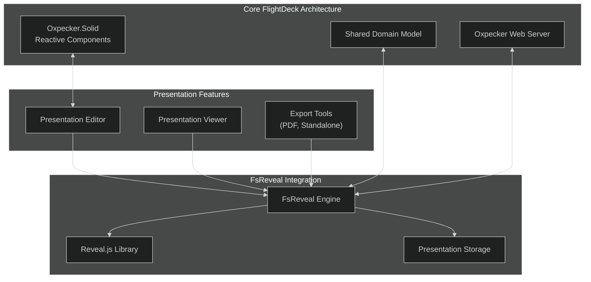
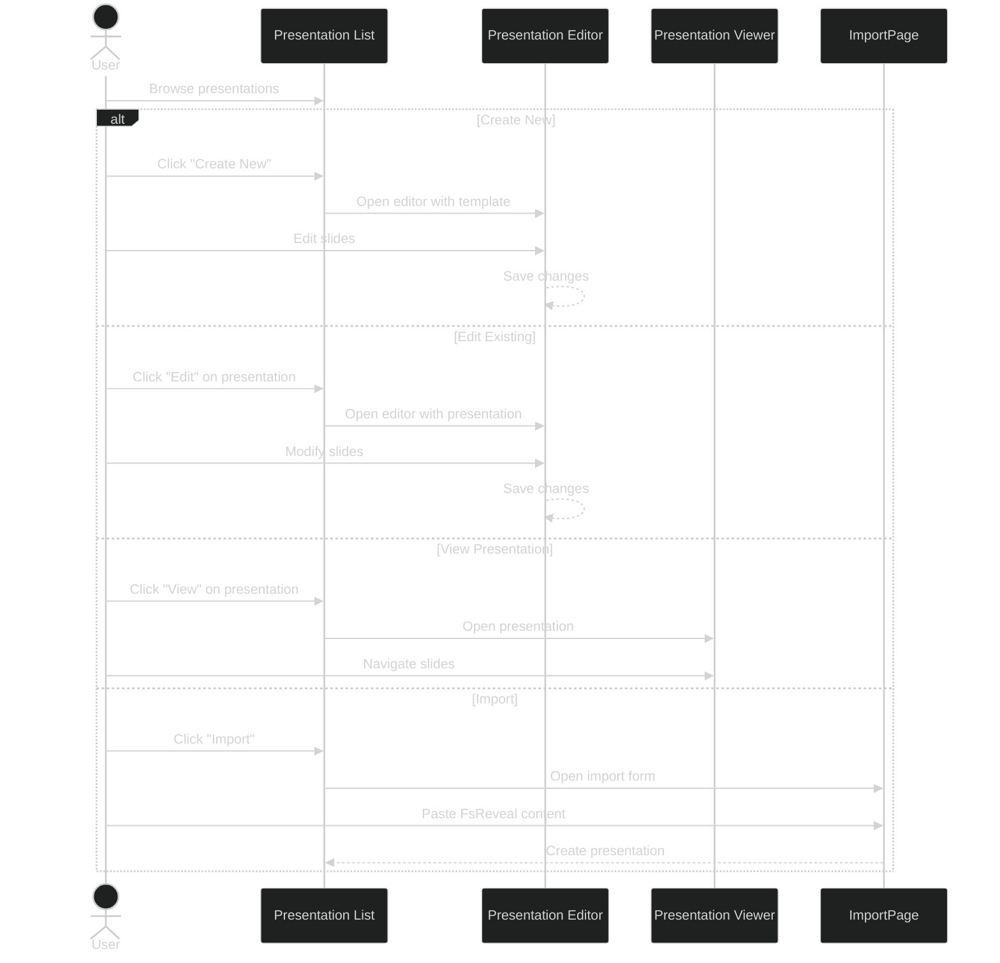
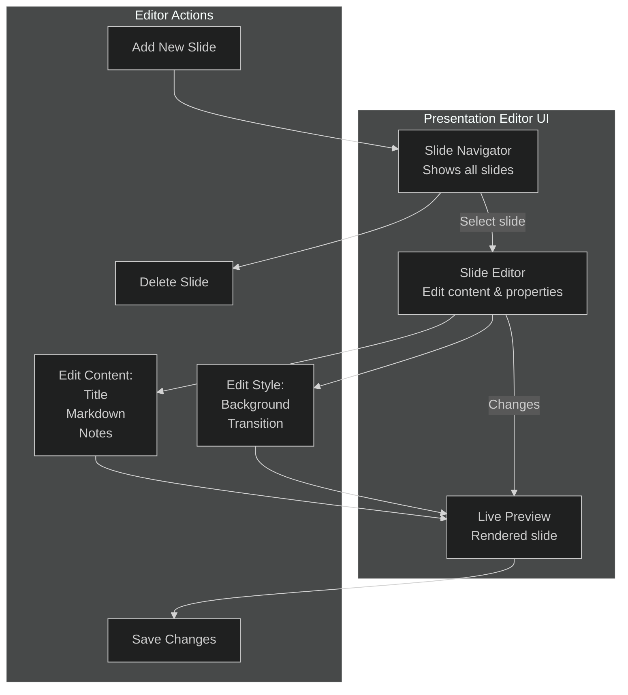

# FsReveal Integration

## Introduction

This document details the integration of FsReveal into the FlightDeck architecture to provide dynamic presentation capabilities. FsReveal allows you to create beautiful, web-based presentations using F# and leverages the reveal.js framework for the actual presentation display. By integrating FsReveal into FlightDeck, we can create, manage, and deliver presentations directly from our platform, maintaining a fully F# stack while providing rich presentation features.

## Architectural Overview

The FsReveal integration fits into the FlightDeck architecture as follows:



## Integration Strategy

### Core Components

1. **FsReveal Engine**: Adapted version of FsReveal library for use within FlightDeck
2. **Presentation Domain Model**: Extended domain model for presentations and slides
3. **Presentation Storage**: Persistence layer for presentation content
4. **Presentation Editor**: Interactive editor built with Oxpecker.Solid
5. **Presentation Viewer**: Integrated reveal.js viewer

## Implementation Guide

### Domain Model Extension

Extend the shared domain model to support presentations:

```fsharp
// FlightDeck.Shared/Domain.fs - Add presentation types
module FlightDeck.Shared.Domain

open System

// Existing types...

// Presentation types
type SlideId = string
type PresentationId = string

type SlideContent =
    | Text of string
    | Markdown of string
    | Code of string * language:string
    | Image of url:string * alt:string

type SlideStyle = {
    Background: string option
    Transition: string option
    CustomClasses: string list
}

type Slide = {
    Id: SlideId
    Title: string option
    Content: SlideContent list
    Notes: string option
    Order: int
    Style: SlideStyle
}

type PresentationStyle = {
    Theme: string
    Transition: string
    BackgroundColor: string option
    CustomCss: string option
}

type Presentation = {
    Id: PresentationId
    Title: string
    Description: string option
    Author: string
    CreatedAt: DateTime
    UpdatedAt: DateTime
    Slides: Slide list
    Style: PresentationStyle
    IsPublic: bool
}
```

### FsReveal Engine Adaptation

Create a custom FsReveal engine for FlightDeck:

```fsharp
// FlightDeck.Core/Presentations/FsRevealEngine.fs
module FlightDeck.Core.Presentations.FsRevealEngine

open System
open System.IO
open FSharp.Formatting.Markdown
open FlightDeck.Shared.Domain

// Parse Markdown content
let parseMarkdown (markdown: string) =
    Markdown.Parse(markdown)

// Render Markdown to HTML
let renderMarkdown (markdown: string) =
    let parsedMarkdown = parseMarkdown markdown
    Markdown.ToHtml(parsedMarkdown)

// Convert SlideContent to HTML
let renderSlideContent (content: SlideContent) =
    match content with
    | Text text -> $"<p>{text}</p>"
    | Markdown md -> renderMarkdown md
    | Code (code, language) -> 
        $"""<pre><code class="language-{language}">{code}</code></pre>"""
    | Image (url, alt) -> 
        $""""""

// Generate slide HTML
let generateSlideHtml (slide: Slide) =
    let contentHtml = 
        slide.Content
        |> List.map renderSlideContent
        |> String.concat "\n"
        
    let titleHtml =
        match slide.Title with
        | Some title -> $"<h2>{title}</h2>"
        | None -> ""
        
    let notesHtml =
        match slide.Notes with
        | Some notes -> $"<aside class=\"notes\">{notes}</aside>"
        | None -> ""
        
    let backgroundAttr =
        match slide.Style.Background with
        | Some bg -> $"data-background=\"{bg}\""
        | None -> ""
        
    let transitionAttr =
        match slide.Style.Transition with
        | Some transition -> $"data-transition=\"{transition}\""
        | None -> ""
        
    let classAttr =
        if slide.Style.CustomClasses.Length > 0 then
            $"class=\"{String.concat " " slide.Style.CustomClasses}\""
        else
            ""
    
    $"""<section id="{slide.Id}" {backgroundAttr} {transitionAttr} {classAttr}>
        {titleHtml}
        {contentHtml}
        {notesHtml}
    </section>"""

// Generate complete presentation HTML
let generatePresentationHtml (presentation: Presentation) =
    let slidesHtml = 
        presentation.Slides
        |> List.sortBy (fun s -> s.Order)
        |> List.map generateSlideHtml
        |> String.concat "\n"
        
    let customCss =
        match presentation.Style.CustomCss with
        | Some css -> $"<style>{css}</style>"
        | None -> ""
        
    $"""<!DOCTYPE html>
    <html>
    <head>
        <meta charset="utf-8">
        <meta name="viewport" content="width=device-width, initial-scale=1.0">
        <title>{presentation.Title}</title>
        <link rel="stylesheet" href="/lib/reveal.js/dist/reveal.css">
        <link rel="stylesheet" href="/lib/reveal.js/dist/theme/{presentation.Style.Theme}.css">
        <link rel="stylesheet" href="/lib/reveal.js/plugin/highlight/monokai.css">
        {customCss}
    </head>
    <body>
        <div class="reveal">
            <div class="slides">
                {slidesHtml}
            </div>
        </div>
        <script src="/lib/reveal.js/dist/reveal.js"></script>
        <script src="/lib/reveal.js/plugin/notes/notes.js"></script>
        <script src="/lib/reveal.js/plugin/markdown/markdown.js"></script>
        <script src="/lib/reveal.js/plugin/highlight/highlight.js"></script>
        <script>
            Reveal.initialize({
                hash: true,
                transition: '{presentation.Style.Transition}',
                backgroundTransition: 'fade',
                plugins: [ RevealMarkdown, RevealHighlight, RevealNotes ]
            });
        </script>
    </body>
    </html>"""

// Convert Presentation to FsReveal format
let toPresentationFile (presentation: Presentation) =
    let header = 
        $"""---
        title: {presentation.Title}
        description: {presentation.Description |> Option.defaultValue ""}
        author: {presentation.Author}
        theme: {presentation.Style.Theme}
        transition: {presentation.Style.Transition}
        ---
        """
        
    let slides =
        presentation.Slides
        |> List.sortBy (fun s -> s.Order)
        |> List.map (fun slide ->
            let slideHeader =
                match slide.Title with
                | Some title -> $"# {title}"
                | None -> ""
                
            let slideContent =
                slide.Content
                |> List.map (function
                    | Text t -> t
                    | Markdown md -> md
                    | Code (code, lang) -> 
                        $"""```{lang}
                        {code}
                        ```"""
                    | Image (url, alt) -> $"")
                |> String.concat "\n\n"
                
            let slideNotes =
                match slide.Notes with
                | Some notes -> $"Note: {notes}"
                | None -> ""
                
            let slideAttrs =
                [
                    match slide.Style.Background with
                    | Some bg -> $"data-background=\"{bg}\""
                    | None -> ()
                    
                    match slide.Style.Transition with
                    | Some transition -> $"data-transition=\"{transition}\""
                    | None -> ()
                    
                    if slide.Style.CustomClasses.Length > 0 then
                        $"class=\"{String.concat " " slide.Style.CustomClasses}\""
                ]
                |> String.concat " "
                |> fun attrs -> if attrs.Length > 0 then $" {{{attrs}}}" else ""
                
            $"{slideHeader}{slideAttrs}\n\n{slideContent}\n\n{slideNotes}\n\n---"
        )
        |> String.concat "\n\n"
    
    header.TrimStart() + "\n\n" + slides

// Convert FsReveal format to Presentation
let fromPresentationFile (content: string) (id: PresentationId) (author: string) =
    // Simple parser for FsReveal markdown
    let lines = content.Split('\n', StringSplitOptions.RemoveEmptyEntries)
    
    // Extract header section
    let headerEndIndex = Array.findIndex (fun (line: string) -> line.Trim() = "---") lines
    let headerSection = lines.[1..headerEndIndex-1] |> Array.map (fun s -> s.Trim())
    
    // Parse header metadata
    let title = 
        headerSection 
        |> Array.tryFind (fun line -> line.StartsWith("title:"))
        |> Option.map (fun line -> line.Substring("title:".Length).Trim())
        |> Option.defaultValue "Untitled Presentation"
        
    let description =
        headerSection
        |> Array.tryFind (fun line -> line.StartsWith("description:"))
        |> Option.map (fun line -> line.Substring("description:".Length).Trim())
        
    let theme =
        headerSection
        |> Array.tryFind (fun line -> line.StartsWith("theme:"))
        |> Option.map (fun line -> line.Substring("theme:".Length).Trim())
        |> Option.defaultValue "black"
        
    let transition =
        headerSection
        |> Array.tryFind (fun line -> line.StartsWith("transition:"))
        |> Option.map (fun line -> line.Substring("transition:".Length).Trim())
        |> Option.defaultValue "slide"
    
    // Split content into slides
    let slideDelimiter = "---"
    let contentSection = content.Substring(content.IndexOf(slideDelimiter, content.IndexOf(slideDelimiter) + 3) + slideDelimiter.Length)
    let slideContents = contentSection.Split(slideDelimiter, StringSplitOptions.RemoveEmptyEntries)
    
    // Parse slides
    let slides =
        slideContents
        |> Array.mapi (fun i slideContent ->
            let slideLines = slideContent.Split('\n', StringSplitOptions.RemoveEmptyEntries)
            
            // Extract title (first line starting with #)
            let title =
                slideLines
                |> Array.tryFind (fun line -> line.TrimStart().StartsWith("# "))
                |> Option.map (fun line -> 
                    let titleLine = line.TrimStart().Substring(2).Trim()
                    // Remove attributes if present
                    if titleLine.Contains("{") then
                        titleLine.Substring(0, titleLine.IndexOf("{")).Trim()
                    else
                        titleLine
                )
            
            // Extract slide attributes
            let attributes =
                slideLines
                |> Array.tryPick (fun line -> 
                    if line.Contains("{") && line.Contains("}") then
                        let start = line.IndexOf("{")
                        let last = line.LastIndexOf("}")
                        Some (line.Substring(start + 1, last - start - 1))
                    else
                        None
                )
                |> Option.defaultValue ""
            
            // Parse background
            let background =
                if attributes.Contains("data-background") then
                    let startIndex = attributes.IndexOf("data-background=\"") + "data-background=\"".Length
                    let endIndex = attributes.IndexOf("\"", startIndex)
                    Some (attributes.Substring(startIndex, endIndex - startIndex))
                else
                    None
            
            // Parse transition
            let slideTransition =
                if attributes.Contains("data-transition") then
                    let startIndex = attributes.IndexOf("data-transition=\"") + "data-transition=\"".Length
                    let endIndex = attributes.IndexOf("\"", startIndex)
                    Some (attributes.Substring(startIndex, endIndex - startIndex))
                else
                    None
            
            // Parse custom classes
            let customClasses =
                if attributes.Contains("class=\"") then
                    let startIndex = attributes.IndexOf("class=\"") + "class=\"".Length
                    let endIndex = attributes.IndexOf("\"", startIndex)
                    attributes.Substring(startIndex, endIndex - startIndex).Split(' ', StringSplitOptions.RemoveEmptyEntries)
                    |> List.ofArray
                else
                    []
            
            // Extract notes
            let notes =
                slideLines
                |> Array.tryFind (fun line -> line.TrimStart().StartsWith("Note:"))
                |> Option.map (fun line -> line.Substring(line.IndexOf("Note:") + 5).Trim())
            
            // Extract content (everything except title, attributes, and notes)
            let content =
                slideLines
                |> Array.filter (fun line -> 
                    not (line.TrimStart().StartsWith("# ")) && 
                    not (line.Contains("Note:")) &&
                    not (line.Contains("{") && line.Contains("}")))
                |> String.concat "\n"
                |> fun s -> Markdown s
            
            {
                Id = Guid.NewGuid().ToString()
                Title = title
                Content = [content]
                Notes = notes
                Order = i
                Style = {
                    Background = background
                    Transition = slideTransition
                    CustomClasses = customClasses
                }
            }
        )
        |> List.ofArray
    
    let now = DateTime.UtcNow
    
    {
        Id = id
        Title = title
        Description = description
        Author = author
        CreatedAt = now
        UpdatedAt = now
        Slides = slides
        Style = {
            Theme = theme
            Transition = transition
            BackgroundColor = None
            CustomCss = None
        }
        IsPublic = false
    }

// Export presentation as PDF (using headless browser)
let exportToPdf (presentation: Presentation) (outputPath: string) =
    // This would require integration with a headless browser
    // For example, using Puppeteer or Playwright
    failwith "Not implemented"

// Export presentation as standalone HTML
let exportToStandaloneHtml (presentation: Presentation) (outputPath: string) =
    let html = generatePresentationHtml presentation
    File.WriteAllText(outputPath, html)
```

### Presentation Storage

Create a storage service for presentations:

```fsharp
// FlightDeck.Core/Presentations/PresentationStorage.fs
module FlightDeck.Core.Presentations.PresentationStorage

open System
open System.IO
open System.Text.Json
open System.Threading.Tasks
open FlightDeck.Shared.Domain

// Storage provider for presentations
type IPresentationStorage =
    abstract member GetPresentation: PresentationId -> Task<Presentation option>
    abstract member GetAllPresentations: unit -> Task<Presentation list>
    abstract member SavePresentation: Presentation -> Task<unit>
    abstract member DeletePresentation: PresentationId -> Task<bool>

// File-based implementation
type FilePresentationStorage(storageDir: string) =
    
    do 
        if not (Directory.Exists storageDir) then
            Directory.CreateDirectory storageDir |> ignore
    
    let getPresentationPath id = Path.Combine(storageDir, $"{id}.json")
    let getFsRevealPath id = Path.Combine(storageDir, $"{id}.md")
    
    interface IPresentationStorage with
        member _.GetPresentation(id) = task {
            let path = getPresentationPath id
            if File.Exists path then
                let! content = File.ReadAllTextAsync(path)
                return JsonSerializer.Deserialize<Presentation>(content) |> Some
            else
                return None
        }
                
        member _.GetAllPresentations() = task {
            let files = Directory.GetFiles(storageDir, "*.json")
            
            let! results = files 
                         |> Array.map (fun path -> task {
                             try 
                                 let! content = File.ReadAllTextAsync(path)
                                 return JsonSerializer.Deserialize<Presentation>(content) |> Some
                             with _ -> 
                                 return None
                         })
                         |> Task.WhenAll
                         
            return results 
                   |> Array.choose id
                   |> Array.toList
        }
                
        member _.SavePresentation(presentation) = task {
            let jsonPath = getPresentationPath presentation.Id
            let fsRevealPath = getFsRevealPath presentation.Id
            
            // Save JSON format for our application
            let json = JsonSerializer.Serialize(presentation, JsonSerializerOptions(WriteIndented = true))
            do! File.WriteAllTextAsync(jsonPath, json)
            
            // Also save in FsReveal format for potential external use
            let fsRevealContent = FsRevealEngine.toPresentationFile presentation
            do! File.WriteAllTextAsync(fsRevealPath, fsRevealContent)
        }
                
        member _.DeletePresentation(id) = task {
            let jsonPath = getPresentationPath id
            let fsRevealPath = getFsRevealPath id
            
            let jsonExists = File.Exists jsonPath
            let fsRevealExists = File.Exists fsRevealPath
            
            if jsonExists then File.Delete jsonPath
            if fsRevealExists then File.Delete fsRevealPath
            
            return jsonExists || fsRevealExists
        }
```

### Presentation Service

Create a service to handle presentation logic:

```fsharp
// FlightDeck.Core/Presentations/PresentationService.fs
module FlightDeck.Core.Presentations.PresentationService

open System
open System.Threading.Tasks
open FlightDeck.Shared.Domain
open FlightDeck.Core.Presentations.PresentationStorage

// Presentation service interface
type IPresentationService =
    abstract member GetPresentation: PresentationId -> Task<Presentation option>
    abstract member GetAllPresentations: unit -> Task<Presentation list>
    abstract member CreatePresentation: string -> string -> string option -> Task<Presentation>
    abstract member UpdatePresentation: Presentation -> Task<Presentation option>
    abstract member DeletePresentation: PresentationId -> Task<bool>
    abstract member ImportFromFsReveal: string -> string -> Task<Presentation>
    abstract member ExportToPdf: PresentationId -> string -> Task<bool>
    abstract member ExportToStandaloneHtml: PresentationId -> string -> Task<bool>

// Implementation
type PresentationService(storage: IPresentationStorage) =
    
    interface IPresentationService with
        member _.GetPresentation(id) =
            storage.GetPresentation(id)
            
        member _.GetAllPresentations() =
            storage.GetAllPresentations()
            
        member _.CreatePresentation(title, author, description) = task {
            let id = Guid.NewGuid().ToString()
            let now = DateTime.UtcNow
            
            let presentation = {
                Id = id
                Title = title
                Description = description
                Author = author
                CreatedAt = now
                UpdatedAt = now
                Slides = [
                    {
                        Id = Guid.NewGuid().ToString()
                        Title = Some "Title Slide"
                        Content = [Markdown $"## {title}\n\nBy {author}"]
                        Notes = None
                        Order = 0
                        Style = {
                            Background = None
                            Transition = None
                            CustomClasses = []
                        }
                    }
                ]
                Style = {
                    Theme = "black"
                    Transition = "slide"
                    BackgroundColor = None
                    CustomCss = None
                }
                IsPublic = false
            }
            
            do! storage.SavePresentation(presentation)
            return presentation
        }
            
        member _.UpdatePresentation(presentation) = task {
            // Check if presentation exists
            let! existingPresentationOpt = storage.GetPresentation(presentation.Id)
            
            match existingPresentationOpt with
            | Some existingPresentation ->
                // Update timestamp
                let updatedPresentation = { 
                    presentation with 
                        UpdatedAt = DateTime.UtcNow 
                        CreatedAt = existingPresentation.CreatedAt
                }
                
                do! storage.SavePresentation(updatedPresentation)
                return Some updatedPresentation
                
            | None ->
                return None
        }
                
        member _.DeletePresentation(id) =
            storage.DeletePresentation(id)
            
        member _.ImportFromFsReveal(content, author) = task {
            let id = Guid.NewGuid().ToString()
            let presentation = FsRevealEngine.fromPresentationFile content id author
            
            do! storage.SavePresentation(presentation)
            return presentation
        }
            
        member _.ExportToPdf(id, outputPath) = task {
            let! presentationOpt = storage.GetPresentation(id)
            
            match presentationOpt with
            | Some presentation ->
                try
                    FsRevealEngine.exportToPdf presentation outputPath
                    return true
                with _ ->
                    return false
                    
            | None ->
                return false
        }
                
        member _.ExportToStandaloneHtml(id, outputPath) = task {
            let! presentationOpt = storage.GetPresentation(id)
            
            match presentationOpt with
            | Some presentation ->
                try
                    FsRevealEngine.exportToStandaloneHtml presentation outputPath
                    return true
                with _ ->
                    return false
                    
            | None ->
                return false
        }
```

### Oxpecker API Handlers

Create HTTP handlers for presentation management:

```fsharp
// FlightDeck.Server/Handlers/PresentationHandlers.fs
module FlightDeck.Server.Handlers.PresentationHandlers

open System.IO
open Oxpecker
open FlightDeck.Shared.Domain
open FlightDeck.Shared.Contracts
open FlightDeck.Core.Presentations.PresentationService
open FlightDeck.Server.Views

// List presentations
let listPresentations : HttpHandler =
    fun ctx -> task {
        let presentationService = ctx.GetService<IPresentationService>()
        let! presentations = presentationService.GetAllPresentations()
        
        // Convert to response type
        let response = 
            presentations
            |> List.map (fun p ->
                {
                    Id = p.Id
                    Title = p.Title
                    Description = p.Description
                    Author = p.Author
                    CreatedAt = p.CreatedAt.ToString("o")
                    UpdatedAt = p.UpdatedAt.ToString("o")
                    SlideCount = p.Slides.Length
                    Theme = p.Style.Theme
                    IsPublic = p.IsPublic
                })
        
        return! Views.presentationList response ctx
    }

// View presentation
let viewPresentation : HttpHandler =
    routef (fun id ctx -> task {
        let presentationService = ctx.GetService<IPresentationService>()
        
        let! presentationOpt = presentationService.GetPresentation(id)
        
        match presentationOpt with
        | Some presentation ->
            // Use the FsReveal engine to generate HTML
            let presentationHtml = FsRevealEngine.generatePresentationHtml presentation
            
            // Return raw HTML - this bypasses our normal layout
            return! htmlString presentationHtml ctx
            
        | None ->
            return! (setStatusCode 404 >=> Error.notFound) ctx
    })

// Create presentation
let createPresentation : HttpHandler =
    bindJson<CreatePresentationRequest> (fun request ctx -> task {
        let presentationService = ctx.GetService<IPresentationService>()
        
        let! presentation = 
            presentationService.CreatePresentation(
                request.Title, 
                request.Author |> Option.defaultValue "Anonymous", 
                request.Description)
        
        // Convert to response
        let response: PresentationResponse = {
            Id = presentation.Id
            Title = presentation.Title
            Description = presentation.Description
            Author = presentation.Author
            CreatedAt = presentation.CreatedAt.ToString("o")
            UpdatedAt = presentation.UpdatedAt.ToString("o")
            Slides = []  // Don't include slides in list response
            Theme = presentation.Style.Theme
            IsPublic = presentation.IsPublic
        }
        
        return! json response ctx
    })

// Edit presentation interface
let editPresentation : HttpHandler =
    routef (fun id ctx -> task {
        let presentationService = ctx.GetService<IPresentationService>()
        
        let! presentationOpt = presentationService.GetPresentation(id)
        
        match presentationOpt with
        | Some presentation ->
            // Convert to JSON for initial state
            let serialized = System.Text.Json.JsonSerializer.Serialize(presentation)
            
            return! Views.presentationEditor presentation serialized ctx
            
        | None ->
            return! (setStatusCode 404 >=> Error.notFound) ctx
    })

// Update presentation
let updatePresentation : HttpHandler =
    bindJson<UpdatePresentationRequest> (fun request ctx -> task {
        let presentationService = ctx.GetService<IPresentationService>()
        
        // Check if presentation exists
        let! existingPresentationOpt = presentationService.GetPresentation(request.Id)
        
        match existingPresentationOpt with
        | Some existingPresentation ->
            // Update fields from request
            let updatedPresentation = {
                existingPresentation with
                    Title = request.Title |> Option.defaultValue existingPresentation.Title
                    Description = 
                        match request.Description with
                        | Some (Some desc) -> Some desc
                        | Some None -> None
                        | None -> existingPresentation.Description
                    Style = {
                        existingPresentation.Style with
                            Theme = request.Theme |> Option.defaultValue existingPresentation.Style.Theme
                            Transition = request.Transition |> Option.defaultValue existingPresentation.Style.Transition
                    }
                    IsPublic = request.IsPublic |> Option.defaultValue existingPresentation.IsPublic
            }
            
            // Update in storage
            let! updatedPresentationOpt = presentationService.UpdatePresentation(updatedPresentation)
            
            match updatedPresentationOpt with
            | Some updated ->
                // Convert to response
                let response: ApiResponse<PresentationResponse> = {
                    Success = true
                    Data = Some {
                        Id = updated.Id
                        Title = updated.Title
                        Description = updated.Description
                        Author = updated.Author
                        CreatedAt = updated.CreatedAt.ToString("o")
                        UpdatedAt = updated.UpdatedAt.ToString("o")
                        Slides = 
                            updated.Slides
                            |> List.map (fun s -> {
                                Id = s.Id
                                Title = s.Title
                                Content = s.Content
                                Notes = s.Notes
                                Order = s.Order
                            })
                        Theme = updated.Style.Theme
                        IsPublic = updated.IsPublic
                    }
                    Errors = None
                }
                
                return! json response ctx
                
            | None ->
                let errorResponse: ApiResponse<PresentationResponse> = {
                    Success = false
                    Data = None
                    Errors = Some [{
                        Type = ApiErrorType.ServerError
                        Message = "Failed to update presentation"
                        Details = None
                    }]
                }
                
                return! (setStatusCode 500 >=> json errorResponse) ctx
                
        | None ->
            let errorResponse: ApiResponse<PresentationResponse> = {
                Success = false
                Data = None
                Errors = Some [{
                    Type = ApiErrorType.NotFoundError
                    Message = "Presentation not found"
                    Details = None
                }]
            }
            
            return! (setStatusCode 404 >=> json errorResponse) ctx
    })

// Delete presentation
let deletePresentation : HttpHandler =
    routef (fun id ctx -> task {
        let presentationService = ctx.GetService<IPresentationService>()
        
        let! success = presentationService.DeletePresentation(id)
        
        if success then
            return! json {| success = true |} ctx
        else
            return! (setStatusCode 404 >=> json {| success = false; error = "Presentation not found" |}) ctx
    })

// Export presentation as PDF
let exportPresentationPdf : HttpHandler =
    routef (fun id ctx -> task {
        let presentationService = ctx.GetService<IPresentationService>()
        
        // Create temporary file path
        let tempFile = Path.GetTempFileName() + ".pdf"
        
        let! success = presentationService.ExportToPdf(id, tempFile)
        
        if success then
            // Send file to client
            return! ctx |> (
                setHttpHeader "Content-Disposition" $"attachment; filename=\"presentation_{id}.pdf\""
                >=> streamFile false tempFile "application/pdf"
            )
        else
            return! (setStatusCode 404 >=> json {| success = false; error = "Presentation not found or export failed" |}) ctx
    })

// Export presentation as standalone HTML
let exportPresentationHtml : HttpHandler =
    routef (fun id ctx -> task {
        let presentationService = ctx.GetService<IPresentationService>()
        
        // Create temporary file path
        let tempFile = Path.GetTempFileName() + ".html"
        
        let! success = presentationService.ExportToStandaloneHtml(id, tempFile)
        
        if success then
            // Send file to client
            return! ctx |> (
                setHttpHeader "Content-Disposition" $"attachment; filename=\"presentation_{id}.html\""
                >=> streamFile false tempFile "text/html"
            )
        else
            return! (setStatusCode 404 >=> json {| success = false; error = "Presentation not found or export failed" |}) ctx
    })

// Import presentation from FsReveal format
let importPresentation : HttpHandler =
    bindForm<ImportPresentationRequest> (fun request ctx -> task {
        let presentationService = ctx.GetService<IPresentationService>()
        
        try
            let! presentation = presentationService.ImportFromFsReveal(request.Content, request.Author)
            
            // Convert to response
            let response: ApiResponse<PresentationResponse> = {
                Success = true
                Data = Some {
                    Id = presentation.Id
                    Title = presentation.Title
                    Description = presentation.Description
                    Author = presentation.Author
                    CreatedAt = presentation.CreatedAt.ToString("o")
                    UpdatedAt = presentation.UpdatedAt.ToString("o")
                    Slides = 
                        presentation.Slides
                        |> List.map (fun s -> {
                            Id = s.Id
                            Title = s.Title
                            Content = s.Content
                            Notes = s.Notes
                            Order = s.Order
                        })
                    Theme = presentation.Style.Theme
                    IsPublic = presentation.IsPublic
                }
                Errors = None
            }
            
            return! json response ctx
        with ex ->
            let errorResponse: ApiResponse<PresentationResponse> = {
                Success = false
                Data = None
                Errors = Some [{
                    Type = ApiErrorType.ValidationError
                    Message = "Failed to import presentation"
                    Details = Some [ex.Message]
                }]
            }
            
            return! (setStatusCode 400 >=> json errorResponse) ctx
    })
```

### View Templates

Create view templates for the presentation UI:

```fsharp
// FlightDeck.Server/Views/PresentationViews.fs
module FlightDeck.Server.Views.PresentationViews

open Oxpecker.ViewEngine
open FlightDeck.Shared.Domain
open FlightDeck.Shared.Contracts

// Presentation list view
let presentationList (presentations: PresentationListItem list) =
    masterLayout "Presentations" [
        div [ _class "presentation-header" ] [
            h1 [] [ rawText "Presentations" ]
            div [ _class "actions" ] [
                a [ 
                    _href "/presentations/create"
                    _class "button primary" 
                ] [ rawText "Create New Presentation" ]
                
                a [ 
                    _href "/presentations/import"
                    _class "button secondary" 
                ] [ rawText "Import" ]
            ]
        ]
        
        div [ _class "presentation-list" ] [
            if presentations.Length = 0 then
                div [ _class "empty-state" ] [
                    p [] [ rawText "No presentations yet. Create your first one!" ]
                ]
            else
                div [ _class "presentation-grid" ] [
                    for p in presentations do
                        div [ _class "presentation-card" ] [
                            div [ _class "card-header" ] [
                                h3 [] [ rawText p.Title ]
                            ]
                            
                            div [ _class "card-body" ] [
                                p [ _class "description" ] [ 
                                    rawText (p.Description |> Option.defaultValue "No description") 
                                ]
                                
                                div [ _class "meta" ] [
                                    span [ _class "slides" ] [ 
                                        rawText $"{p.SlideCount} slides" 
                                    ]
                                    
                                    span [ _class "author" ] [ 
                                        rawText $"By {p.Author}" 
                                    ]
                                    
                                    span [ _class "date" ] [ 
                                        rawText (
                                            try
                                                let date = System.DateTime.Parse(p.UpdatedAt)
                                                date.ToString("MMM d, yyyy")
                                            with _ ->
                                                p.UpdatedAt
                                        )
                                    ]
                                ]
                            ]
                            
                            div [ _class "card-footer" ] [
                                a [ 
                                    _href $"/presentations/{p.Id}"
                                    _class "button view" 
                                    _target "_blank"
                                ] [ rawText "View" ]
                                
                                a [ 
                                    _href $"/presentations/{p.Id}/edit"
                                    _class "button edit" 
                                ] [ rawText "Edit" ]
                                
                                div [ _class "dropdown" ] [
                                    button [ 
                                        _class "button more"
                                        _type "button"
                                    ] [ rawText "⋮" ]
                                    
                                    div [ _class "dropdown-content" ] [
                                        a [ 
                                            _href $"/presentations/{p.Id}/export/pdf"
                                        ] [ rawText "Export as PDF" ]
                                        
                                        a [ 
                                            _href $"/presentations/{p.Id}/export/html"
                                        ] [ rawText "Export as HTML" ]
                                        
                                        button [ 
                                            _class "delete-button"
                                            attr "data-presentation-id" p.Id
                                        ] [ rawText "Delete" ]
                                    ]
                                ]
                            ]
                        ]
                ]
        ]
        
        // Mount Oxpecker.Solid component for interactivity
        div [ 
            _id "presentation-app"
            attr "data-initial-data" (System.Text.Json.JsonSerializer.Serialize(presentations))
        ] []
        
        // Add reactive script
        script [
            _src "/js/presentations.js"
            _type "module"
            _defer
        ] []
    ]
    |> htmlView

// Presentation editor view
let presentationEditor (presentation: Presentation) (initialData: string) =
    masterLayout $"Editing: {presentation.Title}" [
        div [ _class "editor-header" ] [
            h1 [] [ rawText $"Editing: {presentation.Title}" ]
            div [ _class "actions" ] [
                a [ 
                    _href "/presentations"
                    _class "button secondary" 
                ] [ rawText "Back to Presentations" ]
                
                a [ 
                    _href $"/presentations/{presentation.Id}"
                    _class "button primary"
                    _target "_blank"
                ] [ rawText "View Presentation" ]
            ]
        ]
        
        // Editor container - will be replaced by Oxpecker.Solid
        div [ 
            _id "presentation-editor"
            attr "data-presentation-id" presentation.Id
            attr "data-initial-data" initialData
        ] []
        
        // Add reactive script
        script [
            _src "/js/presentation-editor.js"
            _type "module"
            _defer
        ] []
    ]
    |> htmlView

// Import presentation view
let importPresentation() =
    masterLayout "Import Presentation" [
        div [ _class "import-header" ] [
            h1 [] [ rawText "Import Presentation" ]
            div [ _class "actions" ] [
                a [ 
                    _href "/presentations"
                    _class "button secondary" 
                ] [ rawText "Back to Presentations" ]
            ]
        ]
        
        // Import form
        form [ 
            _id "import-form"
            _action "/api/presentations/import"
            _method "post"
        ] [
            div [ _class "form-group" ] [
                label [ _for "author" ] [ rawText "Author" ]
                input [ 
                    _id "author"
                    _name "author"
                    _type "text"
                    _required
                ]
            ]
            
            div [ _class "form-group" ] [
                label [ _for "content" ] [ rawText "FsReveal Content" ]
                textarea [ 
                    _id "content"
                    _name "content"
                    _rows 20
                    _required
                ] []
                div [ _class "form-help" ] [
                    rawText "Paste FsReveal markdown content here. Format should include frontmatter and slides."
                ]
            ]
            
            div [ _class "form-actions" ] [
                button [ 
                    _type "submit"
                    _class "button primary" 
                ] [ rawText "Import" ]
            ]
        ]
        
        // Mount Oxpecker.Solid component for interactivity
        div [ _id "import-app" ] []
        
        // Add reactive script
        script [
            _src "/js/presentation-import.js"
            _type "module"
            _defer
        ] []
    ]
    |> htmlView
```

### Editor Component

Create an Oxpecker.Solid component for the presentation editor:

```fsharp
// FlightDeck.Client/Pages/PresentationEditor.fs
module FlightDeck.Client.Pages.PresentationEditor

open Oxpecker.Solid
open Browser.Dom
open FlightDeck.Shared.Domain
open FlightDeck.Shared.Contracts
open FlightDeck.Client.Components
open FlightDeck.Client.Api

// Presentation editor page
let PresentationEditorPage() =
    // Parse initial data from DOM
    let editorElement = document.getElementById("presentation-editor")
    let presentationId = editorElement.getAttribute("presentation-id")
    let initialData = editorElement.getAttribute("initial-data")
    
    // Parse the initial presentation data
    let initialPresentation = 
        try
            Some (System.Text.Json.JsonSerializer.Deserialize<Presentation>(initialData))
        with _ ->
            None
    
    // State
    let (presentation, setPresentation) = createSignal(initialPresentation)
    let (activeSlideId, setActiveSlideId) = createSignal(
        initialPresentation
        |> Option.bind (fun p -> p.Slides |> List.tryHead)
        |> Option.map (fun s -> s.Id)
        |> Option.defaultValue ""
    )
    let (isSaving, setIsSaving) = createSignal(false)
    let (saveError, setSaveError) = createSignal(None: string option)
    
    // Save presentation
    let savePresentation() =
        match presentation() with
        | Some p ->
            setIsSaving(true)
            setSaveError(None)
            
            async {
                try
                    let request: UpdatePresentationRequest = {
                        Id = p.Id
                        Title = Some p.Title
                        Description = Some p.Description
                        Theme = Some p.Style.Theme
                        Transition = Some p.Style.Transition
                        IsPublic = Some p.IsPublic
                        Slides = 
                            p.Slides
                            |> List.map (fun slide -> {
                                Id = slide.Id
                                Title = slide.Title
                                Content = slide.Content
                                Notes = slide.Notes
                                Order = slide.Order
                                Background = slide.Style.Background
                                Transition = slide.Style.Transition
                                CustomClasses = slide.Style.CustomClasses
                            })
                            |> Some
                    }
                    
                    let! response = Api.updatePresentation request
                    
                    if response.Success && response.Data.IsSome then
                        // Update with saved data
                        setPresentation(Some {
                            p with
                                UpdatedAt = System.DateTime.Parse(response.Data.Value.UpdatedAt)
                        })
                    else
                        let errorMsg = 
                            response.Errors 
                            |> Option.bind (fun errs -> errs |> List.tryHead) 
                            |> Option.map (fun err -> err.Message)
                            |> Option.defaultValue "Failed to save presentation"
                            
                        setSaveError(Some errorMsg)
                with ex ->
                    setSaveError(Some ex.Message)
                
                setIsSaving(false)
            } |> Async.StartImmediate
        | None ->
            setSaveError(Some "No presentation data to save")
    
    // Add a new slide
    let addSlide() =
        match presentation() with
        | Some p ->
            let newSlide = {
                Id = System.Guid.NewGuid().ToString()
                Title = Some "New Slide"
                Content = [Markdown "Add your content here"]
                Notes = None
                Order = p.Slides.Length
                Style = {
                    Background = None
                    Transition = None
                    CustomClasses = []
                }
            }
            
            let updatedPresentation = {
                p with
                    Slides = p.Slides @ [newSlide]
            }
            
            setPresentation(Some updatedPresentation)
            setActiveSlideId(newSlide.Id)
            
            // Save after adding slide
            savePresentation()
            
        | None ->
            ()
    
    // Update a slide
    let updateSlide (slideId: string) (updateFn: Slide -> Slide) =
        match presentation() with
        | Some p ->
            let updatedSlides =
                p.Slides
                |> List.map (fun slide ->
                    if slide.Id = slideId then updateFn slide else slide
                )
                
            setPresentation(Some { p with Slides = updatedSlides })
            
        | None ->
            ()
    
    // Delete a slide
    let deleteSlide (slideId: string) =
        match presentation() with
        | Some p ->
            let slideIndex = p.Slides |> List.findIndex (fun s -> s.Id = slideId)
            let updatedSlides = p.Slides |> List.filter (fun s -> s.Id <> slideId)
            
            // Update slide order
            let reorderedSlides =
                updatedSlides
                |> List.mapi (fun i s -> { s with Order = i })
                
            let updatedPresentation = { p with Slides = reorderedSlides }
            setPresentation(Some updatedPresentation)
            
            // Set active slide
            if p.Slides.Length > 1 then
                let newActiveIndex = min slideIndex (updatedSlides.Length - 1)
                let newActiveSlide = updatedSlides.[newActiveIndex]
                setActiveSlideId(newActiveSlide.Id)
            
            // Save after deleting slide
            savePresentation()
            
        | None ->
            ()
    
    // Render
    div [ class' "presentation-editor" ] [
        // Editor toolbar
        div [ class' "editor-toolbar" ] [
            // Save button
            button [
                class' "save-button"
                disabled (isSaving())
                onClick (fun _ -> savePresentation())
            ] [
                Show(isSaving(), fun () ->
                    text "Saving..."
                , fun () ->
                    text "Save"
                )
            ]
            
            // Theme selector
            div [ class' "theme-selector" ] [
                label [ for' "theme" ] [ text "Theme:" ]
                select [
                    id "theme"
                    onChange (fun e -> 
                        let theme = e.target?value
                        match presentation() with
                        | Some p ->
                            setPresentation(Some { 
                                p with 
                                    Style = { p.Style with Theme = theme } 
                            })
                        | None -> ()
                    )
                    value (presentation() |> Option.map (fun p -> p.Style.Theme) |> Option.defaultValue "black")
                ] [
                    option [ value "black" ] [ text "Black" ]
                    option [ value "white" ] [ text "White" ]
                    option [ value "league" ] [ text "League" ]
                    option [ value "beige" ] [ text "Beige" ]
                    option [ value "sky" ] [ text "Sky" ]
                    option [ value "night" ] [ text "Night" ]
                    option [ value "serif" ] [ text "Serif" ]
                    option [ value "simple" ] [ text "Simple" ]
                    option [ value "solarized" ] [ text "Solarized" ]
                    option [ value "blood" ] [ text "Blood" ]
                    option [ value "moon" ] [ text "Moon" ]
                ]
            ]
            
            // Transition selector
            div [ class' "transition-selector" ] [
                label [ for' "transition" ] [ text "Transition:" ]
                select [
                    id "transition"
                    onChange (fun e -> 
                        let transition = e.target?value
                        match presentation() with
                        | Some p ->
                            setPresentation(Some { 
                                p with 
                                    Style = { p.Style with Transition = transition } 
                            })
                        | None -> ()
                    )
                    value (presentation() |> Option.map (fun p -> p.Style.Transition) |> Option.defaultValue "slide")
                ] [
                    option [ value "none" ] [ text "None" ]
                    option [ value "fade" ] [ text "Fade" ]
                    option [ value "slide" ] [ text "Slide" ]
                    option [ value "convex" ] [ text "Convex" ]
                    option [ value "concave" ] [ text "Concave" ]
                    option [ value "zoom" ] [ text "Zoom" ]
                ]
            ]
            
            // Add slide button
            button [
                class' "add-slide-button"
                onClick (fun _ -> addSlide())
            ] [ text "Add Slide" ]
            
            // Preview button
            a [
                href $"/presentations/{presentationId}"
                class' "preview-button"
                target "_blank"
            ] [ text "Preview" ]
        ]
        
        // Error message
        Show(saveError().IsSome, fun () ->
            div [ class' "save-error" ] [
                text (saveError() |> Option.defaultValue "")
            ]
        )
        
        // Editor main content
        div [ class' "editor-content" ] [
            // Slide navigator
            div [ class' "slide-navigator" ] [
                Show(presentation().IsSome, fun () ->
                    For(presentation().Value.Slides |> List.sortBy (fun s -> s.Order), fun slide ->
                        div [
                            classList [
                                "slide-thumbnail", true
                                "active", slide.Id = activeSlideId()
                            ]
                            onClick (fun _ -> setActiveSlideId(slide.Id))
                        ] [
                            div [ class' "thumbnail-number" ] [ text (string (slide.Order + 1)) ]
                            div [ class' "thumbnail-title" ] [ text (slide.Title |> Option.defaultValue "Untitled") ]
                        ]
                    )
                )
            ]
            
            // Slide editor
            div [ class' "slide-editor" ] [
                Show(presentation().IsSome && activeSlideId() <> "", fun () ->
                    let activeSlide = 
                        presentation().Value.Slides 
                        |> List.find (fun s -> s.Id = activeSlideId())
                    
                    Fragment() [
                        // Slide editor toolbar
                        div [ class' "slide-toolbar" ] [
                            button [
                                class' "delete-slide-button"
                                onClick (fun _ -> 
                                    if window.confirm("Are you sure you want to delete this slide?") then
                                        deleteSlide activeSlide.Id
                                )
                            ] [ text "Delete Slide" ]
                        ]
                        
                        // Slide form
                        div [ class' "slide-form" ] [
                            // Title field
                            div [ class' "form-group" ] [
                                label [ for' "slide-title" ] [ text "Title:" ]
                                input [
                                    id "slide-title"
                                    type' "text"
                                    value (activeSlide.Title |> Option.defaultValue "")
                                    onInput (fun e ->
                                        let title = e.target?value
                                        updateSlide activeSlide.Id (fun s ->
                                            { s with Title = if title = "" then None else Some title }
                                        )
                                    )
                                ]
                            ]
                            
                            // Content field
                            div [ class' "form-group" ] [
                                label [ for' "slide-content" ] [ text "Content:" ]
                                textarea [
                                    id "slide-content"
                                    value (
                                        match activeSlide.Content with
                                        | [Markdown md] -> md
                                        | [Text txt] -> txt
                                        | _ -> ""
                                    )
                                    rows 10
                                    onInput (fun e ->
                                        let content = e.target?value
                                        updateSlide activeSlide.Id (fun s ->
                                            { s with Content = [Markdown content] }
                                        )
                                    )
                                ] []
                            ]
                            
                            // Notes field
                            div [ class' "form-group" ] [
                                label [ for' "slide-notes" ] [ text "Presenter Notes:" ]
                                textarea [
                                    id "slide-notes"
                                    value (activeSlide.Notes |> Option.defaultValue "")
                                    rows 3
                                    onInput (fun e ->
                                        let notes = e.target?value
                                        updateSlide activeSlide.Id (fun s ->
                                            { s with Notes = if notes = "" then None else Some notes }
                                        )
                                    )
                                ] []
                            ]
                            
                            // Background field
                            div [ class' "form-group" ] [
                                label [ for' "slide-background" ] [ text "Background:" ]
                                input [
                                    id "slide-background"
                                    type' "text"
                                    value (activeSlide.Style.Background |> Option.defaultValue "")
                                    placeholder "Color or image URL"
                                    onInput (fun e ->
                                        let bg = e.target?value
                                        updateSlide activeSlide.Id (fun s ->
                                            { s with Style = 
                                                { s.Style with 
                                                    Background = if bg = "" then None else Some bg 
                                                } 
                                            }
                                        )
                                    )
                                ]
                            ]
                            
                            // Transition field
                            div [ class' "form-group" ] [
                                label [ for' "slide-transition" ] [ text "Transition:" ]
                                select [
                                    id "slide-transition"
                                    onChange (fun e ->
                                        let transition = e.target?value
                                        updateSlide activeSlide.Id (fun s ->
                                            { s with Style = 
                                                { s.Style with 
                                                    Transition = 
                                                        if transition = "default" then None 
                                                        else Some transition 
                                                } 
                                            }
                                        )
                                    )
                                    value (
                                        activeSlide.Style.Transition
                                        |> Option.defaultValue "default"
                                    )
                                ] [
                                    option [ value "default" ] [ text "Default" ]
                                    option [ value "none" ] [ text "None" ]
                                    option [ value "fade" ] [ text "Fade" ]
                                    option [ value "slide" ] [ text "Slide" ]
                                    option [ value "convex" ] [ text "Convex" ]
                                    option [ value "concave" ] [ text "Concave" ]
                                    option [ value "zoom" ] [ text "Zoom" ]
                                ]
                            ]
                        ]
                    ]
                )
            ]
            
            // Slide preview
            div [ class' "slide-preview" ] [
                Show(presentation().IsSome && activeSlideId() <> "", fun () ->
                    let activeSlide = 
                        presentation().Value.Slides 
                        |> List.find (fun s -> s.Id = activeSlideId())
                    
                    let theme = presentation().Value.Style.Theme
                    
                    iframe [
                        src $"/presentations/{presentationId}?previewSlide={activeSlideId()}"
                        class' "preview-frame"
                    ] []
                )
            ]
        ]
    ]

// Mount component
let mount() =
    let container = document.getElementById("presentation-editor")
    if not (isNull container) then
        Oxpecker.Solid.mount (container, PresentationEditorPage())

// Initialize
mount()
```

### Endpoint Configuration

Configure the Oxpecker endpoints:

```fsharp
// FlightDeck.Server/Endpoints.fs
module FlightDeck.Server.Endpoints

open Oxpecker
open FlightDeck.Server.Handlers

// Add presentation endpoints
let presentationEndpoints = [
    // UI routes
    GET [
        route "/presentations" PresentationHandlers.listPresentations
        route "/presentations/create" PresentationHandlers.createPresentationForm
        route "/presentations/import" PresentationHandlers.importPresentationForm
        route "/presentations/{id}" PresentationHandlers.viewPresentation
        route "/presentations/{id}/edit" PresentationHandlers.editPresentation
    ]
    
    // API routes
    POST [
        route "/api/presentations" PresentationHandlers.createPresentation
    ]
    
    PUT [
        route "/api/presentations/{id}" PresentationHandlers.updatePresentation
    ]
    
    DELETE [
        route "/api/presentations/{id}" PresentationHandlers.deletePresentation
    ]
    
    POST [
        route "/api/presentations/import" PresentationHandlers.importPresentation
    ]
    
    // Export routes
    GET [
        route "/presentations/{id}/export/pdf" PresentationHandlers.exportPresentationPdf
        route "/presentations/{id}/export/html" PresentationHandlers.exportPresentationHtml
    ]
]

// Add to main endpoints
let endpoints = 
    [
        // Other endpoints...
    ]
    @ presentationEndpoints
```

### Service Registration

Register the presentation services:

```fsharp
// FlightDeck.Server/Program.fs
module FlightDeck.Server.Program

open Microsoft.Extensions.DependencyInjection
open FlightDeck.Core.Presentations.PresentationStorage
open FlightDeck.Core.Presentations.PresentationService

// Configure services
let configureServices (services: IServiceCollection) =
    services
        // Other services...
        
        // Add presentation services
        .AddSingleton<IPresentationStorage>(fun sp ->
            let config = sp.GetService<IConfiguration>()
            let storageDir = config.GetValue<string>("Presentations:StorageDirectory")
            FilePresentationStorage(storageDir) :> IPresentationStorage)
            
        .AddSingleton<IPresentationService>(fun sp ->
            let storage = sp.GetService<IPresentationStorage>()
            PresentationService(storage) :> IPresentationService)
        
        // Add other services
        |> ignore
```

## Deployment Considerations

### Static Files

Ensure the reveal.js library is included in your static files:

```fsharp
// FlightDeck.Server/Program.fs
let configureApp (app: IApplicationBuilder) =
    app.UseStaticFiles(StaticFileOptions(
            OnPrepareResponse = fun ctx ->
                // Cache static assets for a year
                ctx.Context.Response.Headers.Add(
                    "Cache-Control", 
                    "public, max-age=31536000")
        ))
        // Other middleware...
        |> ignore
```

### Building and Installing reveal.js

Include instructions for building and installing reveal.js:

```bash
# Install reveal.js
npm install reveal.js

# Copy to static files directory
mkdir -p public/lib/reveal.js
cp -r node_modules/reveal.js/dist public/lib/reveal.js/
cp -r node_modules/reveal.js/plugin public/lib/reveal.js/
```

## User Experience

### Presentation Flow

The user workflow for presentations is:



### Slide Editing

The slide editing workflow:



## Conclusion

Integrating FsReveal into the FlightDeck architecture provides a powerful way to create, manage, and deliver presentations directly from your platform. This integration leverages the flexibility of Oxpecker, the reactivity of Oxpecker.Solid, and the presentation capabilities of reveal.js, all within a fully F# codebase.

Key benefits of this approach include:

1. **Full F# Integration**: Maintain a consistent, type-safe development experience across your entire stack.

2. **Dynamic Presentations**: Create and modify presentations through a user-friendly interface.

3. **Real-time Preview**: See changes instantly with live previews.

4. **Export Options**: Export presentations as PDF or standalone HTML for offline use.

5. **Customization**: Apply custom themes, transitions, and styles to match your brand.

This implementation provides a solid foundation for presentation capabilities within FlightDeck, with room for additional features and enhancements as your needs evolve.