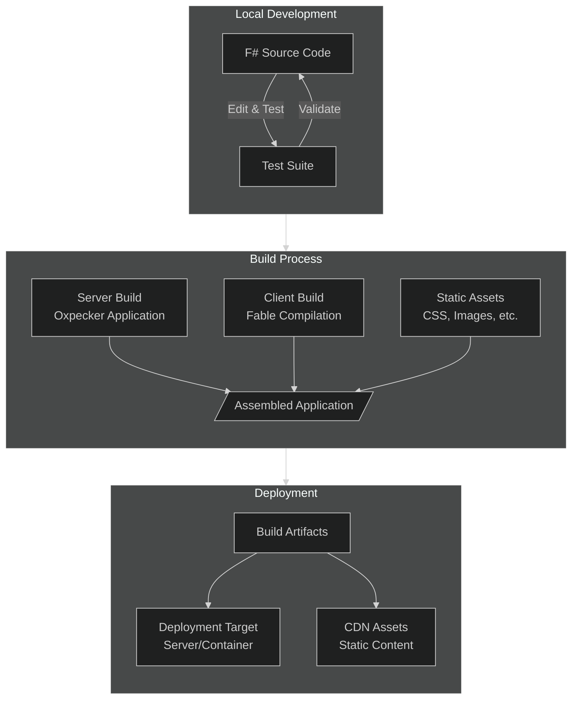
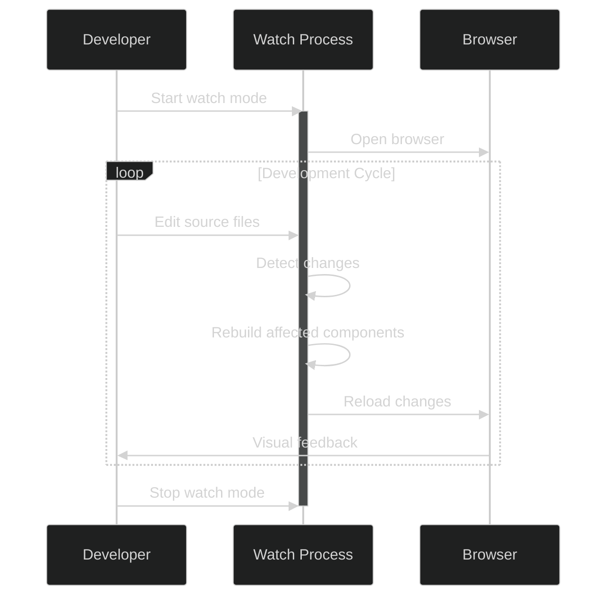
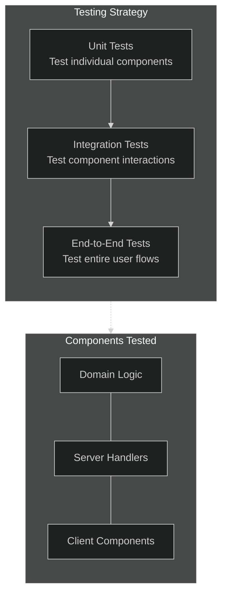

# Build and Deployment Strategy

## Introduction

This document outlines the build, development, and deployment strategy for the FlightDeck platform. It covers the entire process from local development to production deployment, including continuous integration, testing, and performance optimization. The strategy ensures a smooth, reliable development workflow while maintaining the type safety and performance benefits of the F# architecture.

## Build Pipeline Overview

The build pipeline for FlightDeck encompasses several stages to transform source code into deployable artifacts:



## Development Tools and Environment

### Core Development Tools

1. **F# Development Environment**:
   - .NET SDK (Latest stable version)
   - F# compiler and tools
   - Visual Studio Code with Ionide plugin or JetBrains Rider

2. **Build Automation**:
   - FAKE (F# Make) for build scripts
   - Paket for dependency management

3. **JavaScript Tools**:
   - Node.js (for Fable and npm packages)
   - Fable compiler
   - Webpack for bundling

4. **Container Platform**:
   - Docker (optional, for containerized deployment)

### Development Setup

The development environment setup requires the following steps:

```bash
# Install .NET SDK
dotnet tool install --global fake-cli
dotnet tool install --global paket
dotnet tool install --global fable

# Clone repository
git clone https://github.com/your-org/FlightDeck.git
cd FlightDeck

# Install dependencies
paket install
npm install

# Build the project
fake build
```

## Project Structure

A well-organized project structure supports the build and deployment process:

```
FlightDeck/
├── .github/                # GitHub Actions workflows
├── build/                  # Build scripts and configurations
│   ├── Build.fs            # FAKE build script
│   └── webpack.config.js   # Webpack configuration
├── paket.dependencies      # Paket dependencies
├── src/
│   ├── FlightDeck.Client/  # Client-side code (Oxpecker.Solid)
│   ├── FlightDeck.Core/    # Core business logic
│   ├── FlightDeck.Server/  # Oxpecker web server
│   └── FlightDeck.Shared/  # Shared domain model
├── tests/
│   ├── FlightDeck.Client.Tests/
│   ├── FlightDeck.Core.Tests/
│   └── FlightDeck.Server.Tests/
├── public/                 # Static assets
│   ├── css/                # Stylesheets
│   ├── js/                 # Generated JavaScript
│   └── lib/                # Third-party libraries
└── docs/                   # Documentation
```

## Build Process

The build process is fully automated using FAKE (F# Make) and consists of several key stages:

### 1. Restore Dependencies

```fsharp
// build/Build.fs
Target.create "Restore" (fun _ ->
    DotNet.restore (fun opts -> { opts with NoCache = true }) "FlightDeck.sln"
    Npm.install (fun o -> { o with WorkingDirectory = "." })
)
```

### 2. Compile Server Code

```fsharp
Target.create "BuildServer" (fun _ ->
    DotNet.build (fun opts -> 
        { opts with
            Configuration = DotNet.BuildConfiguration.Release
            NoRestore = true
        }) "src/FlightDeck.Server/FlightDeck.Server.fsproj"
)
```

### 3. Compile Client Code with Fable

```fsharp
Target.create "BuildClient" (fun _ ->
    // Run Fable compiler
    DotNet.exec (fun opts -> 
        { opts with 
            WorkingDirectory = "src/FlightDeck.Client" 
        }) "fable" "src -o dist --run webpack"
    |> ignore
)
```

### 4. Run Tests

```fsharp
Target.create "Test" (fun _ ->
    DotNet.test (fun opts -> 
        { opts with
            Configuration = DotNet.BuildConfiguration.Debug
            NoBuild = false
        }) "FlightDeck.sln"
)
```

### 5. Build Documentation

```fsharp
Target.create "Docs" (fun _ ->
    DotNet.exec (fun opts -> opts) "fsdocs" "build --clean" |> ignore
)
```

### 6. Package for Deployment

```fsharp
Target.create "Package" (fun _ ->
    // Create output directory
    Directory.ensure "./dist"
    
    // Copy server binaries
    Shell.copyDir 
        "./dist/server" 
        "./src/FlightDeck.Server/bin/Release/net7.0/publish" 
        (fun _ -> true)
    
    // Copy client files
    Shell.copyDir 
        "./dist/public" 
        "./public" 
        (fun _ -> true)
    
    // Create deployment package
    Zip.zip "./dist" "./dist/FlightDeck.zip" "./dist/"
)
```

### Full Build Pipeline

```fsharp
// Define the build order
"Clean"
  ==> "Restore"
  ==> "BuildServer"
  ==> "BuildClient"
  ==> "Test"
  ==> "Docs"
  ==> "Package"
  ==> "Default"

// Start the build
Target.runOrDefault "Default"
```

## Development Workflow

### Local Development

The development workflow is optimized for rapid feedback and iteration:



### Watch Mode Implementation

Watch mode enables rapid development with automatic rebuilding:

```fsharp
// build/Build.fs
Target.create "Watch" (fun _ ->
    // Create watch processes
    let serverWatch = 
        DotNet.exec (fun opts -> 
            { opts with WorkingDirectory = "src/FlightDeck.Server" }) 
            "watch" "run"
        |> CreateProcess.redirectOutput
        
    let clientWatch =
        DotNet.exec (fun opts -> 
            { opts with WorkingDirectory = "src/FlightDeck.Client" })
            "fable" "watch src -o dist --run webpack --watch"
        |> CreateProcess.redirectOutput
    
    // Run watch processes in parallel
    [serverWatch; clientWatch]
    |> List.map (fun proc -> proc |> Async.AwaitProcess)
    |> Async.Parallel
    |> Async.RunSynchronously
    |> ignore
)
```

### Integration with Development Tools

Visual Studio Code tasks configuration:

```json
// .vscode/tasks.json
{
  "version": "2.0.0",
  "tasks": [
    {
      "label": "Build",
      "command": "fake",
      "args": ["build"],
      "type": "shell",
      "group": {
        "kind": "build",
        "isDefault": true
      }
    },
    {
      "label": "Watch",
      "command": "fake",
      "args": ["build", "-t", "Watch"],
      "type": "shell",
      "isBackground": true,
      "problemMatcher": {
        "owner": "fsharp",
        "fileLocation": "absolute",
        "pattern": {
          "regexp": "^(.*)\\((\\d+),(\\d+)\\): \\((\\w+)\\) (.*)$",
          "file": 1,
          "line": 2,
          "column": 3,
          "severity": 4,
          "message": 5
        },
        "background": {
          "activeOnStart": true,
          "beginsPattern": "^Building...$",
          "endsPattern": "^Build completed"
        }
      }
    },
    {
      "label": "Test",
      "command": "fake",
      "args": ["build", "-t", "Test"],
      "type": "shell",
      "group": {
        "kind": "test",
        "isDefault": true
      }
    }
  ]
}
```

## Continuous Integration

### GitHub Actions Workflow

Continuous integration ensures code quality with every commit:

```yaml
# .github/workflows/ci.yml
name: FlightDeck CI

on:
  push:
    branches: [ main, develop ]
  pull_request:
    branches: [ main, develop ]

jobs:
  build:
    runs-on: ubuntu-latest
    
    steps:
    - uses: actions/checkout@v3
    
    - name: Setup .NET
      uses: actions/setup-dotnet@v3
      with:
        dotnet-version: '7.0.x'
        
    - name: Setup Node.js
      uses: actions/setup-node@v3
      with:
        node-version: '18'
        
    - name: Install tools
      run: |
        dotnet tool restore
        
    - name: Restore dependencies
      run: |
        dotnet restore
        npm ci
        
    - name: Build
      run: dotnet fake build
      
    - name: Test
      run: dotnet fake build -t Test
      
    - name: Upload artifacts
      uses: actions/upload-artifact@v3
      with:
        name: flight-deck-build
        path: ./dist
```

### Automated Testing

The testing strategy includes multiple types of tests:



### Pull Request Process

The pull request workflow ensures code quality:

1. **Create Feature Branch**: Develop features in isolated branches
2. **Implement Tests**: Write tests for new functionality
3. **Submit PR**: Create pull request with description of changes
4. **CI Validation**: Automated build and tests verify changes
5. **Code Review**: Team members review code for quality
6. **Merge**: After approval, changes are merged to the main branch

## Deployment Strategies

### Deployment Options

FlightDeck supports multiple deployment approaches:

1. **Traditional Web Server**:
   - Direct deployment to IIS or Kestrel on Windows Server
   - Deployment to Nginx with Kestrel on Linux

2. **Containerized Deployment**:
   - Docker container with application
   - Orchestration with Kubernetes or Docker Compose

3. **Serverless Option**:
   - Azure Functions (with custom handlers)
   - AWS Lambda (with custom runtime)

### Docker Deployment

Containerized deployment configuration:

```dockerfile
# Dockerfile
FROM mcr.microsoft.com/dotnet/aspnet:7.0 AS runtime
WORKDIR /app

# Copy published app
COPY ./dist/server ./
COPY ./dist/public ./public

# Set environment variables
ENV ASPNETCORE_URLS=http://+:80
ENV ASPNETCORE_ENVIRONMENT=Production

# Expose ports
EXPOSE 80

# Start the application
ENTRYPOINT ["dotnet", "FlightDeck.Server.dll"]
```

Docker Compose configuration for development:

```yaml
# docker-compose.yml
version: '3.8'

services:
  flightdeck:
    build:
      context: .
      dockerfile: Dockerfile
    ports:
      - "5000:80"
    environment:
      - ASPNETCORE_ENVIRONMENT=Development
    volumes:
      - ./data:/app/data
```

### Deployment to Azure App Service

Azure App Service deployment workflow:

```yaml
# .github/workflows/deploy-azure.yml
name: Deploy to Azure

on:
  push:
    branches: [ main ]
    
jobs:
  build-and-deploy:
    runs-on: ubuntu-latest
    
    steps:
    - uses: actions/checkout@v3
    
    # Setup and build steps as in CI workflow
    
    - name: Deploy to Azure Web App
      uses: azure/webapps-deploy@v2
      with:
        app-name: 'flightdeck'
        slot-name: 'production'
        publish-profile: ${{ secrets.AZURE_WEBAPP_PUBLISH_PROFILE }}
        package: ./dist
```

## Performance Optimization

### Server-Side Optimizations

1. **Response Caching**:
   
   ```fsharp
   // FlightDeck.Server/Program.fs
   let configureServices (services: IServiceCollection) =
       services
           .AddResponseCaching()
           .AddMemoryCache()
           // Other services...
           .AddRouting() 
           |> ignore
   
   let configureApp (app: IApplicationBuilder) =
       app.UseResponseCaching()
          // Other middleware...
          .UseOxpecker(endpoints)
          |> ignore
   ```

2. **Cache Control Headers**:
   
   ```fsharp
   // FlightDeck.Server/Handlers/ContentHandlers.fs
   let withCaching (duration: int) (handler: HttpHandler) : HttpHandler =
       fun ctx -> task {
           ctx.Response.Headers.Add("Cache-Control", $"public, max-age={duration}")
           return! handler ctx
       }
   
   // Use in handlers
   let contentHandler : HttpHandler =
       // Handler implementation
       |> withCaching 3600  // Cache for 1 hour
   ```

### Client-Side Optimizations

1. **Code Splitting**:
   
   ```javascript
   // webpack.config.js
   module.exports = {
     // Other config...
     optimization: {
       splitChunks: {
         chunks: 'all',
         cacheGroups: {
           vendors: {
             test: /[\\/]node_modules[\\/]/,
             name: 'vendors',
             chunks: 'all'
           }
         }
       }
     }
   }
   ```

2. **Tree Shaking and Bundling**:
   
   ```javascript
   // webpack.config.js
   module.exports = {
     mode: 'production',
     optimization: {
       usedExports: true,
       minimize: true
     }
   }
   ```

### CDN Integration

For improved global performance, integrate with a CDN:

```fsharp
// FlightDeck.Server/Program.fs
let configureServices (services: IServiceCollection) =
    let cdnUrl = 
        Configuration.GetValue<string>("CDN:Url") 
        |> Option.ofObj
        |> Option.defaultValue ""
    
    services
        .AddSingleton<ICdnUrlProvider>(CdnUrlProvider(cdnUrl))
        // Other services...
        .AddRouting() 
        |> ignore

// In views
let renderWithCdn (cdn: ICdnUrlProvider) (path: string) =
    if cdn.HasCdn then
        $"{cdn.CdnUrl.TrimEnd('/')}/{path.TrimStart('/')}"
    else
        $"/{path.TrimStart('/')}"
```

## Environment Configuration

### Configuration Management

Environment-specific configuration is managed through the standard .NET configuration system:

```fsharp
// FlightDeck.Server/Program.fs
let configureApp (webHostBuilder: IWebHostBuilder) =
    webHostBuilder
        .ConfigureAppConfiguration(fun context config ->
            let env = context.HostingEnvironment
            
            config
                .AddJsonFile("appsettings.json", false, true)
                .AddJsonFile($"appsettings.{env.EnvironmentName}.json", true, true)
                .AddEnvironmentVariables()
                |> ignore
                
            if env.IsDevelopment() then
                config.AddUserSecrets<Program>() |> ignore
        )
        |> ignore
```

### Configuration Schema

A structured configuration schema helps manage settings across environments:

```json
// appsettings.json
{
  "Application": {
    "Name": "FlightDeck",
    "Version": "1.0.0"
  },
  "Storage": {
    "ContentDirectory": "data/content",
    "PresentationsDirectory": "data/presentations"
  },
  "Caching": {
    "ContentCacheDuration": 3600,
    "PresentationCacheDuration": 3600,
    "StaticFilesCacheDuration": 86400
  },
  "CDN": {
    "Url": "",
    "Enabled": false
  },
  "Logging": {
    "LogLevel": {
      "Default": "Information",
      "Microsoft": "Warning",
      "Microsoft.Hosting.Lifetime": "Information"
    }
  }
}
```

### Environment Variables

For containerized deployment, configure via environment variables:

```bash
# Example Docker run command with environment variables
docker run -d \
  -p 80:80 \
  -e "ASPNETCORE_ENVIRONMENT=Production" \
  -e "Storage__ContentDirectory=/data/content" \
  -e "Storage__PresentationsDirectory=/data/presentations" \
  -e "CDN__Url=https://cdn.example.com" \
  -e "CDN__Enabled=true" \
  -v /host/data:/data \
  flightdeck:latest
```

## Monitoring and Logging

### Structured Logging

Implement structured logging for better observability:

```fsharp
// FlightDeck.Server/Program.fs
let configureServices (services: IServiceCollection) =
    services
        .AddLogging(fun logging ->
            logging.AddConsole()
                   .AddDebug()
                   .AddSeq(Configuration.GetSection("Seq"))
                   |> ignore
        )
        // Other services...
        .AddRouting()
        |> ignore
```

### Application Insights Integration

For cloud-hosted environments, add Application Insights:

```fsharp
// FlightDeck.Server/Program.fs
let configureServices (services: IServiceCollection) =
    services
        .AddApplicationInsightsTelemetry(fun options ->
            options.ConnectionString <- Configuration.GetConnectionString("ApplicationInsights")
        )
        // Other services...
        .AddRouting()
        |> ignore
```

### Health Checks

Implement health checks for monitoring:

```fsharp
// FlightDeck.Server/Program.fs
let configureServices (services: IServiceCollection) =
    services
        .AddHealthChecks()
        .AddCheck<StorageHealthCheck>("storage_health")
        .AddCheck<DatabaseHealthCheck>("database_health")
        |> ignore
        
    // Other services...

let configureApp (app: IApplicationBuilder) =
    app.UseRouting()
       .UseEndpoints(fun endpoints -> 
           endpoints.MapHealthChecks("/health") |> ignore
       )
       // Other middleware...
       .UseOxpecker(endpoints)
       |> ignore
```

## Backup and Disaster Recovery

### Regular Backups

Implement regular backups of content data:

```fsharp
// FlightDeck.Core/Backup/BackupService.fs
type BackupService(options: BackupOptions, storage: IStorageProvider) =
    
    member _.CreateBackup() = task {
        let timestamp = DateTime.UtcNow.ToString("yyyyMMdd_HHmmss")
        let backupPath = Path.Combine(options.BackupDirectory, $"backup_{timestamp}.zip")
        
        // Create backup directory if it doesn't exist
        if not (Directory.Exists(options.BackupDirectory)) then
            Directory.CreateDirectory(options.BackupDirectory) |> ignore
            
        // Create backup
        return! storage.CreateBackup(backupPath)
        
        // Clean up old backups
        do! BackupService.CleanupOldBackups(options.BackupDirectory, options.BackupRetentionDays)
        
        return backupPath
    }
        
    static member CleanupOldBackups(backupDirectory: string, retentionDays: int) = task {
        let cutoffDate = DateTime.UtcNow.AddDays(-retentionDays)
        
        let files = 
            Directory.GetFiles(backupDirectory, "backup_*.zip")
            |> Array.filter (fun file ->
                let fileInfo = FileInfo(file)
                fileInfo.CreationTimeUtc < cutoffDate)
        
        for file in files do
            File.Delete(file)
    }
```

### Backup Scheduling

Add a scheduled task for regular backups:

```fsharp
// FlightDeck.Server/BackupScheduler.fs
type BackupScheduler(backupService: BackupService, logger: ILogger<BackupScheduler>) =
    inherit BackgroundService()
    
    override _.ExecuteAsync(cancellationToken) = task {
        while not cancellationToken.IsCancellationRequested do
            try
                // Perform backup
                let! backupPath = backupService.CreateBackup()
                logger.LogInformation($"Backup created at {backupPath}")
            with ex ->
                logger.LogError(ex, "Failed to create backup")
                
            // Wait for next backup time
            do! Task.Delay(TimeSpan.FromHours(24), cancellationToken)
    }
```

## Security Considerations

### HTTPS Configuration

Always configure HTTPS in production:

```fsharp
// FlightDeck.Server/Program.fs
let configureServices (services: IServiceCollection) =
    services
        .AddHttpsRedirection(fun options ->
            options.RedirectStatusCode <- StatusCodes.Status307TemporaryRedirect
            options.HttpsPort <- 443
        )
        // Other services...
        .AddRouting()
        |> ignore

let configureApp (app: IApplicationBuilder, env: IWebHostEnvironment) =
    if env.IsProduction() then
        app.UseHsts()
           .UseHttpsRedirection()
           |> ignore
           
    // Other middleware...
    app.UseOxpecker(endpoints) |> ignore
```

### Security Headers

Add security headers to all responses:

```fsharp
// FlightDeck.Server/Program.fs
let securityHeaders (next: RequestDelegate) (ctx: HttpContext) = task {
    // Add Content-Security-Policy header
    ctx.Response.Headers.Add("Content-Security-Policy", 
        "default-src 'self'; script-src 'self'; style-src 'self'; img-src 'self' data:;")
    
    // Add other security headers
    ctx.Response.Headers.Add("X-Frame-Options", "DENY")
    ctx.Response.Headers.Add("X-Content-Type-Options", "nosniff")
    ctx.Response.Headers.Add("Referrer-Policy", "strict-origin-when-cross-origin")
    
    return! next.Invoke(ctx)
}

// In Program.fs configuration
let configureApp (app: IApplicationBuilder) =
    app.Use(securityHeaders)
       // Other middleware...
       |> ignore
```

## Conclusion

This build and deployment strategy establishes a solid foundation for the FlightDeck platform. By leveraging modern F# tools and practices, it ensures a productive development experience while maintaining high quality standards. The deployment options provide flexibility for various hosting scenarios, from traditional servers to cloud platforms.

Key takeaways:

1. **Fully Automated**: The entire build and deployment process is automated for consistency and reliability.

2. **Type Safety**: The F# type system ensures robust code throughout the pipeline.

3. **Flexible Deployment**: Multiple deployment options support various hosting requirements.

4. **Performance Optimized**: Built-in optimizations for both server and client components.

5. **Secure by Default**: Security best practices integrated throughout the architecture.

This strategy will evolve as the FlightDeck platform grows, incorporating new technologies and practices while maintaining its core principles of type safety, performance, and developer productivity.