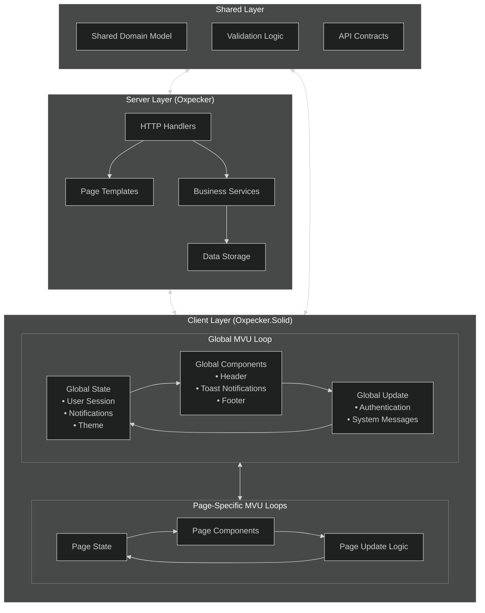
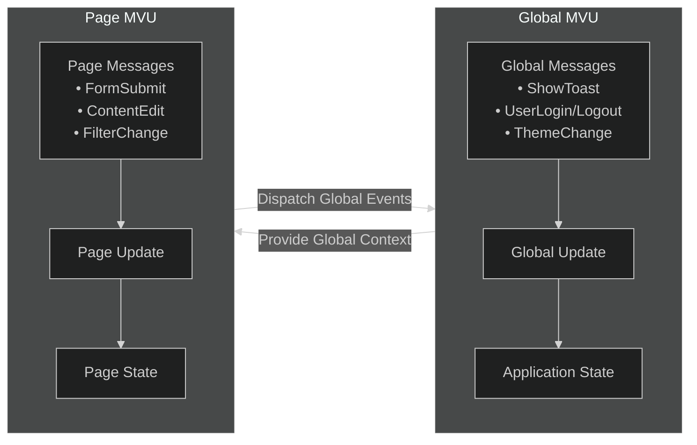
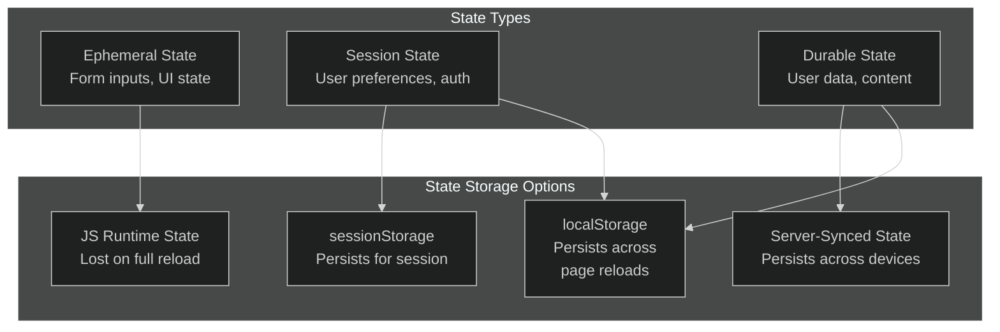
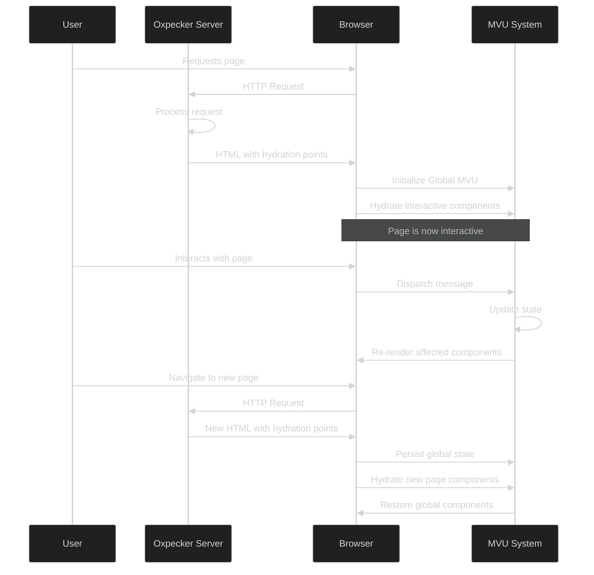
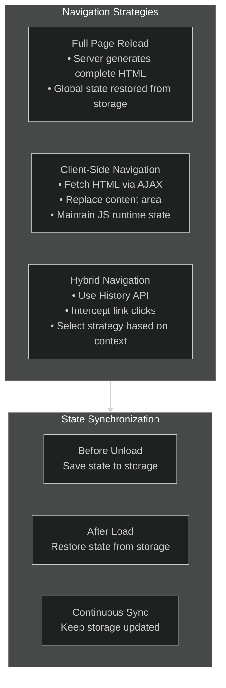

# Architectural Memo: Implementing MVU Architecture with SolidJS in an Oxpecker-Based Web Application

## Executive Summary

This memo outlines a hybrid architecture that combines server-rendered pages using Oxpecker with client-side interactivity using the Model-View-Update (MVU) pattern implemented via SolidJS. The approach leverages F#'s type safety across the stack while enabling a responsive, modern user experience that maintains state across page transitions.

## Background

FlightDeck is transitioning from a static site generator to a dynamic web application platform built on Oxpecker. This evolution requires a thoughtful approach to client-side interactivity that maintains the benefits of server rendering while adding reactive UI capabilities through Oxpecker.Solid.

## Architectural Goals

1. **Server-Side Rendering**: Generate complete HTML pages for initial loads, enhancing SEO and performance
2. **Selective Hydration**: Add interactivity only where needed through islands of reactivity
3. **Persistent Application State**: Maintain state across page transitions
4. **Unified Programming Model**: Use F# across the stack for consistency and type safety
5. **Performance**: Leverage SolidJS's fine-grained reactivity for efficient updates

## MVU Architecture Overview



## Implementation Approach

### 1. Two-Tier MVU Structure

The architecture implements MVU at two complementary levels:



### 2. State Management and Persistence



### 3. Hydration Flow



## Code Organization

### 1. Server-Side Structure (Oxpecker)

```
src/
├── FlightDeck.Server/
│   ├── Program.fs           # Application entry point
│   ├── Handlers/            # HTTP handlers
│   │   ├── HomeHandler.fs
│   │   ├── ContentHandler.fs
│   │   └── AdminHandler.fs
│   ├── Views/               # Page templates
│   │   ├── Layout.fs        # Master layout with hydration points
│   │   ├── Home.fs
│   │   └── Content.fs
│   └── Services/            # Business logic
```

### 2. Client-Side Structure (Oxpecker.Solid)

```
src/
├── FlightDeck.Client/
│   ├── App.fs               # Main application entry
│   ├── Global/              # Global MVU components
│   │   ├── Store.fs         # Global state management
│   │   ├── Messages.fs      # Global message types
│   │   └── Components/      # Global UI components
│   │       ├── Header.fs
│   │       ├── Footer.fs
│   │       └── Toast.fs
│   └── Pages/               # Page-specific MVU components
│       ├── Home/
│       │   ├── Model.fs     # Page-specific state
│       │   ├── Messages.fs  # Page-specific messages
│       │   └── Components.fs # Page UI components
│       └── Content/
│           ├── Model.fs
│           ├── Messages.fs
│           └── Components.fs
```

## Implementation Details

### 1. Global MVU Implementation

```fsharp
// FlightDeck.Client/Global/Messages.fs
module FlightDeck.Client.Global.Messages

type GlobalMsg =
    | ShowToast of message: string * toastType: string
    | CloseToast
    | UserLoggedIn of username: string
    | UserLoggedOut
    | SetTheme of theme: string
```

```fsharp
// FlightDeck.Client/Global/Store.fs
module FlightDeck.Client.Global.Store

open Oxpecker.Solid
open Browser.WebStorage
open FlightDeck.Client.Global.Messages

// Global application state
type GlobalState = {
    toasts: {| message: string; toastType: string |} list
    currentUser: string option
    theme: string
}

// Persistence helpers
let saveState (state: GlobalState) =
    localStorage.setItem("app_state", JSON.stringify(state))
    
let loadState() : GlobalState =
    try
        match localStorage.getItem("app_state") with
        | null -> 
            { toasts = []; currentUser = None; theme = "dark" }
        | value -> 
            JSON.parse(value) |> unbox<GlobalState>
    with _ -> 
        { toasts = []; currentUser = None; theme = "dark" }

// Create a global update function
let globalUpdate (msg: GlobalMsg) (state: GlobalState, setState: GlobalState -> unit) =
    match msg with
    | ShowToast (message, toastType) ->
        let newState = { state with toasts = state.toasts @ [{| message = message; toastType = toastType |}] }
        setState(newState)
        // Auto-dismiss after delay
        Browser.Dom.window.setTimeout(
            (fun _ -> globalDispatch CloseToast), 3000) |> ignore
    
    | CloseToast ->
        match state.toasts with
        | [] -> ()
        | _ :: remaining -> 
            let newState = { state with toasts = remaining }
            setState(newState)
            saveState(newState)
    
    | UserLoggedIn username ->
        let newState = { state with currentUser = Some username }
        setState(newState)
        saveState(newState)
    
    | UserLoggedOut ->
        let newState = { state with currentUser = None }
        setState(newState)
        saveState(newState)
        
    | SetTheme theme ->
        let newState = { state with theme = theme }
        setState(newState)
        saveState(newState)
        Browser.Dom.document.documentElement.setAttribute("data-theme", theme)

// Create mutable reference for global dispatch function
let mutable globalDispatch: GlobalMsg -> unit = fun _ -> ()

// Initialize the global MVU loop
let initGlobalMVU() =
    let initialState = loadState()
    let (state, setState) = createStore(initialState)
    
    // Set up the global dispatch function
    globalDispatch <- fun msg -> globalUpdate msg (state, setState)
    
    // Apply theme on initialization
    Browser.Dom.document.documentElement.setAttribute("data-theme", state.theme)
    
    // Return the state and dispatch function
    state, globalDispatch
```

### 2. Page-Specific MVU Implementation

```fsharp
// FlightDeck.Client/Pages/Content/Messages.fs
module FlightDeck.Client.Pages.Content.Messages

type ContentMsg =
    | UpdateTitle of string
    | UpdateBody of string
    | SaveContent
    | ContentSaved
    | ContentError of string
```

```fsharp
// FlightDeck.Client/Pages/Content/Model.fs
module FlightDeck.Client.Pages.Content.Model

// Page-specific state
type ContentState = {
    contentId: string option
    title: string
    body: string
    isDirty: bool
    isSaving: bool
    error: string option
}

// Initialize state potentially from server-provided data
let initContentState (serverData: string option) =
    match serverData with
    | Some data ->
        try
            JSON.parse(data) |> unbox<ContentState>
        with _ ->
            { contentId = None; title = ""; body = ""; isDirty = false; isSaving = false; error = None }
    | None ->
        { contentId = None; title = ""; body = ""; isDirty = false; isSaving = false; error = None }
```

```fsharp
// FlightDeck.Client/Pages/Content/Components.fs
module FlightDeck.Client.Pages.Content.Components

open Oxpecker.Solid
open FlightDeck.Client.Global.Store
open FlightDeck.Client.Pages.Content.Messages
open FlightDeck.Client.Pages.Content.Model
open FlightDeck.Shared.Api  // API client functions

// Page-specific update function
let contentUpdate (msg: ContentMsg) (state: ContentState, setState: ContentState -> unit) =
    match msg with
    | UpdateTitle title -> 
        setState({ state with title = title; isDirty = true })
    
    | UpdateBody body -> 
        setState({ state with body = body; isDirty = true })
    
    | SaveContent ->
        setState({ state with isSaving = true; error = None })
        
        // API call using shared API client
        async {
            try
                let! result = 
                    match state.contentId with
                    | Some id -> 
                        Api.updateContent { id = id; title = state.title; content = state.body }
                    | None -> 
                        Api.createContent { title = state.title; content = state.body }
                
                match result with
                | Ok content -> 
                    contentDispatch ContentSaved
                    globalDispatch (ShowToast("Content saved successfully!", "success"))
                | Error err -> 
                    contentDispatch (ContentError err)
                    globalDispatch (ShowToast("Failed to save: " + err, "error"))
            with ex ->
                contentDispatch (ContentError ex.Message)
        } |> Async.StartImmediate
    
    | ContentSaved ->
        setState({ state with isDirty = false; isSaving = false })
    
    | ContentError err ->
        setState({ state with isSaving = false; error = Some err })

// Mutable reference for content dispatch
let mutable contentDispatch: ContentMsg -> unit = fun _ -> ()

// Editor component that will be hydrated on the page
let ContentEditor(props: {| serverData: string option |}) =
    // Initialize state from server data
    let initialState = initContentState props.serverData
    let (state, setState) = createStore(initialState)
    
    // Set up content dispatch
    contentDispatch <- fun msg -> contentUpdate msg (state, setState)
    
    // Access global state
    let (globalState, _) = initGlobalMVU()
    
    // Render the editor component
    div [ class' "content-editor" ] [
        // Show error if present
        Show(state.error.IsSome, fun () ->
            div [ class' "error-alert" ] [
                text (state.error |> Option.defaultValue "")
            ]
        )
        
        // Editor form
        div [ class' "form-group" ] [
            label [ for' "title" ] [ text "Title" ]
            input [ 
                id "title"
                class' "form-control"
                value state.title
                onInput (fun e -> contentDispatch (UpdateTitle e.target?value))
            ]
        ]
        
        div [ class' "form-group" ] [
            label [ for' "body" ] [ text "Content" ]
            textarea [ 
                id "body"
                class' "form-control"
                rows 10
                value state.body
                onInput (fun e -> contentDispatch (UpdateBody e.target?value))
            ] []
        ]
        
        button [ 
            class' "btn btn-primary"
            onClick (fun _ -> contentDispatch SaveContent)
            disabled (state.isSaving || not state.isDirty)
        ] [
            text (if state.isSaving then "Saving..." else "Save")
        ]
    ]

// Register the component for hydration
do registerHydratableComponent("ContentEditor", ContentEditor)
```

### 3. Server-Side Integration (Oxpecker)

```fsharp
// FlightDeck.Server/Views/Layout.fs
module FlightDeck.Server.Views.Layout

open Oxpecker.ViewEngine
open FlightDeck.Shared.Domain

// Master layout with hydration points
let layout (ctx : SiteContents) active bodyCnt =
    let siteInfo = ctx.TryGetValue<Globalloader.SiteInfo> ()
    let ttl =
      siteInfo
      |> Option.map (fun si -> si.title)
      |> Option.defaultValue ""

    html [ _attr "data-theme" "dark" ] [
        head [] [
            meta [ _charset "utf-8" ]
            meta [ _name "viewport"; _content "width=device-width, initial-scale=1" ]
            title [] [ rawText ttl ]
            
            // Add client scripts
            script [ _src "/js/solid.js" ] []
            script [ _src "/js/app.js"; _type "module" ] []
        ]
        body [] [
            // Toast container for global notifications
            div [ _id "toast-container"; _class "fixed top-4 right-4 z-50" ] []
            
            // Main content
            yield! bodyCnt
            
            // Hydration initialization script
            script [] [ rawText """
                document.addEventListener('DOMContentLoaded', function() {
                    // Initialize hydration process
                    window.initializeHydration();
                });
            """]
        ]
    ]
```

```fsharp
// FlightDeck.Server/Handlers/ContentHandler.fs
module FlightDeck.Server.Handlers.ContentHandler

open Oxpecker
open FlightDeck.Core.Domain
open FlightDeck.Server.Views

// Handler for content editor page
let editContent : HttpHandler =
    routef (fun contentId ctx -> task {
        let contentService = ctx.GetService<IContentService>()
        
        // Different handling for new vs existing content
        let! contentOpt, initialState =
            if contentId = "new" then
                // New content
                task {
                    return None, {| contentId = None; title = ""; body = ""; isDirty = false; isSaving = false; error = None |}
                }
            else
                // Existing content - fetch from service
                task {
                    let! contentOpt = contentService.GetContentById(contentId)
                    return 
                        match contentOpt with
                        | Some c -> 
                            Some c, 
                            {| 
                                contentId = Some contentId
                                title = c.Title
                                body = c.Content
                                isDirty = false
                                isSaving = false
                                error = None
                            |}
                        | None -> None, {| contentId = None; title = ""; body = ""; isDirty = false; isSaving = false; error = None |}
                }
        
        // Serialize initial state for hydration
        let initialStateJson = System.Text.Json.JsonSerializer.Serialize(initialState)
        
        // Create the page with hydration point
        return! Views.contentEditor 
                contentOpt 
                [
                    section [ _class "hero is-primary" ] [
                        div [ _class "hero-body" ] [
                            div [ _class "container" ] [
                                h1 [ _class "title" ] [ 
                                    rawText (if contentId = "new" then "Create New Content" else "Edit Content") 
                                ]
                            ]
                        ]
                    ]
                    
                    div [ _class "container mt-4" ] [
                        div [ _class "card" ] [
                            div [ _class "card-content" ] [
                                // Hydration point with data
                                div [ 
                                    _id "content-editor"
                                    _attr "data-hydrate" "true"
                                    _attr "data-component" "ContentEditor"
                                    _attr "data-state" initialStateJson
                                ] []
                            ]
                        ]
                    ]
                ]
                ctx
    })
```

### 4. Client Hydration System

```fsharp
// FlightDeck.Client/Hydration.fs
module FlightDeck.Client.Hydration

open Oxpecker.Solid
open Browser.Dom

// Component registry
let private components = System.Collections.Generic.Dictionary<string, obj -> unit>()

// Register a component for hydration
let registerHydratableComponent<'Props> (name: string) (component: 'Props -> HtmlElement) =
    components.[name] <- (fun props -> component (unbox<'Props> props))

// Hydrate a component
let hydrateComponent (element: Element) =
    let componentName = element.getAttribute("data-component")
    let stateJson = element.getAttribute("data-state")
    
    match components.TryGetValue(componentName) with
    | true, componentFactory ->
        // Parse state if present
        let state = 
            if isNull stateJson || stateJson = "" then None
            else Some stateJson
            
        // Create props object with server data
        let props = {| serverData = state |}
        
        // Mount the component
        let factory = unbox<{| serverData: string option |} -> HtmlElement> componentFactory
        mount (element, fun () -> factory props)
        
    | false, _ ->
        console.warn($"Component {componentName} not registered for hydration")

// Initialize hydration process
let initializeHydration() =
    // First initialize global MVU
    let (_, _) = Global.Store.initGlobalMVU()
    
    // Then hydrate all marked components
    document.querySelectorAll("[data-hydrate='true']")
    |> Seq.cast<Element>
    |> Seq.iter hydrateComponent
    
    // Also hydrate global components
    let toastContainer = document.getElementById("toast-container")
    if not (isNull toastContainer) then
        mount (toastContainer, Global.Components.ToastContainer)

// Export to window for script tag initialization
Browser.Dom.window?initializeHydration <- initializeHydration
```

## Navigation and Page Transitions

When using a multi-page application architecture with MVU, navigation requires special consideration:



For an Oxpecker-based application, I recommend the hybrid approach:

1. Use regular navigation for major section changes and when SEO is critical
2. Use client-side navigation for related pages within the same section
3. Persist important state to localStorage to survive full page reloads

## Performance Considerations

### Server-Side Rendering Optimization

1. **Initial Load Performance**: Server-side rendering provides optimal First Contentful Paint (FCP)
2. **Cache Control**: Implement appropriate HTTP caching headers in Oxpecker handlers
3. **Static Asset Handling**: Use CDN for static assets with long cache durations

### Client-Side Optimization

1. **Code Splitting**: Load JavaScript components on-demand
2. **Bundle Size**: Use SolidJS's tree-shaking to minimize script size
3. **Selective Hydration**: Only hydrate components that need interactivity

## Security Considerations

1. **Cross-Site Scripting (XSS)**: Safely handle state serialization for hydration
2. **Cross-Site Request Forgery (CSRF)**: Include anti-CSRF tokens in forms
3. **Content Security Policy (CSP)**: Implement appropriate policies

## Advantages of This Approach

1. **Progressive Enhancement**: Pages work without JavaScript, enhanced when available
2. **SEO-Friendly**: Server rendering ensures content is available to search engines
3. **Performance**: Fast initial load with optimized subsequent interactions
4. **Developer Experience**: Consistent F# programming model across server and client
5. **Type Safety**: Shared types prevent common errors and improve refactoring

## Disadvantages and Mitigations

1. **Complexity**: The hybrid approach is more complex than either pure SSR or SPA
   - Mitigation: Clear separation of concerns and well-defined patterns

2. **Duplicate Rendering Logic**: Some rendering occurs on both server and client
   - Mitigation: Shared components through F# DSL

3. **Learning Curve**: Developers must understand both Oxpecker and Oxpecker.Solid
   - Mitigation: Training and comprehensive documentation

## Conclusion

The hybrid MVU architecture with Oxpecker and SolidJS provides a powerful approach for building modern web applications that deliver both excellent performance and interactive user experiences. By leveraging F#'s type safety across the stack and SolidJS's efficient rendering, FlightDeck can provide a responsive and maintainable platform for content management and presentation.

This approach aligns with current industry best practices in web development, emphasizing progressive enhancement, performance, and developer experience while providing a clear path for future evolution.