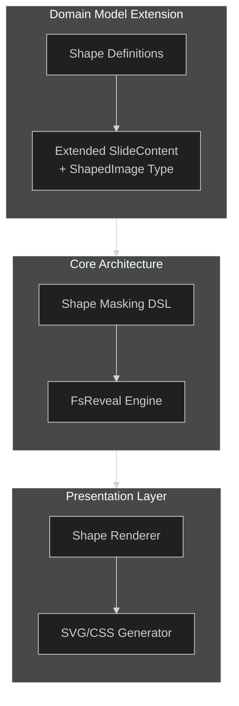

# Implementing Custom Shape Masks in FsReveal

## Introduction

This document details approaches for implementing custom geometric shape masks for images in FsReveal presentations within the FlightDeck architecture. By leveraging F# domain-specific language (DSL) patterns, we can create visually engaging presentations with images shaped as circles, rhombuses, hexagons, and other custom forms while maintaining type safety and F# idioms.

## Architectural Integration

The shape masking functionality integrates with the existing FlightDeck architecture as follows:



## Domain Model Extension

The implementation extends the shared domain model to support shape-masked images:

```fsharp
// In FlightDeck.Shared/Domain.fs
module FlightDeck.Shared.Domain

// Existing types...

// Shape definitions
type ShapeDefinition =
    | Circle of centerX:float * centerY:float * radius:float
    | Rectangle of x:float * y:float * width:float * height:float
    | Rhombus of centerX:float * centerY:float * width:float * height:float
    | Hexagon of centerX:float * centerY:float * size:float
    | Polygon of points:(float * float) list
    | CustomPath of pathData:string

// Image styling and effects
type ImageStyle = {
    CssClass: string option
    HoverEffect: HoverEffect option
}

and HoverEffect =
    | Scale of factor:float
    | Rotate of degrees:float
    | Translate of x:float * y:float
    | Custom of cssProperty:string * value:string

// Shaped image definition
type ShapedImage = {
    Source: string
    Shape: ShapeDefinition
    Width: int
    Height: int
    Alt: string option
    Style: ImageStyle option
}

// Enhanced SlideContent to include shaped images
type SlideContent =
    | Text of string
    | Markdown of string
    | Code of string * language:string
    | Image of url:string * alt:string
    | ShapedImage of ShapedImage  // New content type
```

## F# DSL for Shape-Masked Images

A dedicated DSL provides a fluent interface for creating and configuring shape-masked images:

```fsharp
// In FlightDeck.Core/Presentations/ShapeImageDSL.fs
module FlightDeck.Core.Presentations.ShapeImageDSL

open FlightDeck.Shared.Domain

// Basic shape creation functions
let circleImage source width height =
    {
        Source = source
        Shape = Circle(0.5, 0.5, 0.5)  // Centered circle with 50% radius
        Width = width
        Height = height
        Alt = None
        Style = None
    }

let rhombusImage source width height =
    {
        Source = source
        Shape = Rhombus(0.5, 0.5, 1.0, 1.0)  // Centered rhombus
        Width = width
        Height = height
        Alt = None
        Style = None
    }

let hexagonImage source width height =
    {
        Source = source
        Shape = Hexagon(0.5, 0.5, 0.5)  // Centered hexagon
        Width = width
        Height = height
        Alt = None
        Style = None
    }

let polygonImage source points width height =
    {
        Source = source
        Shape = Polygon(points)
        Width = width
        Height = height
        Alt = None
        Style = None
    }

// Image customization functions
let withAlt alt image =
    { image with Alt = Some alt }

let withClass cssClass image =
    let style = 
        match image.Style with
        | Some s -> { s with CssClass = Some cssClass }
        | None -> { CssClass = Some cssClass; HoverEffect = None }
    { image with Style = Some style }

let withHoverEffect effect image =
    let style = 
        match image.Style with
        | Some s -> { s with HoverEffect = Some effect }
        | None -> { CssClass = None; HoverEffect = Some effect }
    { image with Style = Some style }

// Helper function to convert to SlideContent
let asSlideContent image =
    ShapedImage image
```

## Rendering Implementation

The FsReveal engine is extended to render shaped images:

```fsharp
// In FlightDeck.Core/Presentations/FsRevealEngine.fs
module FlightDeck.Core.Presentations.FsRevealEngine

open System
open FlightDeck.Shared.Domain

// Existing functions...

// Render shape definition to SVG
let renderShapeDefinition (shape: ShapeDefinition) (clipPathId: string) =
    match shape with
    | Circle (centerX, centerY, radius) ->
        $"""<clipPath id="{clipPathId}">
              <circle cx="{centerX * 100.0}%" cy="{centerY * 100.0}%" r="{radius * 100.0}%" />
            </clipPath>"""
    
    | Rectangle (x, y, width, height) ->
        $"""<clipPath id="{clipPathId}">
              <rect x="{x * 100.0}%" y="{y * 100.0}%" width="{width * 100.0}%" height="{height * 100.0}%" />
            </clipPath>"""
    
    | Rhombus (centerX, centerY, width, height) ->
        let halfW = width / 2.0
        let halfH = height / 2.0
        let x = centerX * 100.0
        let y = centerY * 100.0
        
        $"""<clipPath id="{clipPathId}">
              <polygon points="{x}% {(y - halfH) * 100.0}%, 
                               {(x + halfW) * 100.0}% {y}%, 
                               {x}% {(y + halfH) * 100.0}%, 
                               {(x - halfW) * 100.0}% {y}%" />
            </clipPath>"""
    
    | Hexagon (centerX, centerY, size) ->
        let x = centerX * 100.0
        let y = centerY * 100.0
        let s = size * 100.0
        
        $"""<clipPath id="{clipPathId}">
              <polygon points="{x}% {(y - s)}%, 
                               {(x + s * 0.866)}% {(y - s * 0.5)}%, 
                               {(x + s * 0.866)}% {(y + s * 0.5)}%, 
                               {x}% {(y + s)}%, 
                               {(x - s * 0.866)}% {(y + s * 0.5)}%, 
                               {(x - s *.866)}% {(y - s * 0.5)}%" />
            </clipPath>"""
    
    | Polygon points ->
        let pointsStr = 
            points 
            |> List.map (fun (x, y) -> $"{x * 100.0}% {y * 100.0}%")
            |> String.concat ", "
            
        $"""<clipPath id="{clipPathId}">
              <polygon points="{pointsStr}" />
            </clipPath>"""
    
    | CustomPath pathData ->
        $"""<clipPath id="{clipPathId}">
              <path d="{pathData}" />
            </clipPath>"""

// Render hover effect to CSS
let renderHoverEffect (effect: HoverEffect) (elementId: string) =
    match effect with
    | Scale factor ->
        $"#{elementId}:hover {{ transform: scale({factor}); }}"
    | Rotate degrees ->
        $"#{elementId}:hover {{ transform: rotate({degrees}deg); }}"
    | Translate (x, y) ->
        $"#{elementId}:hover {{ transform: translate({x}px, {y}px); }}"
    | Custom (prop, value) ->
        $"#{elementId}:hover {{ {prop}: {value}; }}"

// Render a shaped image
let renderShapedImage (image: ShapedImage) =
    let clipPathId = $"clip-{Guid.NewGuid().ToString("N")}"
    let imageId = $"img-{Guid.NewGuid().ToString("N")}"
    
    // Render SVG definition
    let svgDef = renderShapeDefinition image.Shape clipPathId
    
    // Render CSS class and hover effect
    let cssClass = 
        match image.Style with
        | Some s -> s.CssClass |> Option.defaultValue ""
        | None -> ""
        
    let hoverCss =
        match image.Style with
        | Some s -> 
            match s.HoverEffect with
            | Some effect -> renderHoverEffect effect imageId
            | None -> ""
        | None -> ""
    
    // Alt text
    let alt = image.Alt |> Option.defaultValue ""
    
    // Combine into final SVG with embedded image
    $"""<div class="shaped-image-container">
          <svg width="{image.Width}" height="{image.Height}" viewBox="0 0 100 100" preserveAspectRatio="none">
            <defs>
              {svgDef}
            </defs>
            <image 
              id="{imageId}"
              width="100%" 
              height="100%" 
              xlink:href="{image.Source}" 
              clip-path="url(#{clipPathId})" 
              preserveAspectRatio="xMidYMid slice"
              class="{cssClass}" 
              alt="{alt}" />
          </svg>
          <style>
            #{imageId} {{ transition: transform 0.3s ease; }}
            {hoverCss}
          </style>
        </div>"""

// Extended renderSlideContent function
let renderSlideContent (content: SlideContent) =
    match content with
    | Text text -> 
        $"<p>{text}</p>"
    | Markdown md -> 
        renderMarkdown md
    | Code (code, language) -> 
        $"""<pre><code class="language-{language}">{code}</code></pre>"""
    | Image (url, alt) -> 
        $""""""
    | ShapedImage shapedImage -> 
        renderShapedImage shapedImage
```

## Using the DSL in Presentations

With this implementation, creating presentations with shaped images becomes straightforward and type-safe:

```fsharp
// Example usage in presentation creation
open FlightDeck.Core.Presentations.ShapeImageDSL

let createShapedImagePresentation() =
    let presentation = {
        Id = Guid.NewGuid().ToString()
        Title = "Geometric Shapes in Design"
        Description = Some "A presentation on using geometric shapes in design"
        Author = "Design Team"
        CreatedAt = DateTime.UtcNow
        UpdatedAt = DateTime.UtcNow
        Slides = [
            {
                Id = Guid.NewGuid().ToString()
                Title = Some "Geometric Shapes in Design"
                Content = [
                    Markdown "# Geometric Shapes in Design\n\nUsing different shapes to create visual interest"
                    
                    // Create a row of shaped images
                    Text """<div class="image-row">"""
                    
                    // Rhombus shaped image
                    rhombusImage "/images/mountain.jpg" 300 300
                    |> withAlt "Mountain landscape"
                    |> withHoverEffect (Scale 1.1)
                    |> asSlideContent
                    
                    // Circle shaped image
                    circleImage "/images/portrait.jpg" 300 300
                    |> withAlt "Portrait"
                    |> withHoverEffect (Rotate 15.0)
                    |> asSlideContent
                    
                    // Hexagon shaped image
                    hexagonImage "/images/cityscape.jpg" 300 300
                    |> withAlt "City skyline"
                    |> withClass "highlight-image"
                    |> asSlideContent
                    
                    Text """</div>"""
                ]
                Notes = Some "This slide demonstrates various geometric masks applied to images"
                Order = 0
                Style = {
                    Background = None
                    Transition = Some "fade"
                    CustomClasses = ["demo-slide"]
                }
            }
            
            // Additional slides...
        ]
        Style = {
            Theme = "black"
            Transition = "slide"
            BackgroundColor = None
            CustomCss = Some """
            .image-row {
                display: flex;
                justify-content: space-around;
                margin-top: 30px;
            }
            
            .shaped-image-container {
                display: inline-block;
                margin: 10px;
            }
            
            .highlight-image {
                box-shadow: 0 0 15px rgba(255, 255, 255, 0.6);
            }
            """
        }
        IsPublic = true
    }
    
    // Save presentation
    presentationService.SavePresentation(presentation)
```

## Editor Integration

The presentation editor in FlightDeck is extended to support shape selection and configuration:

```fsharp
// In FlightDeck.Client/Pages/PresentationEditor.fs

// Shape selector component
let ShapeSelector (props: {| onSelect: ShapeDefinition -> unit |}) =
    div [ class' "shape-selector" ] [
        button [
            class' "shape-button"
            onClick (fun _ -> Circle(0.5, 0.5, 0.5) |> props.onSelect)
        ] [
            // Circle icon
            svg [ class' "shape-icon"; viewBox "0 0 100 100"; width "24"; height "24" ] [
                circle [ cx "50"; cy "50"; r "40"; fill "none"; stroke "currentColor"; strokeWidth "2" ] []
            ]
            span [] [ text "Circle" ]
        ]
        
        button [
            class' "shape-button"
            onClick (fun _ -> Rhombus(0.5, 0.5, 1.0, 1.0) |> props.onSelect)
        ] [
            // Rhombus icon
            svg [ class' "shape-icon"; viewBox "0 0 100 100"; width "24"; height "24" ] [
                polygon [ 
                    points "50,10 90,50 50,90 10,50"
                    fill "none"
                    stroke "currentColor"
                    strokeWidth "2"
                ] []
            ]
            span [] [ text "Rhombus" ]
        ]
        
        button [
            class' "shape-button"
            onClick (fun _ -> Hexagon(0.5, 0.5, 0.5) |> props.onSelect)
        ] [
            // Hexagon icon
            svg [ class' "shape-icon"; viewBox "0 0 100 100"; width "24"; height "24" ] [
                polygon [ 
                    points "50,10 90,30 90,70 50,90 10,70 10,30"
                    fill "none"
                    stroke "currentColor"
                    strokeWidth "2"
                ] []
            ]
            span [] [ text "Hexagon" ]
        ]
        
        // Additional shape options...
    ]

// Image shape editor component
let ImageShapeEditor (props: {| 
    initialImage: ShapedImage option
    onSave: ShapedImage -> unit
    onCancel: unit -> unit
|}) =
    // State
    let (source, setSource) = createSignal(
        props.initialImage |> Option.map (fun i -> i.Source) |> Option.defaultValue "")
    let (shape, setShape) = createSignal(
        props.initialImage |> Option.map (fun i -> i.Shape) |> Option.defaultValue (Circle(0.5, 0.5, 0.5)))
    let (width, setWidth) = createSignal(
        props.initialImage |> Option.map (fun i -> i.Width) |> Option.defaultValue 300)
    let (height, setHeight) = createSignal(
        props.initialImage |> Option.map (fun i -> i.Height) |> Option.defaultValue 300)
    let (alt, setAlt) = createSignal(
        props.initialImage |> Option.bind (fun i -> i.Alt) |> Option.defaultValue "")
    
    // Handlers
    let handleSave () =
        let image = {
            Source = source()
            Shape = shape()
            Width = width()
            Height = height()
            Alt = if alt() = "" then None else Some (alt())
            Style = None  // Style could be added with more form fields
        }
        props.onSave(image)
    
    // Form
    div [ class' "image-shape-editor" ] [
        h3 [] [ text "Shape Image Editor" ]
        
        div [ class' "form-group" ] [
            label [ for' "image-source" ] [ text "Image Source" ]
            input [ 
                id "image-source"
                type' "text"
                value (source())
                onInput (fun e -> setSource(e.target?value))
                placeholder "/path/to/image.jpg"
                required true
            ]
        ]
        
        div [ class' "form-group" ] [
            label [] [ text "Shape" ]
            ShapeSelector {| onSelect = setShape |}
        ]
        
        div [ class' "form-row" ] [
            div [ class' "form-group" ] [
                label [ for' "image-width" ] [ text "Width" ]
                input [ 
                    id "image-width"
                    type' "number"
                    value (string (width()))
                    onInput (fun e -> setWidth(int e.target?value))
                    min "50"
                    max "1000"
                ]
            ]
            
            div [ class' "form-group" ] [
                label [ for' "image-height" ] [ text "Height" ]
                input [ 
                    id "image-height"
                    type' "number"
                    value (string (height()))
                    onInput (fun e -> setHeight(int e.target?value))
                    min "50"
                    max "1000"
                ]
            ]
        ]
        
        div [ class' "form-group" ] [
            label [ for' "image-alt" ] [ text "Alt Text" ]
            input [ 
                id "image-alt"
                type' "text"
                value (alt())
                onInput (fun e -> setAlt(e.target?value))
                placeholder "Image description"
            ]
        ]
        
        // Preview
        div [ class' "preview-container" ] [
            h4 [] [ text "Preview" ]
            
            // Dynamic preview of the shape
            // This would render a live preview of the shaped image
        ]
        
        div [ class' "form-actions" ] [
            button [ 
                class' "cancel-button"
                onClick (fun _ -> props.onCancel())
            ] [ text "Cancel" ]
            
            button [ 
                class' "save-button"
                onClick (fun _ -> handleSave())
            ] [ text "Save" ]
        ]
    ]
```

## Examples and Use Cases

The shaped image system enables various creative presentation techniques:

1. **Visual Interest**: Break the monotony of rectangular images with varied shapes
2. **Thematic Reinforcement**: Use shapes that complement the presentation's theme
3. **Focus Attention**: Draw attention to specific elements through unique shapes
4. **Interactive Elements**: Add hover effects to encourage engagement
5. **Creative Layouts**: Combine shapes to create custom layouts and visual hierarchies

## Browser Compatibility and Fallbacks

The implementation handles browser compatibility by using SVG masks, which have broader support than CSS clip paths. For older browsers, a fallback mechanism displays the original rectangular image when SVG clipping is not supported:

```fsharp
// Enhanced renderShapedImage with fallback
let renderShapedImage (image: ShapedImage) =
    // Original implementation...
    
    // Add fallback for older browsers
    $"""<div class="shaped-image-container">
          <!-- SVG implementation as before -->
          <svg width="{image.Width}" height="{image.Height}" viewBox="0 0 100 100" preserveAspectRatio="none">
            <!-- ... -->
          </svg>
          
          <!-- Fallback for browsers that don't support SVG clipping -->
          <noscript>
             Option.defaultValue ""}" 
                 class="fallback-image {cssClass}" />
          </noscript>
          
          <style>
            /* Styles as before... */
            
            /* Hide fallback by default */
            .fallback-image { display: none; }
            
            /* Show fallback only if SVG clip-path fails */
            @supports not (clip-path: circle(50%)) {
              svg { display: none; }
              .fallback-image { display: block; }
            }
          </style>
        </div>"""
```

## Conclusion

This implementation of custom shape masks for FsReveal presentations demonstrates the power of F# DSLs for creating rich, type-safe abstractions. By integrating this functionality into the FlightDeck architecture, presenters can create visually engaging slides with custom-shaped images while maintaining the benefits of a functional-first approach.

The implementation leverages SVG and CSS features while hiding the complexity behind a clean F# interface, allowing content creators to focus on their presentations rather than implementation details. This approach maintains the type safety, composability, and expressiveness that are hallmarks of the F# language while delivering modern visual presentation capabilities.