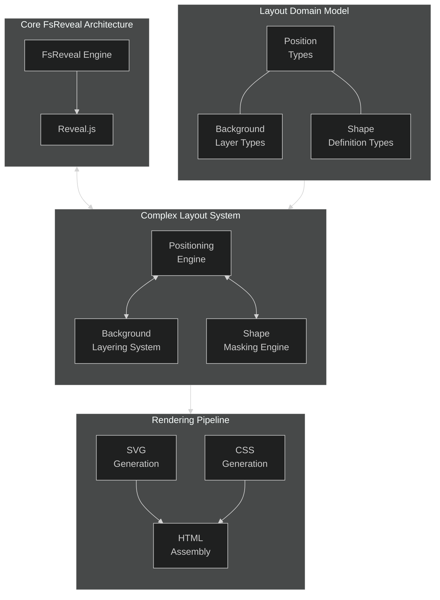

# Complex Layouts in FsReveal

## Introduction

This document outlines a comprehensive approach to creating complex, visually rich layouts in FsReveal presentations. Moving beyond simple content slides, this approach enables precise positioning of elements, layered background "landscaping," and shape-masked images to create professional, design-oriented presentations while maintaining the type safety and functional benefits of F#.

## Architectural Overview

The complex layout system introduces several architectural components that extend the core FsReveal engine:



## Domain Model for Complex Layouts

### 1. Layout Element Positioning

The foundation of complex layouts is precise positioning of elements:

```fsharp
// Position types
type PositionUnit =
    | Pixels of int
    | Percentage of float
    | ViewportWidth of float
    | ViewportHeight of float
    | Calc of string

type Position = {
    X: PositionUnit
    Y: PositionUnit
    Width: PositionUnit option
    Height: PositionUnit option
    ZIndex: int
    Alignment: Alignment option
}

and Alignment =
    | Left
    | Center
    | Right
    | Top
    | Bottom
    | Middle
```

### 2. Background Layering System

For creating rich, layered backgrounds:

```fsharp
// Background types
type BackgroundLayer =
    | ColorLayer of color:string * opacity:float option
    | GradientLayer of gradient:Gradient * opacity:float option
    | ImageLayer of url:string * size:string option * position:string option * opacity:float option
    | SVGLayer of content:string * zIndex:int * opacity:float option * transform:string option

and Gradient = {
    StartColor: string
    EndColor: string
    Direction: string
}

type Background = {
    Layers: BackgroundLayer list
    BaseColor: string option
}
```

### 3. Shape Masking System

For applying geometric masks to images:

```fsharp
// Shape definition types
type ShapeDefinition =
    | Circle of centerX:float * centerY:float * radius:float
    | Ellipse of centerX:float * centerY:float * radiusX:float * radiusY:float
    | Rectangle of x:float * y:float * width:float * height:float * cornerRadius:float option
    | Rhombus of centerX:float * centerY:float * width:float * height:float
    | Hexagon of centerX:float * centerY:float * size:float
    | Polygon of points:(float * float) list
    | CustomPath of pathData:string

// Image with shape masking
type ShapedImage = {
    Source: string
    Shape: ShapeDefinition
    Width: PositionUnit
    Height: PositionUnit
    Alt: string option
    Style: ImageStyle option
}

and ImageStyle = {
    BorderColor: string option
    BorderWidth: string option
    Shadow: string option
    Rotation: float option
    Scale: float option
    Opacity: float option
}
```

### 4. Combined Content Elements

Content elements that can be positioned and styled:

```fsharp
// Content with positioning
type PositionedContent = {
    Content: SlideContent
    Position: Position
    Style: ContentStyle option
}

and ContentStyle = {
    BackgroundColor: string option
    TextColor: string option
    FontSize: string option
    FontWeight: string option
    Padding: string option
    BorderRadius: string option
    Shadow: string option
    Opacity: float option
    TextAlign: string option
}

// Extended slide content types
type SlideContent =
    | Text of string
    | Markdown of string
    | Code of string * language:string
    | Image of url:string * alt:string
    | ShapedImage of ShapedImage
    | ContentGroup of SlideContent list * groupStyle:ContentStyle option
```

## Implementation of Layout Features

### 1. Markdown Extension for Positioned Content

To support readable authoring in markdown, a custom syntax processes positioned elements:

```fsharp
// Parser for custom markdown blocks with position information
let parsePositionedBlock (markdown: string) =
    // RegEx pattern to find blocks like: ::: {.classname position="left:10%;top:20%"}
    let blockPattern = """::: {([^}]*)}([\s\S]*?):::"""
    
    Regex.Matches(markdown, blockPattern)
    |> Seq.map (fun m -> 
        let attributes = m.Groups.[1].Value
        let content = m.Groups.[2].Value
        
        // Parse position, shape, and style attributes
        let parsedAttrs = parseBlockAttributes attributes
        
        // Create the positioned content with the appropriate shape if applicable
        match detectContentType content with
        | ImageContent (url, alt) when parsedAttrs.Shape.IsSome ->
            // Shaped image handling
            ShapedImageContent {
                Source = url
                Shape = parsedAttrs.Shape.Value
                Width = parsedAttrs.Position.Width |> Option.defaultValue (Percentage 100.0)
                Height = parsedAttrs.Position.Height |> Option.defaultValue (Percentage 100.0)
                Alt = Some alt
                Style = parsedAttrs.Style
            }
            |> fun content -> {
                Content = content
                Position = parsedAttrs.Position
                Style = None // Style already in the shaped image
            }
        | _ ->
            // Regular content
            {
                Content = Markdown content
                Position = parsedAttrs.Position
                Style = parsedAttrs.Style
            }
    )
    |> Seq.toList
```

### 2. Rendering Complex Backgrounds

Complex backgrounds with multiple layers are rendered as stacked SVG elements:

```fsharp
// Render a complex background
let renderBackground (background: Background) =
    let baseColor = 
        background.BaseColor 
        |> Option.defaultValue "#ffffff"
    
    let layersHtml =
        background.Layers
        |> List.mapi (fun i layer ->
            match layer with
            | ColorLayer (color, opacity) ->
                let opacityAttr = opacity |> Option.map (fun o -> $"opacity=\"{o}\"") |> Option.defaultValue ""
                $"""<rect x="0" y="0" width="100%" height="100%" fill="{color}" {opacityAttr} />"""
                
            | GradientLayer (gradient, opacity) ->
                let gradientId = $"gradient-{i}"
                let opacityAttr = opacity |> Option.map (fun o -> $"opacity=\"{o}\"") |> Option.defaultValue ""
                
                $"""
                <defs>
                    <linearGradient id="{gradientId}" gradientTransform="rotate({gradient.Direction})">
                        <stop offset="0%" stop-color="{gradient.StartColor}" />
                        <stop offset="100%" stop-color="{gradient.EndColor}" />
                    </linearGradient>
                </defs>
                <rect x="0" y="0" width="100%" height="100%" fill="url(#{gradientId})" {opacityAttr} />
                """
                
            | ImageLayer (url, size, position, opacity) ->
                let sizeAttr = size |> Option.map (fun s -> $"width=\"{s}\" height=\"{s}\"") |> Option.defaultValue ""
                let posAttr = position |> Option.map (fun p -> $"x=\"{p}\" y=\"{p}\"") |> Option.defaultValue ""
                let opacityAttr = opacity |> Option.map (fun o -> $"opacity=\"{o}\"") |> Option.defaultValue ""
                
                $"""<image href="{url}" {sizeAttr} {posAttr} {opacityAttr} />"""
                
            | SVGLayer (content, zIndex, opacity, transform) ->
                let opacityAttr = opacity |> Option.map (fun o -> $"opacity=\"{o}\"") |> Option.defaultValue ""
                let transformAttr = transform |> Option.map (fun t -> $"transform=\"{t}\"") |> Option.defaultValue ""
                let groupAttrs = $"class=\"svg-layer\" style=\"z-index: {zIndex}\" {opacityAttr} {transformAttr}"
                
                $"""<g {groupAttrs}>{content}</g>"""
        )
        |> String.concat "\n"
    
    $"""
    <div class="slide-background" style="background-color: {baseColor}">
        <svg class="background-svg" viewBox="0 0 1920 1080" preserveAspectRatio="xMidYMid slice">
            {layersHtml}
        </svg>
    </div>
    """
```

### 3. Rendering Shape-Masked Images

Shape masks are implemented using SVG clip paths:

```fsharp
// Render SVG clip path for a shape
let renderShapeClipPath (shape: ShapeDefinition) (clipPathId: string) =
    match shape with
    | Circle (centerX, centerY, radius) ->
        $"""
        <clipPath id="{clipPathId}">
            <circle cx="{centerX * 100.0}%" cy="{centerY * 100.0}%" r="{radius * 100.0}%" />
        </clipPath>
        """
    
    | Ellipse (centerX, centerY, radiusX, radiusY) ->
        $"""
        <clipPath id="{clipPathId}">
            <ellipse cx="{centerX * 100.0}%" cy="{centerY * 100.0}%" rx="{radiusX * 100.0}%" ry="{radiusY * 100.0}%" />
        </clipPath>
        """
    
    | Rectangle (x, y, width, height, cornerRadius) ->
        let rxAttr = 
            cornerRadius 
            |> Option.map (fun r -> $"rx=\"{r}%\" ry=\"{r}%\"") 
            |> Option.defaultValue ""
            
        $"""
        <clipPath id="{clipPathId}">
            <rect x="{x * 100.0}%" y="{y * 100.0}%" width="{width * 100.0}%" height="{height * 100.0}%" {rxAttr} />
        </clipPath>
        """
    
    | Rhombus (centerX, centerY, width, height) ->
        let halfW = width / 2.0
        let halfH = height / 2.0
        let x = centerX * 100.0
        let y = centerY * 100.0
        
        $"""
        <clipPath id="{clipPathId}">
            <polygon points="{x}% {(y - halfH) * 100.0}%, 
                         {(x + halfW) * 100.0}% {y}%, 
                         {x}% {(y + halfH) * 100.0}%, 
                         {(x - halfW) * 100.0}% {y}%" />
        </clipPath>
        """
    
    | Hexagon (centerX, centerY, size) ->
        let x = centerX * 100.0
        let y = centerY * 100.0
        let s = size * 100.0
        
        $"""
        <clipPath id="{clipPathId}">
            <polygon points="{x}% {(y - s)}%, 
                         {(x + s * 0.866)}% {(y - s * 0.5)}%, 
                         {(x + s * 0.866)}% {(y + s * 0.5)}%, 
                         {x}% {(y + s)}%, 
                         {(x - s * 0.866)}% {(y + s * 0.5)}%, 
                         {(x - s * 0.866)}% {(y - s * 0.5)}%" />
        </clipPath>
        """
    
    | Polygon points ->
        let pointsStr = 
            points 
            |> List.map (fun (x, y) -> $"{x * 100.0}% {y * 100.0}%")
            |> String.concat ", "
            
        $"""
        <clipPath id="{clipPathId}">
            <polygon points="{pointsStr}" />
        </clipPath>
        """
    
    | CustomPath pathData ->
        $"""
        <clipPath id="{clipPathId}">
            <path d="{pathData}" />
        </clipPath>
        """

// Render a shaped image
let renderShapedImage (image: ShapedImage) =
    let clipPathId = $"clip-{Guid.NewGuid().ToString("N")}"
    let imageId = $"img-{Guid.NewGuid().ToString("N")}"
    
    // Render SVG definition
    let svgDef = renderShapeClipPath image.Shape clipPathId
    
    // Convert position units to CSS
    let width = positionUnitToCss image.Width
    let height = positionUnitToCss image.Height
    
    // Generate style attributes
    let styleAttrs =
        match image.Style with
        | Some style ->
            let border = 
                match style.BorderColor, style.BorderWidth with
                | Some color, Some width -> $"border: {width} solid {color};"
                | _ -> ""
                
            let shadow = style.Shadow |> Option.map (fun s -> $"filter: {s};") |> Option.defaultValue ""
            let transform = 
                [
                    style.Rotation |> Option.map (fun r -> $"rotate({r}deg)")
                    style.Scale |> Option.map (fun s -> $"scale({s})")
                ]
                |> List.choose id
                |> function
                   | [] -> ""
                   | transforms -> $"transform: {String.concat " " transforms};"
                   
            let opacity = style.Opacity |> Option.map (fun o -> $"opacity: {o};") |> Option.defaultValue ""
            
            $"{border} {shadow} {transform} {opacity}"
        | None -> ""
    
    // Alt text
    let alt = image.Alt |> Option.defaultValue ""
    
    // Combine into final SVG with embedded image
    $"""
    <div class="shaped-image-container" style="width: {width}; height: {height}">
        <svg width="100%" height="100%" viewBox="0 0 100 100" preserveAspectRatio="xMidYMid slice">
            <defs>
                {svgDef}
            </defs>
            <image 
                id="{imageId}"
                width="100%" 
                height="100%" 
                href="{image.Source}" 
                clip-path="url(#{clipPathId})" 
                preserveAspectRatio="xMidYMid slice"
                style="{styleAttrs}"
                alt="{alt}" />
        </svg>
    </div>
    """
```

### 4. Rendering Positioned Content

Positioned content is rendered with absolute positioning:

```fsharp
// Convert position unit to CSS
let positionUnitToCss (unit: PositionUnit) =
    match unit with
    | Pixels px -> $"{px}px"
    | Percentage p -> $"{p}%"
    | ViewportWidth vw -> $"{vw}vw"
    | ViewportHeight vh -> $"{vh}vh"
    | Calc expression -> $"calc({expression})"

// Generate position style
let generatePositionStyle (position: Position) =
    let x = positionUnitToCss position.X
    let y = positionUnitToCss position.Y
    
    let width = 
        position.Width 
        |> Option.map positionUnitToCss 
        |> Option.map (fun w -> $"width: {w};") 
        |> Option.defaultValue ""
        
    let height = 
        position.Height 
        |> Option.map positionUnitToCss 
        |> Option.map (fun h -> $"height: {h};") 
        |> Option.defaultValue ""
    
    let alignmentStyle =
        match position.Alignment with
        | Some Center -> "left: 50%; transform: translateX(-50%);"
        | Some Middle -> "top: 50%; transform: translateY(-50%);"
        | Some (Center, Middle) -> "left: 50%; top: 50%; transform: translate(-50%, -50%);"
        | _ -> $"left: {x}; top: {y};"
    
    $"position: absolute; {alignmentStyle} z-index: {position.ZIndex}; {width} {height}"

// Render positioned content
let renderPositionedContent (content: PositionedContent) =
    // Generate position style
    let positionStyle = generatePositionStyle content.Position
    
    // Generate content style
    let contentStyle =
        match content.Style with
        | Some style ->
            let bgColor = style.BackgroundColor |> Option.map (fun c -> $"background-color: {c};") |> Option.defaultValue ""
            let textColor = style.TextColor |> Option.map (fun c -> $"color: {c};") |> Option.defaultValue ""
            let fontSize = style.FontSize |> Option.map (fun s -> $"font-size: {s};") |> Option.defaultValue ""
            let fontWeight = style.FontWeight |> Option.map (fun w -> $"font-weight: {w};") |> Option.defaultValue ""
            let padding = style.Padding |> Option.map (fun p -> $"padding: {p};") |> Option.defaultValue ""
            let borderRadius = style.BorderRadius |> Option.map (fun r -> $"border-radius: {r};") |> Option.defaultValue ""
            let shadow = style.Shadow |> Option.map (fun s -> $"box-shadow: {s};") |> Option.defaultValue ""
            let opacity = style.Opacity |> Option.map (fun o -> $"opacity: {o};") |> Option.defaultValue ""
            let textAlign = style.TextAlign |> Option.map (fun a -> $"text-align: {a};") |> Option.defaultValue ""
            
            $"{bgColor} {textColor} {fontSize} {fontWeight} {padding} {borderRadius} {shadow} {opacity} {textAlign}"
        | None -> ""
    
    // Combine styles
    let style = $"{positionStyle} {contentStyle}"
    
    // Render the content with positioning
    $"""<div class="positioned-content" style="{style}">
         {renderSlideContent content.Content}
       </div>"""
```

## F# DSL for Complex Layouts

To make the creation of complex layouts more intuitive, a fluent DSL provides a functional interface:

```fsharp
// Base DSL functions
let slide title content =
    {
        Id = Guid.NewGuid().ToString()
        Title = Some title
        Background = None
        Content = content
        Notes = None
        Order = 0
        Style = {
            Transition = None
            CustomClasses = []
        }
    }

// Background creation functions
let solidBackground color =
    {
        Layers = [ColorLayer(color, None)]
        BaseColor = Some color
    }

let gradientBackground startColor endColor direction =
    {
        Layers = [
            GradientLayer({
                StartColor = startColor
                EndColor = endColor
                Direction = direction
            }, None)
        ]
        BaseColor = Some startColor
    }

// SVG landscape creation
let landscapeBackground layers =
    {
        Layers = layers
        BaseColor = Some "#000000" // Default black background
    }

let svgLayer content zIndex opacity transform =
    SVGLayer(content, zIndex, opacity, transform)

// Image creation with shapes
let circleImage source width height =
    {
        Source = source
        Shape = Circle(0.5, 0.5, 0.5) // Center circle
        Width = width
        Height = height
        Alt = None
        Style = None
    }

let rhombusImage source width height =
    {
        Source = source
        Shape = Rhombus(0.5, 0.5, 1.0, 1.0) // Center rhombus
        Width = width
        Height = height
        Alt = None
        Style = None
    }

// Positioning functions
let position x y width height zIndex =
    {
        X = x
        Y = y
        Width = Some width
        Height = Some height
        ZIndex = zIndex
        Alignment = None
    }

let centerPosition y width height zIndex =
    {
        X = Percentage 50.0 // Positioned for centering
        Y = y
        Width = Some width
        Height = Some height
        ZIndex = zIndex
        Alignment = Some Center
    }

// Content styling
let style bgColor textColor fontSize padding borderRadius shadow opacity textAlign =
    {
        BackgroundColor = bgColor
        TextColor = textColor
        FontSize = fontSize
        FontWeight = None
        Padding = padding
        BorderRadius = borderRadius
        Shadow = shadow
        Opacity = opacity
        TextAlign = textAlign
    }

// Composition functions
let withBackground bg slide = { slide with Background = Some bg }
let withNotes notes slide = { slide with Notes = Some notes }

// Positioned content creation
let textBlock text pos style =
    {
        Content = Markdown text
        Position = pos
        Style = style
    }

let imageBlock source alt pos style =
    {
        Content = Image(source, alt)
        Position = pos
        Style = style
    }

let shapedImageBlock shapedImage pos =
    {
        Content = ShapedImage shapedImage
        Position = pos
        Style = None // Style is in the shaped image
    }

// Operations for shaped images
let withAlt alt image = { image with Alt = Some alt }
let withShadow shadow image = 
    let style = 
        match image.Style with
        | Some s -> { s with Shadow = Some shadow }
        | None -> { 
            BorderColor = None; BorderWidth = None; Shadow = Some shadow;
            Rotation = None; Scale = None; Opacity = None
          }
    { image with Style = Some style }
```

## Using the DSL in Practice

### 1. Creating a Simple Slide with Positioned Content

```fsharp
// Create a simple positioned content slide
let positionedContentSlide = 
    slide "Positioned Content Example" [
        textBlock 
            "# Positioned Content\n\nThis text block is positioned precisely on the slide."
            (position (Percentage 10.0) (Percentage 20.0) (Percentage 40.0) (Pixels 200) 10)
            (Some (style 
                (Some "rgba(255,255,255,0.8)") // Background color
                (Some "#333") // Text color
                (Some "1.2em") // Font size
                (Some "20px") // Padding
                (Some "10px") // Border radius
                (Some "0 4px 8px rgba(0,0,0,0.2)") // Shadow
                None // Opacity
                (Some "left") // Text align
            ))
            
        imageBlock 
            "/images/sample.jpg" 
            "Sample image"
            (position (Percentage 60.0) (Percentage 20.0) (Percentage 35.0) (Pixels 200) 5)
            None
    ]
```

### 2. Creating a Landscape Background

```fsharp
// Create a landscape background with SVG layers
let mountainLandscape = 
    landscapeBackground [
        // Sky gradient
        GradientLayer({
            StartColor = "#2980b9"
            EndColor = "#6dd5fa"
            Direction = "180deg"
        }, None)
        
        // Far mountains
        svgLayer 
            """<path d="M0,380 C150,330 350,350 500,280 C650,350 800,330 950,280 C1100,350 1250,330 1400,280 C1550,350 1700,330 1920,380 L1920,1080 L0,1080 Z" fill="#34495e" />"""
            1 // z-index
            (Some 0.7) // opacity
            None // transform
            
        // Middle mountains
        svgLayer 
            """<path d="M0,450 C200,380 400,420 600,350 C800,420 1000,380 1200,350 C1400,420 1600,380 1920,450 L1920,1080 L0,1080 Z" fill="#2c3e50" />"""
            2 // z-index
            (Some 0.8) // opacity
            None // transform
            
        // Front hills
        svgLayer 
            """<path d="M0,550 C300,500 600,530 900,480 C1200,530 1500,500 1920,550 L1920,1080 L0,1080 Z" fill="#1e272e" />"""
            3 // z-index
            (Some 0.9) // opacity
            None // transform
    ]
```

### 3. Creating a Shaped Image Slide

```fsharp
// Create a slide with shaped images
let shapedImageSlide =
    slide "Team Members" [
        // Title text
        textBlock 
            "# Our Team"
            (centerPosition (Percentage 10.0) (Percentage 80.0) (Pixels 80) 10)
            (Some (style None (Some "white") (Some "2.5em") None None None None (Some "center")))
            
        // Team member 1 - circular portrait
        (circleImage "/images/person1.jpg" (Pixels 200) (Pixels 200)
            |> withAlt "Jane Smith"
            |> withShadow "0 8px 16px rgba(0,0,0,0.3)")
        |> shapedImageBlock
            (position (Percentage 20.0) (Percentage 30.0) (Pixels 200) (Pixels 200) 5)
            
        // Caption for team member 1
        textBlock 
            "## Jane Smith\n\n*CEO & Founder*"
            (position (Percentage 20.0) (Percentage 60.0) (Percentage 20.0) (Pixels 100) 5)
            (Some (style None (Some "white") None None None None None (Some "center")))
            
        // Team member 2 - circular portrait
        (circleImage "/images/person2.jpg" (Pixels 200) (Pixels 200)
            |> withAlt "John Davis"
            |> withShadow "0 8px 16px rgba(0,0,0,0.3)")
        |> shapedImageBlock
            (position (Percentage 50.0) (Percentage 30.0) (Pixels 200) (Pixels 200) 5)
            
        // Caption for team member 2
        textBlock 
            "## John Davis\n\n*CTO*"
            (position (Percentage 50.0) (Percentage 60.0) (Percentage 20.0) (Pixels 100) 5)
            (Some (style None (Some "white") None None None None None (Some "center")))
            
        // Team member 3 - circular portrait
        (circleImage "/images/person3.jpg" (Pixels 200) (Pixels 200)
            |> withAlt "Sarah Johnson"
            |> withShadow "0 8px 16px rgba(0,0,0,0.3)")
        |> shapedImageBlock
            (position (Percentage 80.0) (Percentage 30.0) (Pixels 200) (Pixels 200) 5)
            
        // Caption for team member 3
        textBlock 
            "## Sarah Johnson\n\n*CFO*"
            (position (Percentage 80.0) (Percentage 60.0) (Percentage 20.0) (Pixels 100) 5)
            (Some (style None (Some "white") None None None None None (Some "center")))
    ]
    |> withBackground mountainLandscape
```

### 4. Creating a Feature Content Slide with a Rhombus Image

```fsharp
// Create a feature slide with rhombus-shaped image
let featureSlide =
    slide "Product Features" [
        // Feature heading
        textBlock 
            "# Revolutionary Features"
            (centerPosition (Percentage 10.0) (Percentage 80.0) (Pixels 80) 10)
            (Some (style None (Some "#2c3e50") (Some "2.5em") None None None None (Some "center")))
            
        // Feature text
        textBlock 
            "## Transform Your Workflow\n\n* Seamless integration with existing tools\n* AI-powered recommendations\n* Real-time collaboration\n* Enterprise-grade security"
            (position (Percentage 10.0) (Percentage 30.0) (Percentage 45.0) (Pixels 300) 5)
            (Some (style 
                (Some "rgba(255,255,255,0.9)") // Background color
                (Some "#2c3e50") // Text color
                (Some "1.2em") // Font size
                (Some "25px") // Padding
                (Some "15px") // Border radius
                (Some "0 10px 20px rgba(0,0,0,0.1)") // Shadow
                None // Opacity
                (Some "left") // Text align
            ))
            
        // Rhombus-shaped feature image
        (rhombusImage "/images/product-screenshot.jpg" (Pixels 350) (Pixels 350)
            |> withAlt "Product screenshot"
            |> withShadow "0 15px 30px rgba(0,0,0,0.2)")
        |> shapedImageBlock
            (position (Percentage 70.0) (Percentage 40.0) (Pixels 350) (Pixels 350) 5)
    ]
    |> withBackground (
        gradientBackground "#ECE9E6" "#FFFFFF" "135deg"
    )
```

## Markdown for Complex Layouts

For those who prefer working in markdown, the system supports custom block syntax:

```markdown
# Product Features

::: {.feature-heading position="center:0;top:10%;width:80%" style="color:#2c3e50;font-size:2.5em;text-align:center;"}
# Revolutionary Features
:::

::: {.feature-text position="left:10%;top:30%;width:45%" style="background-color:rgba(255,255,255,0.9);color:#2c3e50;font-size:1.2em;padding:25px;border-radius:15px;box-shadow:0 10px 20px rgba(0,0,0,0.1);"}
## Transform Your Workflow

* Seamless integration with existing tools
* AI-powered recommendations
* Real-time collaboration
* Enterprise-grade security
:::

::: {.feature-image position="left:70%;top:40%;width:350px;height:350px" shape="rhombus" style="box-shadow:0 15px 30px rgba(0,0,0,0.2);"}

:::
```

## SVG Background Generator Functions

To simplify the creation of common background elements, helper functions generate SVG patterns:

```fsharp
// Helper function to generate mountain shapes
let mountainShape x1 y1 x2 y2 peakCount amplitude =
    let segmentWidth = (x2 - x1) / float peakCount
    let midY = (y1 + y2) / 2.0
    
    let points = 
        [0..peakCount]
        |> List.map (fun i ->
            let x = x1 + float i * segmentWidth
            let offsetY = 
                if i = 0 || i = peakCount then 0.0
                else (System.Random().NextDouble() * 2.0 - 1.0) * amplitude
            let y = midY + offsetY
            (x, y)
        )
        
    // Start and end points
    let fullPoints = [(x1, y2); (x1, y1)] @ points @ [(x2, y1); (x2, y2)]
    
    // Generate SVG path
    let pointsStr = 
        fullPoints 
        |> List.map (fun (x, y) -> $"{x},{y}")
        |> String.concat " "
        
    $"""<polygon points="{pointsStr}" />"""

// Helper function to generate a wave pattern
let wavePattern startX endX startY amplitude frequency phase =
    let points = [0..100]
    let step = (endX - startX) / 100.0
    
    let path = 
        points
        |> List.map (fun i ->
            let x = startX + float i * step
            let y = startY + amplitude * sin(frequency * x + phase)
            if i = 0 then $"M {x},{y}" else $"L {x},{y}"
        )
        |> String.concat " "
        
    // Complete the path
    $"{path} L {endX},{startY + 1000.0} L {startX},{startY + 1000.0} Z"

// Generate a complete landscape background
let mountainRangeBackground skyStartColor skyEndColor =
    landscapeBackground [
        // Sky gradient
        GradientLayer({
            StartColor = skyStartColor
            EndColor = skyEndColor
            Direction = "180deg"
        }, None)
        
        // Far mountains
        svgLayer 
            (mountainShape 0.0 300.0 1920.0 300.0 8 100.0 |> fun path -> 
                $"""<g fill="#546e7a" opacity="0.6">{path}</g>""")
            1 // z-index
            None // opacity already in path
            None // transform
            
        // Middle mountains
        svgLayer 
            (mountainShape 0.0 400.0 1920.0 400.0 6 150.0 |> fun path -> 
                $"""<g fill="#37474f" opacity="0.7">{path}</g>""")
            2 // z-index
            None // opacity already in path
            None // transform
            
        // Front hills
        svgLayer 
            (wavePattern 0.0 1920.0 600.0 100.0 0.003 0.0 |> fun path -> 
                $"""<path d="{path}" fill="#263238" opacity="0.9" />""")
            3 // z-index
            None // opacity already in path
            None // transform
    ]
```

## Practical Examples

### 1. Title Slide with Circular Portrait

```fsharp
// Create an intro slide with a circular portrait
let introSlide = 
    slide "Introduction" [
        // Title text
        textBlock 
            "# Jane Smith\n\n**Product Design Lead**"
            (centerPosition (Percentage 65.0) (Percentage 60.0) (Pixels 150) 10)
            (Some (style None (Some "white") (Some "1.8em") (Some "20px") None None None (Some "center")))
            
        // Circular headshot
        (circleImage "/images/jane-portrait.jpg" (Pixels 350) (Pixels 350)
            |> withAlt "Jane Smith"
            |> withShadow "0 10px 25px rgba(0,0,0,0.3)")
        |> shapedImageBlock
            (position (Percentage 25.0) (Percentage 40.0) (Pixels 350) (Pixels 350) 5)
            
        // Additional info
        textBlock 
            "15+ years of experience in UX/UI design\n\nLed design teams at Google, Microsoft, and Apple"
            (centerPosition (Percentage 75.0) (Percentage 60.0) (Pixels 200) 8)
            (Some (style 
                (Some "rgba(255,255,255,0.15)") // Subtle background
                (Some "rgba(255,255,255,0.8)") // Slightly transparent text
                (Some "1.2em") // Font size
                (Some "15px") // Padding
                (Some "8px") // Border radius
                None // No shadow
                None // Full opacity
                (Some "center") // Text align
            ))
    ]
    |> withBackground (
        gradientBackground "#4b6cb7" "#182848" "135deg"
    )
```

### 2. Feature Comparison with Rhombus Images

```fsharp
// Create a comparison slide with rhombus-shaped images
let comparisonSlide =
    slide "Product Comparison" [
        // Title
        textBlock 
            "# Before & After"
            (centerPosition (Percentage 10.0) (Percentage 80.0) (Pixels 80) 10)
            (Some (style None (Some "white") (Some "2.2em") None None None None (Some "center")))
            
        // "Before" section
        textBlock 
            "## Before\n\n* Manual process\n* Error-prone\n* Time-consuming\n* Limited insights"
            (position (Percentage 25.0) (Percentage 30.0) (Percentage 30.0) (Pixels 200) 5)
            (Some (style 
                (Some "rgba(255,255,255,0.1)") // Very subtle background
                (Some "rgba(255,255,255,0.9)") // Almost white text
                (Some "1.2em") // Font size
                (Some "20px") // Padding
                (Some "10px") // Border radius
                (Some "0 4px 8px rgba(0,0,0,0.1)") // Subtle shadow
                None // Full opacity
                (Some "left") // Text align
            ))
            
        // "Before" image (rhombus-shaped)
        (rhombusImage "/images/before.jpg" (Pixels 250) (Pixels 250)
            |> withAlt "Before our solution"
            |> withShadow "0 8px 16px rgba(0,0,0,0.2)")
        |> shapedImageBlock
            (position (Percentage 25.0) (Percentage 60.0) (Pixels 250) (Pixels 250) 5)
            
        // "After" section
        textBlock 
            "## After\n\n* Automated workflow\n* 99.9% accuracy\n* 5x faster processing\n* Rich analytics"
            (position (Percentage 75.0) (Percentage 30.0) (Percentage 30.0) (Pixels 200) 5)
            (Some (style 
                (Some "rgba(255,255,255,0.1)") // Very subtle background
                (Some "rgba(255,255,255,0.9)") // Almost white text
                (Some "1.2em") // Font size
                (Some "20px") // Padding
                (Some "10px") // Border radius
                (Some "0 4px 8px rgba(0,0,0,0.1)") // Subtle shadow
                None // Full opacity
                (Some "left") // Text align
            ))
            
        // "After" image (rhombus-shaped)
        (rhombusImage "/images/after.jpg" (Pixels 250) (Pixels 250)
            |> withAlt "After our solution"
            |> withShadow "0 8px 16px rgba(0,0,0,0.2)")
        |> shapedImageBlock
            (position (Percentage 75.0) (Percentage 60.0) (Pixels 250) (Pixels 250) 5)
    ]
    |> withBackground (
        gradientBackground "#232526" "#414345" "105deg"
    )
```

## Best Practices for Complex Layouts

### 1. Design Considerations

When creating complex layouts, keep these design principles in mind:

1. **Visual Hierarchy**: Use positioning and sizing to emphasize important elements
2. **Whitespace**: Leave adequate space between elements for better readability
3. **Color Contrast**: Ensure text is readable against background elements
4. **Consistency**: Maintain consistent positioning and styling across slides
5. **Responsiveness**: Use percentage-based positioning where possible for better scaling

### 2. Performance Optimization

Complex slides with many SVG elements can impact performance:

1. **Simplify SVG Paths**: Use fewer points for background shapes
2. **Limit Animation**: Use animations sparingly and efficiently
3. **Optimize Images**: Use appropriately sized and compressed images
4. **Caching**: Enable browser caching for static assets
5. **Batching**: Group related SVG elements to reduce DOM operations

### 3. Accessibility Considerations

Maintain accessibility when creating complex layouts:

1. **Alternative Text**: Always provide descriptive alt text for images
2. **Color Contrast**: Ensure sufficient contrast for readability
3. **Screen Reader Support**: Consider how content will be read by assistive technologies
4. **Keyboard Navigation**: Ensure all interactive elements are keyboard accessible
5. **Test Thoroughly**: Test presentations with various assistive technologies

## Conclusion

The complex layout system for FsReveal enables the creation of visually rich, professional presentations while maintaining the type safety and functional benefits of F#. By combining positioned content, layered backgrounds, and shape-masked images, presenters can create slides that rival those built with traditional presentation software, all while working within a code-first, version-controlled environment.

This approach bridges the gap between developer-friendly tools and design-oriented presentations, allowing technical teams to create visually compelling content without leaving their preferred development environment.
