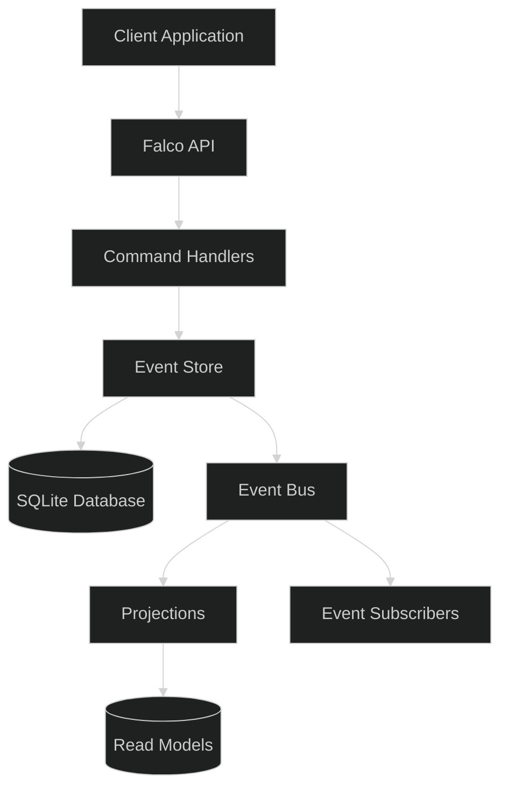
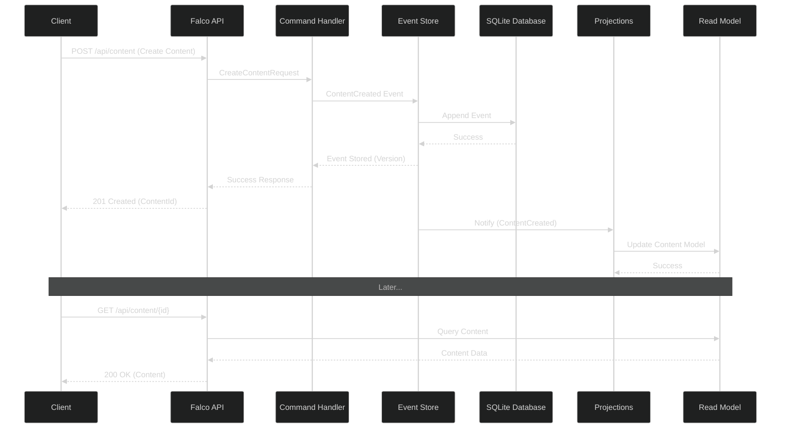

# Event Sourcing with SQLite and F# for FlightDeck

## Overview

This document outlines a lightweight event sourcing implementation for the FlightDeck application using SQLite with Donald (a thin F# ADO.NET wrapper) as an alternative to Marten with PostgreSQL. This approach maintains the benefits of event sourcing while using simpler technology that's more suitable for smaller deployments.



## Core Event Sourcing Concepts

Event sourcing is a design pattern where:
1. All changes to application state are stored as a sequence of events
2. Events are immutable facts that represent what happened, not the current state
3. The current state is derived by replaying events
4. Events provide a complete audit trail and enable temporal queries

### Benefits for FlightDeck

- **Complete History**: Track all changes to content, presentations, and user interactions
- **Temporal Queries**: View the state of any content at any point in time
- **Audit Trail**: Maintain a comprehensive record of all changes
- **Flexibility**: Easily add new projections or views without changing the event store

## Database Schema

The SQLite schema needed for event sourcing is straightforward:

```sql
-- Streams table tracks metadata about event streams
CREATE TABLE IF NOT EXISTS streams (
    stream_id TEXT PRIMARY KEY,
    type TEXT NOT NULL,
    version INTEGER NOT NULL,
    created_at TEXT NOT NULL,
    updated_at TEXT NOT NULL
);

-- Events table stores all events with JSON payload
CREATE TABLE IF NOT EXISTS events (
    id TEXT PRIMARY KEY,
    stream_id TEXT NOT NULL,
    version INTEGER NOT NULL,
    event_type TEXT NOT NULL,
    data TEXT NOT NULL,
    metadata TEXT NOT NULL,
    timestamp TEXT NOT NULL,
    FOREIGN KEY (stream_id) REFERENCES streams(stream_id),
    UNIQUE(stream_id, version)
);

-- Create index for efficient event retrieval
CREATE INDEX IF NOT EXISTS idx_events_stream_id ON events(stream_id);

-- Optional: Snapshots table for performance optimization
CREATE TABLE IF NOT EXISTS snapshots (
    stream_id TEXT PRIMARY KEY,
    version INTEGER NOT NULL,
    data TEXT NOT NULL,
    timestamp TEXT NOT NULL,
    FOREIGN KEY (stream_id) REFERENCES streams(stream_id)
);
```

## F# Domain Model

The core domain types for the event sourcing system:

```fsharp
module FlightDeck.EventSourcing.Domain

open System

// Core identifiers
type StreamId = string
type EventId = Guid
type Version = int

// Event metadata
type EventMetadata = {
    CorrelationId: string option
    Timestamp: DateTimeOffset
    UserId: string option
}

// Generic event record
type Event<'T> = {
    Id: EventId
    StreamId: StreamId
    Version: Version
    EventType: string
    Data: 'T
    Metadata: EventMetadata
}

// Serialized event for storage
type SerializedEvent = {
    Id: EventId
    StreamId: StreamId
    Version: Version
    EventType: string
    Data: string  // JSON serialized
    Metadata: string  // JSON serialized
    Timestamp: DateTimeOffset
}
```

## Event Store Implementation with Donald

Donald provides a lightweight, F# friendly way to interact with SQLite:

```fsharp
module FlightDeck.EventSourcing.EventStore

open System
open System.Data.SQLite
open Donald
open System.Text.Json
open FlightDeck.EventSourcing.Domain

// Connection handling
let connectionString (dbPath: string) =
    sprintf "Data Source=%s;Version=3;" dbPath

// Initialize database
let initializeDatabase (connString: string) =
    use conn = new SQLiteConnection(connString)
    conn.Open()
    
    // SQL to create tables 
    let createTablesSQL = """
    -- Schema SQL from above --
    """
    
    Db.newCommand createTablesSQL
    |> Db.noParams
    |> Db.execNonQuery conn
    |> ignore

// Serialization helpers
let serializeEvent<'T> (event: Event<'T>) : SerializedEvent =
    {
        Id = event.Id
        StreamId = event.StreamId
        Version = event.Version
        EventType = event.EventType
        Data = JsonSerializer.Serialize(event.Data)
        Metadata = JsonSerializer.Serialize(event.Metadata)
        Timestamp = event.Metadata.Timestamp
    }

let deserializeEvent<'T> (serialized: SerializedEvent) : Event<'T> =
    {
        Id = serialized.Id
        StreamId = serialized.StreamId
        Version = serialized.Version
        EventType = serialized.EventType
        Data = JsonSerializer.Deserialize<'T>(serialized.Data)
        Metadata = JsonSerializer.Deserialize<EventMetadata>(serialized.Metadata)
    }

// Core event store operations
let appendEvent<'T> (conn: SQLiteConnection) (streamId: StreamId) (expectedVersion: int option) (event: Event<'T>) =
    use transaction = conn.BeginTransaction()
    
    try
        // Get current version if expected version is specified
        let currentVersion =
            match expectedVersion with
            | None -> None
            | Some _ ->
                let versionSql = "SELECT version FROM streams WHERE stream_id = @streamId"
                let versionParam = [ "@streamId", SqlType.String streamId ]
                
                Db.newCommand versionSql
                |> Db.setParams versionParam
                |> Db.querySingle conn
                |> function
                    | None -> Some 0
                    | Some row -> Some (row.["version"] :?> int)
        
        // Check optimistic concurrency
        match expectedVersion, currentVersion with
        | Some expected, Some current when expected <> current ->
            Error $"Concurrency conflict: expected version {expected}, but current version is {current}"
        | _ ->
            // Check if stream exists
            let streamExists =
                let checkSql = "SELECT 1 FROM streams WHERE stream_id = @streamId"
                let param = [ "@streamId", SqlType.String streamId ]
                
                Db.newCommand checkSql
                |> Db.setParams param
                |> Db.querySingle conn
                |> Option.isSome
            
            // Calculate next version
            let nextVersion =
                match currentVersion with
                | None -> 1
                | Some ver -> ver + 1
            
            // Create or update stream
            if not streamExists then
                let streamSql = """
                INSERT INTO streams (stream_id, type, version, created_at, updated_at)
                VALUES (@streamId, @type, @version, @createdAt, @updatedAt)
                """
                let streamParams = [
                    "@streamId", SqlType.String streamId
                    "@type", SqlType.String event.EventType
                    "@version", SqlType.Int nextVersion
                    "@createdAt", SqlType.String (DateTimeOffset.UtcNow.ToString("o"))
                    "@updatedAt", SqlType.String (DateTimeOffset.UtcNow.ToString("o"))
                ]
                
                Db.newCommand streamSql
                |> Db.setParams streamParams
                |> Db.execNonQuery conn
                |> ignore
            else
                let updateSql = """
                UPDATE streams 
                SET version = @version, updated_at = @updatedAt
                WHERE stream_id = @streamId
                """
                let updateParams = [
                    "@streamId", SqlType.String streamId
                    "@version", SqlType.Int nextVersion
                    "@updatedAt", SqlType.String (DateTimeOffset.UtcNow.ToString("o"))
                ]
                
                Db.newCommand updateSql
                |> Db.setParams updateParams
                |> Db.execNonQuery conn
                |> ignore
            
            // Serialize the event
            let serializedEvent = serializeEvent { event with Version = nextVersion }
            
            // Insert the event
            let eventSql = """
            INSERT INTO events (id, stream_id, version, event_type, data, metadata, timestamp)
            VALUES (@id, @streamId, @version, @eventType, @data, @metadata, @timestamp)
            """
            let eventParams = [
                "@id", SqlType.String (serializedEvent.Id.ToString())
                "@streamId", SqlType.String serializedEvent.StreamId
                "@version", SqlType.Int serializedEvent.Version
                "@eventType", SqlType.String serializedEvent.EventType
                "@data", SqlType.String serializedEvent.Data
                "@metadata", SqlType.String serializedEvent.Metadata
                "@timestamp", SqlType.String (serializedEvent.Timestamp.ToString("o"))
            ]
            
            Db.newCommand eventSql
            |> Db.setParams eventParams
            |> Db.execNonQuery conn
            |> ignore
            
            transaction.Commit()
            Ok nextVersion
    with
    | ex ->
        transaction.Rollback()
        Error ex.Message

// Get events for a stream
let getEvents<'T> (conn: SQLiteConnection) (streamId: StreamId) =
    let sql = """
    SELECT id, stream_id, version, event_type, data, metadata, timestamp
    FROM events
    WHERE stream_id = @streamId
    ORDER BY version ASC
    """
    let param = [ "@streamId", SqlType.String streamId ]
    
    Db.newCommand sql
    |> Db.setParams param
    |> Db.query conn
    |> Seq.map (fun row ->
        let serialized = {
            Id = Guid.Parse(row.["id"] :?> string)
            StreamId = row.["stream_id"] :?> string
            Version = row.["version"] :?> int
            EventType = row.["event_type"] :?> string
            Data = row.["data"] :?> string
            Metadata = row.["metadata"] :?> string
            Timestamp = DateTimeOffset.Parse(row.["timestamp"] :?> string)
        }
        deserializeEvent<'T> serialized)
    |> Seq.toList
```

## Domain Events

Specific domain events for FlightDeck:

```fsharp
module FlightDeck.Domain.Events

open System

// Content events
type ContentCreated = {
    ContentId: string
    Title: string
    Slug: string option
    Description: string option
    Content: string
    Format: string
    Author: string
    Tags: string list
}

type ContentUpdated = {
    ContentId: string
    Title: string option
    Slug: string option
    Description: string option
    Content: string option
    Format: string option
    Status: string option
    Tags: string list option
}

type ContentDeleted = {
    ContentId: string
}

// Presentation events
type PresentationCreated = {
    PresentationId: string
    Title: string
    Description: string option
    Author: string
    Theme: string
    IsPublic: bool
}

type SlideAdded = {
    PresentationId: string
    SlideId: string
    Title: string option
    Content: string // JSON serialized content
    Notes: string option
    Order: int
}

type SlideUpdated = {
    PresentationId: string
    SlideId: string
    Title: string option
    Content: string option
    Notes: string option
    Order: int option
}

type SlideRemoved = {
    PresentationId: string
    SlideId: string
}

// User events
type UserRegistered = {
    UserId: string
    Email: string
    DisplayName: string
}

type UserLoggedIn = {
    UserId: string
    LoginTimestamp: DateTimeOffset
}
```

## Projections

Projections transform events into optimized read models:

```fsharp
module FlightDeck.Projections

open System
open System.Data.SQLite
open FlightDeck.EventSourcing.Domain
open FlightDeck.Domain.Events
open Donald

// Projection for Content
let projectContent (conn: SQLiteConnection) =
    // Create or ensure content table exists
    let createTableSql = """
    CREATE TABLE IF NOT EXISTS content (
        id TEXT PRIMARY KEY,
        title TEXT NOT NULL,
        slug TEXT UNIQUE,
        description TEXT,
        content TEXT NOT NULL,
        format TEXT NOT NULL,
        status TEXT NOT NULL,
        author TEXT NOT NULL,
        created_at TEXT NOT NULL,
        updated_at TEXT NOT NULL,
        tags TEXT
    );
    """
    
    Db.newCommand createTableSql
    |> Db.noParams
    |> Db.execNonQuery conn
    |> ignore
    
    // Process content events
    let handleContentCreated (evt: ContentCreated) (metadata: EventMetadata) =
        let sql = """
        INSERT INTO content (id, title, slug, description, content, format, status, author, created_at, updated_at, tags)
        VALUES (@id, @title, @slug, @description, @content, @format, @status, @author, @createdAt, @updatedAt, @tags)
        """
        let parameters = [
            "@id", SqlType.String evt.ContentId
            "@title", SqlType.String evt.Title
            "@slug", match evt.Slug with Some s -> SqlType.String s | None -> SqlType.Null
            "@description", match evt.Description with Some d -> SqlType.String d | None -> SqlType.Null
            "@content", SqlType.String evt.Content
            "@format", SqlType.String evt.Format
            "@status", SqlType.String "Draft"
            "@author", SqlType.String evt.Author
            "@createdAt", SqlType.String (metadata.Timestamp.ToString("o"))
            "@updatedAt", SqlType.String (metadata.Timestamp.ToString("o"))
            "@tags", SqlType.String (String.Join(",", evt.Tags))
        ]
        
        Db.newCommand sql
        |> Db.setParams parameters
        |> Db.execNonQuery conn
        |> ignore
    
    let handleContentUpdated (evt: ContentUpdated) (metadata: EventMetadata) =
        // Build dynamic SQL and parameters based on what fields were updated
        let mutable setClauses = []
        let mutable parameters = [ "@id", SqlType.String evt.ContentId ]
        
        match evt.Title with
        | Some title -> 
            setClauses <- "title = @title" :: setClauses
            parameters <- ("@title", SqlType.String title) :: parameters
        | None -> ()
        
        match evt.Slug with
        | Some slug -> 
            setClauses <- "slug = @slug" :: setClauses
            parameters <- ("@slug", SqlType.String slug) :: parameters
        | None -> ()
        
        match evt.Description with
        | Some desc -> 
            setClauses <- "description = @description" :: setClauses
            parameters <- ("@description", SqlType.String desc) :: parameters
        | None -> ()
        
        match evt.Content with
        | Some content -> 
            setClauses <- "content = @content" :: setClauses
            parameters <- ("@content", SqlType.String content) :: parameters
        | None -> ()
        
        match evt.Format with
        | Some format -> 
            setClauses <- "format = @format" :: setClauses
            parameters <- ("@format", SqlType.String format) :: parameters
        | None -> ()
        
        match evt.Status with
        | Some status -> 
            setClauses <- "status = @status" :: setClauses
            parameters <- ("@status", SqlType.String status) :: parameters
        | None -> ()
        
        match evt.Tags with
        | Some tags -> 
            setClauses <- "tags = @tags" :: setClauses
            parameters <- ("@tags", SqlType.String (String.Join(",", tags))) :: parameters
        | None -> ()
        
        // Always update the updated_at timestamp
        setClauses <- "updated_at = @updatedAt" :: setClauses
        parameters <- ("@updatedAt", SqlType.String (metadata.Timestamp.ToString("o"))) :: parameters
        
        let setClauses = String.Join(", ", setClauses)
        let sql = $"UPDATE content SET {setClauses} WHERE id = @id"
        
        Db.newCommand sql
        |> Db.setParams parameters
        |> Db.execNonQuery conn
        |> ignore
    
    let handleContentDeleted (evt: ContentDeleted) =
        let sql = "DELETE FROM content WHERE id = @id"
        let parameters = [ "@id", SqlType.String evt.ContentId ]
        
        Db.newCommand sql
        |> Db.setParams parameters
        |> Db.execNonQuery conn
        |> ignore
    
    // Handler for different event types
    let handleEvent (event: Event<obj>) =
        match event.EventType with
        | "ContentCreated" ->
            let typedData = event.Data :?> ContentCreated
            handleContentCreated typedData event.Metadata
        | "ContentUpdated" ->
            let typedData = event.Data :?> ContentUpdated
            handleContentUpdated typedData event.Metadata
        | "ContentDeleted" ->
            let typedData = event.Data :?> ContentDeleted
            handleContentDeleted typedData
        | _ -> () // Ignore other event types
    
    handleEvent
```

## Integration with Falco

Integrating the event sourcing system with Falco:

```fsharp
module FlightDeck.Web.Handlers

open System
open System.Data.SQLite
open Falco
open FlightDeck.EventSourcing.Domain
open FlightDeck.EventSourcing.EventStore
open FlightDeck.Domain.Events

// Connection factory
let getConnection() =
    let conn = new SQLiteConnection(connectionString "flightdeck.db")
    conn.Open()
    conn

// Command handler for creating content
let createContent : HttpHandler =
    Request.bindJson<CreateContentRequest> (fun request ctx ->
        let contentId = Guid.NewGuid().ToString()
        let userId = ctx.User.FindFirst("sub")?.Value
        
        // Create the domain event
        let contentCreated = {
            ContentId = contentId
            Title = request.Title
            Slug = request.Slug
            Description = request.Description
            Content = request.Content
            Format = request.Format.ToString()
            Author = request.Author
            Tags = request.Tags
        }
        
        // Create the event metadata
        let metadata = {
            CorrelationId = Some (Guid.NewGuid().ToString())
            Timestamp = DateTimeOffset.UtcNow
            UserId = Option.ofObj userId
        }
        
        // Create the event
        let event = {
            Id = Guid.NewGuid()
            StreamId = contentId
            Version = 0  // First event in the stream
            EventType = "ContentCreated"
            Data = contentCreated
            Metadata = metadata
        }
        
        // Save the event
        use conn = getConnection()
        let result = appendEvent conn contentId None event
        
        match result with
        | Ok version ->
            // Return success response with the new content ID
            Response.ofJson {| success = true; contentId = contentId |} ctx
        | Error errorMsg ->
            // Return error response
            Response.withStatusCode 500
            >> Response.ofJson {| success = false; error = errorMsg |}
            |> fun handler -> handler ctx
    )

// Query handler for getting content
let getContent : HttpHandler =
    Request.mapRoute (fun route -> 
        let contentId = route.GetString "id" ""
        contentId)
        (fun contentId ctx ->
            use conn = getConnection()
            
            // Get all events for the content
            let events = getEvents<obj> conn contentId
            
            if List.isEmpty events then
                // Content not found
                Response.withStatusCode 404
                >> Response.ofJson {| success = false; error = "Content not found" |}
                |> fun handler -> handler ctx
            else
                // Project the current state from events
                let mutable content = None
                
                for event in events do
                    match event.EventType with
                    | "ContentCreated" ->
                        let e = event.Data :?> ContentCreated
                        content <- Some {|
                            id = e.ContentId
                            title = e.Title
                            slug = e.Slug
                            description = e.Description
                            content = e.Content
                            format = e.Format
                            status = "Draft"
                            author = e.Author
                            createdAt = event.Metadata.Timestamp
                            updatedAt = event.Metadata.Timestamp
                            tags = e.Tags
                        |}
                    | "ContentUpdated" ->
                        let e = event.Data :?> ContentUpdated
                        content <- content |> Option.map (fun c ->
                            {| c with
                                title = e.Title |> Option.defaultValue c.title
                                slug = e.Slug |> Option.orElse c.slug
                                description = e.Description |> Option.orElse c.description
                                content = e.Content |> Option.defaultValue c.content
                                format = e.Format |> Option.defaultValue c.format
                                status = e.Status |> Option.defaultValue c.status
                                updatedAt = event.Metadata.Timestamp
                                tags = e.Tags |> Option.defaultValue c.tags
                            |}
                        )
                    | "ContentDeleted" ->
                        content <- None
                    | _ -> ()
                
                match content with
                | Some c ->
                    // Return the content
                    Response.ofJson c ctx
                | None ->
                    // Content was deleted
                    Response.withStatusCode 404
                    >> Response.ofJson {| success = false; error = "Content not found or deleted" |}
                    |> fun handler -> handler ctx
        )
```

## Event Workflow Example



## SQLite vs PostgreSQL (Marten)

| Feature | SQLite + Donald | PostgreSQL + Marten |
|---------|----------------|---------------------|
| Setup Complexity | Low - embedded database | Medium - separate database service |
| Deployment | Simple - single file | More complex - database infrastructure |
| Scalability | Limited - better for smaller workloads | High - better for large workloads |
| JSON Support | Basic | Advanced (JSONB) |
| Query Capabilities | Limited | Extensive |
| Transactions | Basic | Advanced |
| Concurrency | Limited | High |
| F# Integration | Via Donald (lightweight) | Via Marten.FSharp |
| Use Case | Small to medium applications, single-user scenarios | Larger applications, multi-user scenarios |

## Conclusion

This SQLite-based event sourcing implementation provides a lightweight alternative to Marten while maintaining the core benefits of the event sourcing pattern. It's particularly well-suited for:

1. Single-user or small team deployments of FlightDeck
2. Scenarios where simplified deployment is important
3. Applications where the database load is moderate
4. Development and testing environments

The approach uses F#'s strong type system to provide compile-time safety while keeping the implementation straightforward and maintainable.
