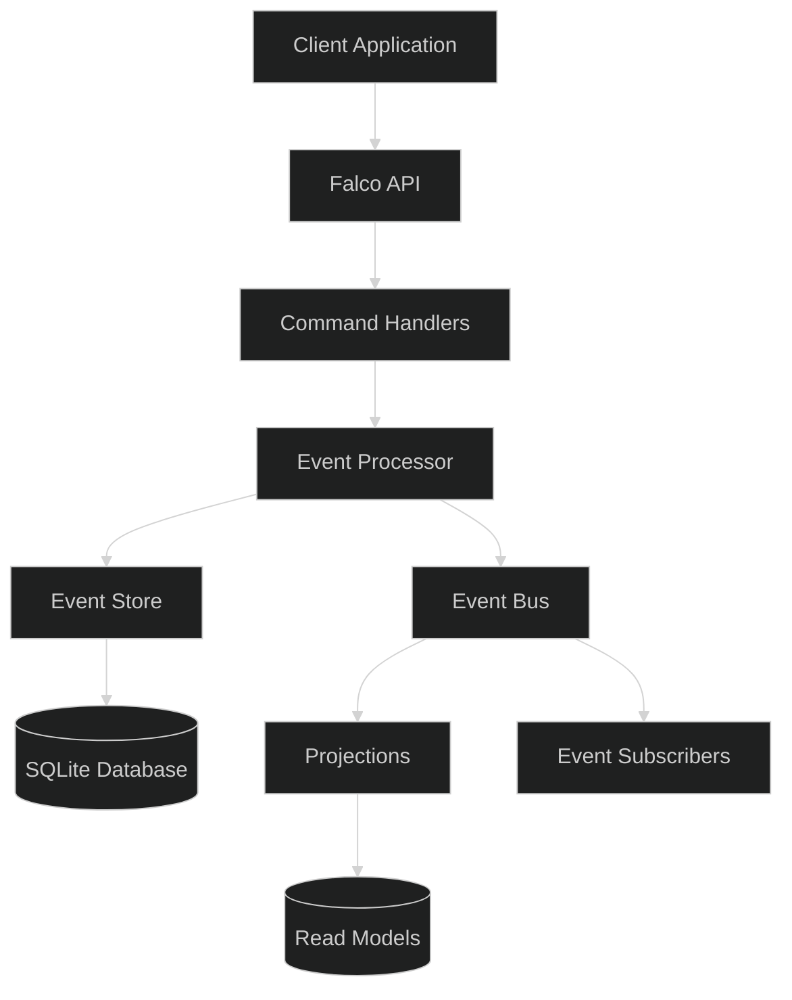
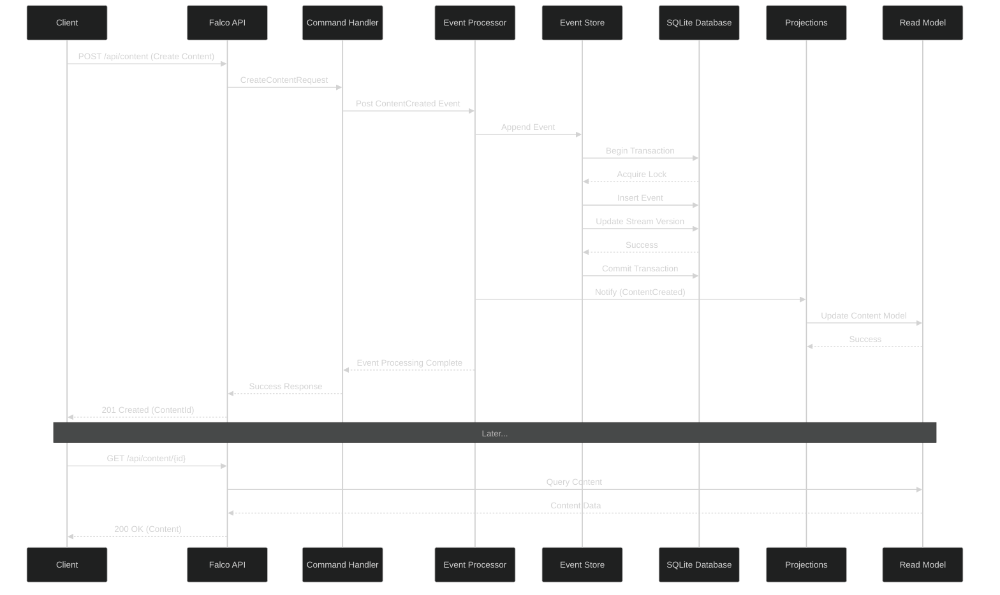

# Event Sourcing with SQLite and F# for FlightDeck

## Overview

This document outlines a lightweight event sourcing implementation for the FlightDeck application using SQLite with Donald (a thin F# ADO.NET wrapper) as an alternative to Marten with PostgreSQL. This approach maintains the benefits of event sourcing while using simpler technology that's more suitable for smaller deployments.



## Core Event Sourcing Concepts

Event sourcing is a design pattern where:
1. All changes to application state are stored as a sequence of events
2. Events are immutable facts that represent what happened, not the current state
3. The current state is derived by replaying events
4. Events provide a complete audit trail and enable temporal queries

### Benefits for FlightDeck

- **Complete History**: Track all changes to content, presentations, and user interactions
- **Temporal Queries**: View the state of any content at any point in time
- **Audit Trail**: Maintain a comprehensive record of all changes
- **Flexibility**: Easily add new projections or views without changing the event store

## Database Schema

The SQLite schema needed for event sourcing is straightforward:

```sql
-- Streams table tracks metadata about event streams
CREATE TABLE IF NOT EXISTS streams (
    stream_id TEXT PRIMARY KEY,
    type TEXT NOT NULL,
    version INTEGER NOT NULL,
    created_at TEXT NOT NULL,
    updated_at TEXT NOT NULL
);

-- Events table stores all events with JSON payload
CREATE TABLE IF NOT EXISTS events (
    id TEXT PRIMARY KEY,
    stream_id TEXT NOT NULL,
    version INTEGER NOT NULL,
    event_type TEXT NOT NULL,
    data TEXT NOT NULL,
    metadata TEXT NOT NULL,
    timestamp TEXT NOT NULL,
    FOREIGN KEY (stream_id) REFERENCES streams(stream_id),
    UNIQUE(stream_id, version)
);

-- Create index for efficient event retrieval
CREATE INDEX IF NOT EXISTS idx_events_stream_id ON events(stream_id);
CREATE INDEX IF NOT EXISTS idx_events_type ON events(event_type);
CREATE INDEX IF NOT EXISTS idx_events_timestamp ON events(timestamp);

-- Optional: JSON index for common queries
CREATE INDEX IF NOT EXISTS idx_events_json_case ON events(json_extract(data, '$.Case'));

-- Optional: Snapshots table for performance optimization
CREATE TABLE IF NOT EXISTS snapshots (
    stream_id TEXT PRIMARY KEY,
    version INTEGER NOT NULL,
    data TEXT NOT NULL,
    timestamp TEXT NOT NULL,
    FOREIGN KEY (stream_id) REFERENCES streams(stream_id)
);

-- Optional: Archived events table for managing database size
CREATE TABLE IF NOT EXISTS archived_events (
    id TEXT PRIMARY KEY,
    stream_id TEXT NOT NULL,
    version INTEGER NOT NULL,
    event_type TEXT NOT NULL,
    data TEXT NOT NULL,
    metadata TEXT NOT NULL,
    timestamp TEXT NOT NULL,
    archived_at TEXT NOT NULL
);
```

## F# Domain Model

The core domain types for the event sourcing system:

```fsharp
module FlightDeck.EventSourcing.Domain

open System

// Core identifiers
type StreamId = string
type EventId = Guid
type Version = int

// Event metadata
type EventMetadata = {
    CorrelationId: string option
    Timestamp: DateTimeOffset
    UserId: string option
}

// Generic event record
type Event<'T> = {
    Id: EventId
    StreamId: StreamId
    Version: Version
    EventType: string
    Data: 'T
    Metadata: EventMetadata
}

// Serialized event for storage
type SerializedEvent = {
    Id: EventId
    StreamId: StreamId
    Version: Version
    EventType: string
    Data: string  // JSON serialized
    Metadata: string  // JSON serialized
    Timestamp: DateTimeOffset
}

// Event processing message types
type EventProcessingMessage =
    | AppendEvent of StreamId * Event<obj>
    | UpdateReadModel of Event<obj>
    | ArchiveStream of StreamId * int
    | CreateSnapshot of StreamId
```

## Concurrency Management with MailboxProcessor

To manage concurrent writes and ensure event ordering, we implement an event processor using MailboxProcessor:

```fsharp
module FlightDeck.EventSourcing.EventProcessor

open System
open System.Data.SQLite
open FlightDeck.EventSourcing.Domain
open FlightDeck.EventSourcing.EventStore

// Create a mailbox processor for handling all event operations
let eventProcessor = MailboxProcessor<EventProcessingMessage>.Start(fun inbox ->
    // SQLite connection factory
    let getConnection() =
        let conn = new SQLiteConnection(connectionString "flightdeck.db")
        conn.Open()
        // Enable WAL mode for better concurrency
        let cmd = conn.CreateCommand()
        cmd.CommandText <- "PRAGMA journal_mode=WAL;"
        cmd.ExecuteNonQuery() |> ignore
        conn
    
    let rec loop () = async {
        let! msg = inbox.Receive()
        
        try
            match msg with
            | AppendEvent (streamId, event) ->
                use conn = getConnection()
                match appendEvent conn streamId (Some event.Version) event with
                | Ok newVersion -> 
                    // Broadcast to read models
                    inbox.Post(UpdateReadModel { event with Version = newVersion })
                | Error err -> 
                    printfn "Error appending event: %s" err
                    
            | UpdateReadModel event ->
                // Update all read models with the new event
                // This could dispatch to multiple projections
                use conn = getConnection()
                updateProjections conn event
                
            | ArchiveStream (streamId, olderThanVersion) ->
                use conn = getConnection()
                archiveEvents conn streamId olderThanVersion |> ignore
                
            | CreateSnapshot streamId ->
                use conn = getConnection()
                use conn = getConnection()
                let events = getEvents<obj> conn streamId
                createSnapshot conn streamId events |> ignore
        with
        | ex -> 
            printfn "Error processing event message: %s" ex.Message
            
        return! loop()
    }
    
    loop()
)

// API for posting events
let appendEvent<'T> streamId (expectedVersion: int) (event: Event<'T>) =
    let typedEvent = {
        Id = event.Id
        StreamId = event.StreamId
        Version = expectedVersion
        EventType = event.EventType
        Data = event.Data :> obj
        Metadata = event.Metadata
    }
    eventProcessor.Post(AppendEvent(streamId, typedEvent))

// Schedule periodic snapshots
let startSnapshotting() =
    async {
        while true do
            do! Async.Sleep(TimeSpan.FromHours(1).TotalMilliseconds |> int)
            
            // Find streams that need snapshots
            use conn = new SQLiteConnection(connectionString "flightdeck.db")
            conn.Open()
            
            let sql = """
            SELECT stream_id
            FROM streams
            WHERE (SELECT COUNT(*) FROM events WHERE events.stream_id = streams.stream_id) > 50
            """
            
            let streamsNeedingSnapshots =
                Db.newCommand sql
                |> Db.noParams
                |> Db.query conn (fun row -> row.string "stream_id")
                |> Seq.toList
                
            for streamId in streamsNeedingSnapshots do
                eventProcessor.Post(CreateSnapshot streamId)
    } |> Async.Start
```

## Enhanced Event Store Implementation with Donald

Donald provides a lightweight, F# friendly way to interact with SQLite, with additional safeguards for concurrency:

```fsharp
module FlightDeck.EventSourcing.EventStore

open System
open System.Data.SQLite
open Donald
open System.Text.Json
open FlightDeck.EventSourcing.Domain

// Connection handling
let connectionString (dbPath: string) =
    sprintf "Data Source=%s;Version=3;" dbPath

// Initialize database
let initializeDatabase (connString: string) =
    use conn = new SQLiteConnection(connString)
    conn.Open()
    
    // SQL to create tables 
    let createTablesSQL = """
    -- Schema SQL from above --
    """
    
    Db.newCommand createTablesSQL
    |> Db.noParams
    |> Db.execNonQuery conn
    |> ignore

// Serialization helpers
let serializeEvent<'T> (event: Event<'T>) : SerializedEvent =
    {
        Id = event.Id
        StreamId = event.StreamId
        Version = event.Version
        EventType = event.EventType
        Data = JsonSerializer.Serialize(event.Data)
        Metadata = JsonSerializer.Serialize(event.Metadata)
        Timestamp = event.Metadata.Timestamp
    }

let deserializeEvent<'T> (serialized: SerializedEvent) : Event<'T> =
    {
        Id = serialized.Id
        StreamId = serialized.StreamId
        Version = serialized.Version
        EventType = serialized.EventType
        Data = JsonSerializer.Deserialize<'T>(serialized.Data)
        Metadata = JsonSerializer.Deserialize<EventMetadata>(serialized.Metadata)
    }

// Core event store operations with enhanced concurrency control
let appendEvent<'T> (conn: SQLiteConnection) (streamId: StreamId) (expectedVersion: int option) (event: Event<'T>) =
    use transaction = conn.BeginTransaction()
    
    try
        // First acquire an exclusive lock on the stream to prevent concurrency issues
        let lockSql = """
        SELECT version FROM streams WHERE stream_id = @streamId
        """
        
        let lockParam = [ "@streamId", SqlType.String streamId ]
        
        let currentVersion =
            Db.newCommand lockSql
            |> Db.setParams lockParam
            |> Db.querySingle conn
            |> function
                | None -> 0  // Stream doesn't exist yet
                | Some row -> row.int "version"
        
        // Check optimistic concurrency
        match expectedVersion with
        | Some expected when expected <> currentVersion ->
            Error $"Concurrency conflict: expected version {expected}, but current version is {currentVersion}"
        | _ ->
            // Calculate next version
            let nextVersion = currentVersion + 1
            
            // Create or update stream
            if currentVersion = 0 then
                let streamSql = """
                INSERT INTO streams (stream_id, type, version, created_at, updated_at)
                VALUES (@streamId, @type, @version, @createdAt, @updatedAt)
                """
                let streamParams = [
                    "@streamId", SqlType.String streamId
                    "@type", SqlType.String event.EventType
                    "@version", SqlType.Int nextVersion
                    "@createdAt", SqlType.String (DateTimeOffset.UtcNow.ToString("o"))
                    "@updatedAt", SqlType.String (DateTimeOffset.UtcNow.ToString("o"))
                ]
                
                Db.newCommand streamSql
                |> Db.setParams streamParams
                |> Db.execNonQuery conn
                |> ignore
            else
                let updateSql = """
                UPDATE streams 
                SET version = @version, updated_at = @updatedAt
                WHERE stream_id = @streamId
                """
                let updateParams = [
                    "@streamId", SqlType.String streamId
                    "@version", SqlType.Int nextVersion
                    "@updatedAt", SqlType.String (DateTimeOffset.UtcNow.ToString("o"))
                ]
                
                Db.newCommand updateSql
                |> Db.setParams updateParams
                |> Db.execNonQuery conn
                |> ignore
            
            // Serialize the event
            let serializedEvent = serializeEvent { event with Version = nextVersion }
            
            // Insert the event
            let eventSql = """
            INSERT INTO events (id, stream_id, version, event_type, data, metadata, timestamp)
            VALUES (@id, @streamId, @version, @eventType, @data, @metadata, @timestamp)
            """
            let eventParams = [
                "@id", SqlType.String (serializedEvent.Id.ToString())
                "@streamId", SqlType.String serializedEvent.StreamId
                "@version", SqlType.Int serializedEvent.Version
                "@eventType", SqlType.String serializedEvent.EventType
                "@data", SqlType.String serializedEvent.Data
                "@metadata", SqlType.String serializedEvent.Metadata
                "@timestamp", SqlType.String (serializedEvent.Timestamp.ToString("o"))
            ]
            
            Db.newCommand eventSql
            |> Db.setParams eventParams
            |> Db.execNonQuery conn
            |> ignore
            
            transaction.Commit()
            Ok nextVersion
    with
    | ex ->
        transaction.Rollback()
        Error ex.Message

// Retry logic for handling transient SQLite locking issues
let rec appendEventWithRetry<'T> (conn: SQLiteConnection) (streamId: StreamId) (expectedVersion: int option) (event: Event<'T>) (retries: int) =
    match appendEvent conn streamId expectedVersion event with
    | Ok version -> Ok version
    | Error msg when msg.Contains("database is locked") && retries > 0 ->
        // Random backoff to reduce contention
        let delay = Random().Next(50, 200)
        Async.Sleep delay |> Async.RunSynchronously
        appendEventWithRetry conn streamId expectedVersion event (retries - 1)
    | Error msg -> Error msg

// Get events for a stream
let getEvents<'T> (conn: SQLiteConnection) (streamId: StreamId) =
    let sql = """
    SELECT id, stream_id, version, event_type, data, metadata, timestamp
    FROM events
    WHERE stream_id = @streamId
    ORDER BY version ASC
    """
    let param = [ "@streamId", SqlType.String streamId ]
    
    Db.newCommand sql
    |> Db.setParams param
    |> Db.query conn
    |> Seq.map (fun row ->
        let serialized = {
            Id = Guid.Parse(row.string "id")
            StreamId = row.string "stream_id"
            Version = row.int "version"
            EventType = row.string "event_type"
            Data = row.string "data"
            Metadata = row.string "metadata"
            Timestamp = DateTimeOffset.Parse(row.string "timestamp")
        }
        deserializeEvent<'T> serialized)
    |> Seq.toList

// Archive events to reduce main table size
let archiveEvents (conn: SQLiteConnection) (streamId: StreamId) (olderThanVersion: int) =
    use transaction = conn.BeginTransaction()
    
    try
        // First ensure a snapshot exists
        let snapshot = getSnapshot conn streamId
        
        if snapshot.IsNone || snapshot.Value.Version < olderThanVersion then
            // Create snapshot if needed
            let events = getEvents<obj> conn streamId
                        |> List.filter (fun e -> e.Version <= olderThanVersion)
            createSnapshot conn streamId events |> ignore
        
        // Move events to archive
        let archiveSql = """
        INSERT INTO archived_events (id, stream_id, version, event_type, data, metadata, timestamp, archived_at)
        SELECT id, stream_id, version, event_type, data, metadata, timestamp, @archivedAt
        FROM events
        WHERE stream_id = @streamId AND version <= @version
        """
        
        let archiveParams = [
            "@streamId", SqlType.String streamId
            "@version", SqlType.Int olderThanVersion
            "@archivedAt", SqlType.String (DateTimeOffset.UtcNow.ToString("o"))
        ]
        
        Db.newCommand archiveSql
        |> Db.setParams archiveParams
        |> Db.execNonQuery conn
        |> ignore
        
        // Delete from main table
        let deleteSql = """
        DELETE FROM events
        WHERE stream_id = @streamId AND version <= @version
        """
        
        Db.newCommand deleteSql
        |> Db.setParams [
            "@streamId", SqlType.String streamId
            "@version", SqlType.Int olderThanVersion
        ]
        |> Db.execNonQuery conn
        |> ignore
        
        transaction.Commit()
        Ok ()
    with
    | ex ->
        transaction.Rollback()
        Error ex.Message
```

## Domain Events

Specific domain events for FlightDeck:

```fsharp
module FlightDeck.Domain.Events

open System

// Content events
type ContentCreated = {
    ContentId: string
    Title: string
    Slug: string option
    Description: string option
    Content: string
    Format: string
    Author: string
    Tags: string list
}

type ContentUpdated = {
    ContentId: string
    Title: string option
    Slug: string option
    Description: string option
    Content: string option
    Format: string option
    Status: string option
    Tags: string list option
}

type ContentDeleted = {
    ContentId: string
}

// Presentation events
type PresentationCreated = {
    PresentationId: string
    Title: string
    Description: string option
    Author: string
    Theme: string
    IsPublic: bool
}

type SlideAdded = {
    PresentationId: string
    SlideId: string
    Title: string option
    Content: string // JSON serialized content
    Notes: string option
    Order: int
}

type SlideUpdated = {
    PresentationId: string
    SlideId: string
    Title: string option
    Content: string option
    Notes: string option
    Order: int option
}

type SlideRemoved = {
    PresentationId: string
    SlideId: string
}

// User events
type UserRegistered = {
    UserId: string
    Email: string
    DisplayName: string
}

type UserLoggedIn = {
    UserId: string
    LoginTimestamp: DateTimeOffset
}

// Event discriminated unions
type ContentEventCase =
    | ContentCreated of ContentCreated
    | ContentUpdated of ContentUpdated
    | ContentDeleted of ContentDeleted

type PresentationEventCase = 
    | PresentationCreated of PresentationCreated
    | SlideAdded of SlideAdded
    | SlideUpdated of SlideUpdated
    | SlideRemoved of SlideRemoved

type UserEventCase =
    | UserRegistered of UserRegistered
    | UserLoggedIn of UserLoggedIn
```

## Integration with Falco

Integrating the event sourcing system with Falco using the event processor:

```fsharp
module FlightDeck.Web.Handlers

open System
open Falco
open FlightDeck.EventSourcing.Domain
open FlightDeck.EventSourcing.EventProcessor
open FlightDeck.Domain.Events

// Command handler for creating content
let createContent : HttpHandler =
    Request.bindJson<CreateContentRequest> (fun request ctx ->
        let contentId = Guid.NewGuid().ToString()
        let userId = ctx.User.FindFirst("sub")?.Value
        
        // Create the domain event
        let contentCreated = ContentCreated {
            ContentId = contentId
            Title = request.Title
            Slug = request.Slug
            Description = request.Description
            Content = request.Content
            Format = request.Format.ToString()
            Author = request.Author
            Tags = request.Tags
        }
        
        // Create the event metadata
        let metadata = {
            CorrelationId = Some (Guid.NewGuid().ToString())
            Timestamp = DateTimeOffset.UtcNow
            UserId = Option.ofObj userId
        }
        
        // Create the event
        let event = {
            Id = Guid.NewGuid()
            StreamId = contentId
            Version = 0  // First event in the stream
            EventType = "ContentCreated"
            Data = contentCreated
            Metadata = metadata
        }
        
        // Post to the event processor
        appendEvent contentId 0 event
        
        // Return success response with the new content ID
        Response.ofJson {| success = true; contentId = contentId |} ctx
    )

// Query handler for getting content using read models
let getContent : HttpHandler =
    Request.mapRoute (fun route -> 
        let contentId = route.GetString "id" ""
        contentId)
        (fun contentId ctx ->
            // Query the read model directly instead of replaying events
            use conn = ReadModels.getConnection()
            let content = ReadModels.getContentById conn contentId
            
            match content with
            | Some c ->
                // Return the content
                Response.ofJson c ctx
            | None ->
                // Content not found
                Response.withStatusCode 404
                >> Response.ofJson {| success = false; error = "Content not found" |}
                |> fun handler -> handler ctx
        )
```

## Snapshots and Read Models

Snapshots provide performance optimization for aggregate rebuilding:

```fsharp
module FlightDeck.EventSourcing.Snapshots

open System
open System.Data.SQLite
open Donald
open System.Text.Json
open FlightDeck.EventSourcing.Domain

// Create a snapshot of a stream's current state
let createSnapshot<'T> (conn: SQLiteConnection) (streamId: string) (events: Event<'T> list) =
    if List.isEmpty events then
        Ok ()
    else
        try
            // Get the latest version and timestamp
            let latestEvent = events |> List.maxBy (fun e -> e.Version)
            let latestVersion = latestEvent.Version
            let latestTimestamp = latestEvent.Metadata.Timestamp
            
            // Serialize the entire list of events
            // This is a simplistic approach - in a real system, you'd serialize the aggregate state
            let serializedEvents = JsonSerializer.Serialize(events)
            
            // Store the snapshot
            let sql = """
            INSERT OR REPLACE INTO snapshots (stream_id, version, data, timestamp)
            VALUES (@streamId, @version, @data, @timestamp)
            """
            
            let parameters = [
                "@streamId", SqlType.String streamId
                "@version", SqlType.Int latestVersion
                "@data", SqlType.String serializedEvents
                "@timestamp", SqlType.String (latestTimestamp.ToString("o"))
            ]
            
            Db.newCommand sql
            |> Db.setParams parameters
            |> Db.execNonQuery conn
            |> ignore
            
            Ok ()
        with
        | ex -> Error ex.Message

// Get a snapshot for a stream
let getSnapshot<'T> (conn: SQLiteConnection) (streamId: string) =
    let sql = """
    SELECT version, data, timestamp
    FROM snapshots
    WHERE stream_id = @streamId
    """
    
    let parameters = [
        "@streamId", SqlType.String streamId
    ]
    
    Db.newCommand sql
    |> Db.setParams parameters
    |> Db.querySingle conn
    |> Option.map (fun row ->
        {|
            Version = row.int "version"
            Events = JsonSerializer.Deserialize<Event<'T> list>(row.string "data")
            Timestamp = DateTimeOffset.Parse(row.string "timestamp")
        |}
    )

// Get the current state using snapshot if available
let getCurrentState<'T, 'State> 
    (conn: SQLiteConnection) 
    (streamId: string) 
    (initialState: 'State) 
    (applyEvent: 'State -> Event<'T> -> 'State) =
    
    // Try to get snapshot
    let snapshot = getSnapshot<'T> conn streamId
    
    match snapshot with
    | Some snapshot ->
        // Start with state from snapshot
        let stateFromSnapshot = 
            snapshot.Events |> List.fold applyEvent initialState
        
        // Get only events after the snapshot version
        let sql = """
        SELECT id, stream_id, version, event_type, data, metadata, timestamp
        FROM events
        WHERE stream_id = @streamId AND version > @version
        ORDER BY version ASC
        """
        
        let parameters = [
            "@streamId", SqlType.String streamId
            "@version", SqlType.Int snapshot.Version
        ]
        
        let newerEvents = 
            Db.newCommand sql
            |> Db.setParams parameters
            |> Db.query conn
            |> Seq.map (fun row ->
                let serialized = {
                    Id = Guid.Parse(row.string "id")
                    StreamId = row.string "stream_id"
                    Version = row.int "version"
                    EventType = row.string "event_type"
                    Data = row.string "data"
                    Metadata = row.string "metadata"
                    Timestamp = DateTimeOffset.Parse(row.string "timestamp")
                }
                deserializeEvent<'T> serialized)
            |> Seq.toList
        
        // Apply newer events to snapshot state
        let finalState = newerEvents |> List.fold applyEvent stateFromSnapshot
        let latestVersion = 
            if List.isEmpty newerEvents then snapshot.Version
            else newerEvents |> List.maxBy (fun e -> e.Version) |> fun e -> e.Version
            
        Ok (finalState, latestVersion)
        
    | None ->
        // No snapshot, get all events
        let events = getEvents<'T> conn streamId
        
        if List.isEmpty events then
            // Stream doesn't exist or has no events
            Error "Stream not found or has no events"
        else
            let state = events |> List.fold applyEvent initialState
            let latestVersion = events |> List.maxBy (fun e -> e.Version) |> fun e -> e.Version
            Ok (state, latestVersion)
```

## Event Workflow Example



## SQLite vs PostgreSQL (Marten)

| Feature | SQLite + Donald | PostgreSQL + Marten |
|---------|----------------|---------------------|
| Setup Complexity | Low - embedded database | Medium - separate database service |
| Deployment | Simple - single file | More complex - database infrastructure |
| Scalability | Limited - better for smaller workloads | High - better for large workloads |
| JSON Support | Basic but adequate | Advanced (JSONB) |
| Query Capabilities | Good with JSON functions | Extensive with more options |
| Transactions | ACID compliant | ACID with more isolation levels |
| Concurrency | File-level locking, WAL mode helps | MVCC with better concurrency |
| F# Integration | Via Donald (lightweight) | Via Marten.FSharp |
| Use Case | Small to medium applications, single-server deployments | Larger applications, distributed systems |
| Code Generation | None - simpler model | Can require complex type mapping |
| Tooling | Minimal but sufficient | Rich ecosystem |
| Read Models | Manual implementation | Built-in projections |

## Concurrency Management

SQLite's concurrency model differs from PostgreSQL's, requiring specific design considerations:

1. **Use MailboxProcessor as a serialization point**: This ensures events are processed in order and avoids SQLite's file-level locking issues.

2. **Enable Write-Ahead Logging (WAL) mode**: Improves concurrency by allowing multiple readers while a writer is active.

3. **Implement optimistic concurrency control**: Check versions before committing changes to prevent lost updates.

4. **Add retry logic for lock contention**: When multiple processes try to write simultaneously, some transactions may fail with "database is locked" errors.

5. **Consider separate read/write connections**: Keep write operations serialized but allow parallel reads.

## Production Considerations

For production use of SQLite-based event sourcing:

1. **Regular backups**: While SQLite is reliable, regular backups are essential.

2. **Monitor database size**: Implement archiving strategies to prevent the database from growing too large.

3. **Consider read replicas**: For read-heavy workloads, create read-only copies of the database.

4. **Implement connection pooling**: Manage connections efficiently, especially for web applications.

5. **Add proper logging**: Track operations and potential errors during event processing.

6. **Consider SQLite extensions**: Various extensions can enhance SQLite's capabilities for specific needs.

## Conclusion

This SQLite-based event sourcing implementation provides a lightweight alternative to Marten while maintaining the core benefits of the event sourcing pattern. It's particularly well-suited for:

1. Single-server deployments of FlightDeck
2. Scenarios where simplified deployment is important
3. Applications with moderate database loads
4. Development and testing environments

The approach uses F#'s strong type system and SQLite's reliability to create a robust event sourcing system, with MailboxProcessor providing the concurrency control needed for consistent event processing. Although simpler than PostgreSQL-based solutions, it maintains the core benefits of event sourcing while being more accessible and easier to deploy.
