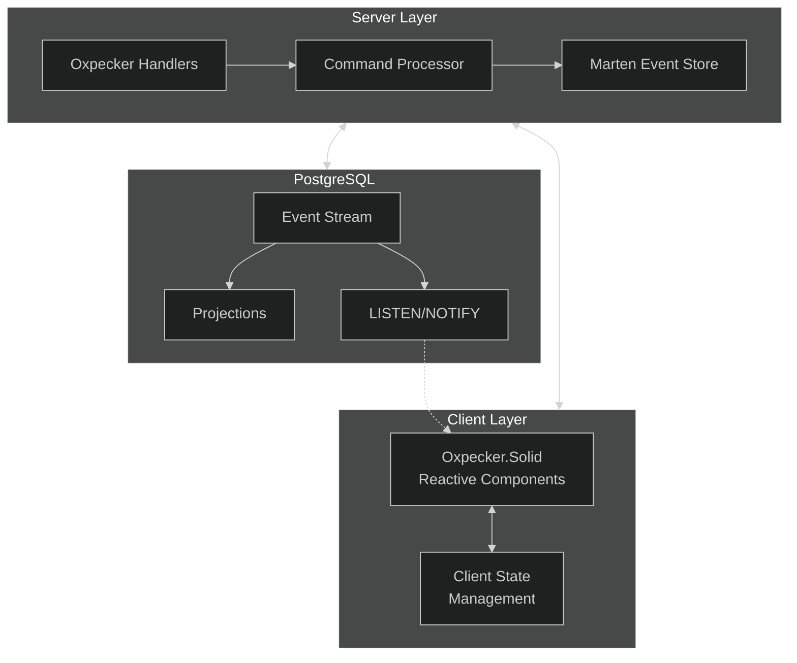

# FlightDeck Event Sourcing Architecture Overview

## Executive Summary

This document provides a high-level overview of the event sourcing architecture for FlightDeck using Oxpecker, Marten, and PostgreSQL. The design builds upon lessons learned from the CollabGateway implementation while taking advantage of Oxpecker's unique features to create a more streamlined solution.

## Architectural Vision

The FlightDeck event sourcing architecture captures user interactions, form submissions, and system events in an append-only event store, providing a complete audit trail while enabling rich analytics and dynamic UI experiences.



## Key Components

### 1. Oxpecker Server

Oxpecker, as a lightweight F# web framework, offers several advantages over Giraffe for our event sourcing implementation:

- **Task-based computation expressions**: Oxpecker's native `task {}` CE provides better performance and cleaner asynchronous code compared to Giraffe's `HttpHandler` composition.

- **Streamlined routing**: Oxpecker's route handling is more concise and type-safe:

```fsharp
// Oxpecker routing
let endpoints = [
    GET [
        route "/api/events/{streamId}" getEvents
        route "/api/stream/current" getCurrentStream
    ]
    POST [
        route "/api/events" recordEvent
    ]
]
```

- **WebSockets integration**: Oxpecker's built-in WebSocket support simplifies real-time event notifications.

### 2. Command Processor

The command processor transforms user actions into events:

```fsharp
type Command =
    | RecordPageView of streamId:string * pageId:string * metadata:Map<string, string>
    | RecordButtonClick of streamId:string * buttonId:string * metadata:Map<string, string>
    | SubmitForm of streamId:string * formId:string * formData:Map<string, string>

let processCommand (cmd: Command) =
    task {
        use session = store.LightweightSession()
        
        let event = 
            match cmd with
            | RecordPageView(streamId, pageId, metadata) ->
                session.Events.Append(streamId, PageViewedEvent(pageId, metadata, DateTime.UtcNow))
            | RecordButtonClick(streamId, buttonId, metadata) ->
                session.Events.Append(streamId, ButtonClickedEvent(buttonId, metadata, DateTime.UtcNow))
            | SubmitForm(streamId, formId, formData) ->
                session.Events.Append(streamId, FormSubmittedEvent(formId, formData, DateTime.UtcNow))
        
        do! session.SaveChangesAsync()
    }
```

### 3. Event Store

Marten provides a robust event store implementation on top of PostgreSQL:

```fsharp
let configureEventStore (services: IServiceCollection) =
    services.AddMarten(fun options ->
        options.Connection(connectionString)
        options.Events.AddEventType<PageViewedEvent>()
        options.Events.AddEventType<ButtonClickedEvent>()
        options.Events.AddEventType<FormSubmittedEvent>()
        
        // Enable async daemon for projections
        options.Projections.Add<UserActivityProjection>(ProjectionLifecycle.Async)
    )
```

### 4. Real-time Updates

PostgreSQL's LISTEN/NOTIFY mechanism enables real-time updates:

```fsharp
// In Oxpecker handler
let eventStreamHandler : HttpHandler =
    fun next ctx -> task {
        // Setup SSE headers
        ctx.Response.Headers.Add("Content-Type", "text/event-stream")
        ctx.Response.Headers.Add("Cache-Control", "no-cache")
        ctx.Response.Headers.Add("Connection", "keep-alive")
        
        // Subscribe to notifications
        use subscription = eventBus.Subscribe("user_events")
        subscription.MessageReceived.Add(fun msg ->
            let data = sprintf "data: %s\n\n" msg.Payload
            ctx.Response.WriteAsync(data).Wait()
            ctx.Response.Body.FlushAsync().Wait()
        )
        
        // Keep connection open
        let tcs = TaskCompletionSource()
        ctx.RequestAborted.Register(fun () -> tcs.SetResult()) |> ignore
        do! tcs.Task
        
        return! next ctx
    }
```

## Integration with FlightDeck

This event sourcing architecture integrates with the core FlightDeck platform:

1. **Frontmatter Integration**: Page metadata in FlightDeck's Frontmatter automatically generates event capture code.

2. **Type-Safe Event Handling**: F# types throughout the stack ensure consistency and reliability.

3. **Progressive Enhancement**: Start with basic page view tracking and progressively add more sophisticated events.

## Conclusion

By leveraging Oxpecker's advantages over Giraffe and applying lessons from CollabGateway, this architecture provides a more streamlined, type-safe approach to event sourcing in FlightDeck. The design reduces boilerplate code while maintaining the power and flexibility needed for comprehensive event capture and analysis.