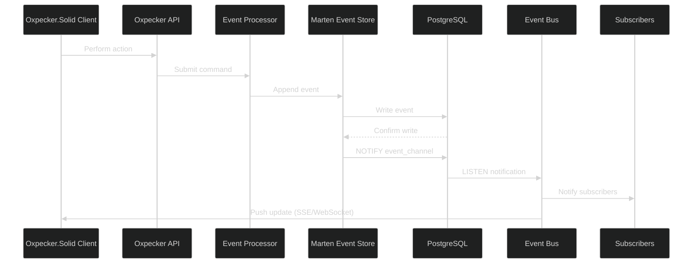

# Pub/Sub Mechanism with Oxpecker.Solid and Marten Event Store

## Overview

This document outlines an implementation strategy for a publish/subscribe (pub/sub) mechanism in FlightDeck using Marten event store with PostgreSQL and Oxpecker.Solid for reactive UI components. This approach leverages PostgreSQL's native LISTEN/NOTIFY capabilities to enable efficient real-time updates throughout the application.

## Architecture



## Marten Integration for Event Sourcing

Marten provides a robust event store built on PostgreSQL, with integrated support for event sourcing patterns:

```fsharp
// FlightDeck.EventSourcing/MartenConfig.fs
module FlightDeck.EventSourcing.MartenConfig

open System
open Marten
open Marten.Events
open Marten.Events.Projections
open Marten.Schema
open Marten.Services
open Microsoft.Extensions.DependencyInjection
open FlightDeck.Domain.Events

// Configure Marten services
let configureMartenServices (services: IServiceCollection) (connectionString: string) =
    services.AddMarten(fun options ->
        // Set connection string
        options.Connection(connectionString)
        
        // Configure event store
        options.Events.AddEventTypes([|
            typeof<ContentEventCase>
            typeof<PresentationEventCase>
            typeof<UserEventCase>
        |])
        
        // Enable stream aggregation
        options.Events.InlineProjections.AggregateStreamsWith<ContentState>()
        options.Events.InlineProjections.AggregateStreamsWith<PresentationState>()
        options.Events.InlineProjections.AggregateStreamsWith<UserState>()
        
        // Configure JSON serialization
        options.UseDefaultSerialization(
            EnumStorage.AsString,
            NonPublicMembersStorage.NonPublicSetters,
            Casing.CamelCase)
        
        // Add async daemon for projections
        options.Projections.AsyncMode <- ProjectionLifecycle.Async
        
        // Configure database schema
        options.Schema.For<ContentReadModel>()
            .Index(fun i -> 
                i.OnField<ContentReadModel>(fun x -> x.Slug)
                 .Name("idx_content_slug"))
                
        // Set auto-create schema options
        options.AutoCreateSchemaObjects <- AutoCreate.All
    )
    |> ignore
    
    // Add hosted service for async daemon
    services.AddMarten()
           .AddAsyncDaemon(DaemonMode.HotCold)
           .ApplyAllDatabaseChangesOnStartup()
    |> ignore
```

## Event Domain Model

Define the events and aggregates:

```fsharp
// FlightDeck.Domain/Aggregates.fs
module FlightDeck.Domain.Aggregates

open FlightDeck.Domain.Events

// Content aggregate
type ContentState = {
    ContentId: string
    Title: string
    Slug: string option
    Description: string option
    Content: string option
    Format: string option
    Status: string option
    Author: string
    Tags: string list
    CreatedAt: System.DateTimeOffset
    UpdatedAt: System.DateTimeOffset option
    IsDeleted: bool
}

// Apply events to content state
let applyContentEvent (state: ContentState option) (event: ContentEventCase) =
    match event, state with
    | ContentCreated e, None ->
        // Create new state from event
        Some {
            ContentId = e.ContentId
            Title = e.Title
            Slug = e.Slug
            Description = e.Description
            Content = Some e.Content
            Format = Some e.Format
            Status = Some "Draft"
            Author = e.Author
            Tags = e.Tags
            CreatedAt = System.DateTimeOffset.UtcNow
            UpdatedAt = None
            IsDeleted = false
        }
        
    | ContentUpdated e, Some state ->
        // Update existing state
        Some {
            state with
                Title = e.Title |> Option.defaultValue state.Title
                Slug = e.Slug |> Option.orElse state.Slug
                Description = e.Description |> Option.orElse state.Description
                Content = e.Content |> Option.orElse state.Content
                Format = e.Format |> Option.orElse state.Format
                Status = e.Status |> Option.orElse state.Status
                Tags = e.Tags |> Option.defaultValue state.Tags
                UpdatedAt = Some (System.DateTimeOffset.UtcNow)
        }
        
    | ContentDeleted e, Some state ->
        // Mark as deleted
        Some { state with IsDeleted = true; UpdatedAt = Some (System.DateTimeOffset.UtcNow) }
        
    | _, _ -> state // Invalid event sequence, return unchanged state
```

## Read Models and Projections

Implement projections for read models:

```fsharp
// FlightDeck.EventSourcing/Projections.fs
module FlightDeck.EventSourcing.Projections

open Marten.Events.Aggregation
open Marten.Events.Projections
open FlightDeck.Domain.Events
open FlightDeck.Domain.Aggregates

// Content read model
type ContentReadModel = {
    Id: string
    Title: string
    Slug: string option
    Description: string option
    Content: string option
    RenderedContent: string option
    Format: string option
    Status: string option
    Author: string
    Tags: string list
    CreatedAt: System.DateTimeOffset
    UpdatedAt: System.DateTimeOffset option
    IsDeleted: bool
}

// Content projector
type ContentProjection() =
    interface IProjection<ContentReadModel, string> with
        member _.DeleteEvent = null
        
        member _.DeleteAsync(model, ctsrc) = 
            // Return None for deletion
            async { return None } |> Async.StartAsTask
        
        member _.EventSelector = EventSelector<ContentEventCase>().Select()
        
        member _.ProjectEventAsync(model, eventData, ctsrc) =
            let event = eventData.Data :?> ContentEventCase
            
            let updatedModel =
                match event, model with
                | ContentCreated e, None ->
                    // Create new read model
                    Some {
                        Id = e.ContentId
                        Title = e.Title
                        Slug = e.Slug
                        Description = e.Description
                        Content = Some e.Content
                        RenderedContent = Some (renderContent e.Content e.Format)
                        Format = Some e.Format
                        Status = Some "Draft"
                        Author = e.Author
                        Tags = e.Tags
                        CreatedAt = System.DateTimeOffset.UtcNow
                        UpdatedAt = None
                        IsDeleted = false
                    }
                    
                | ContentUpdated e, Some model ->
                    // Update existing model
                    let updatedContent = 
                        match e.Content, e.Format with
                        | Some content, Some format -> Some (renderContent content format)
                        | Some content, None -> 
                            match model.Format with
                            | Some format -> Some (renderContent content format)
                            | None -> model.RenderedContent
                        | None, _ -> model.RenderedContent
                    
                    Some {
                        model with
                            Title = e.Title |> Option.defaultValue model.Title
                            Slug = e.Slug |> Option.orElse model.Slug
                            Description = e.Description |> Option.orElse model.Description
                            Content = e.Content |> Option.orElse model.Content
                            RenderedContent = updatedContent
                            Format = e.Format |> Option.orElse model.Format
                            Status = e.Status |> Option.orElse model.Status
                            Tags = e.Tags |> Option.defaultValue model.Tags
                            UpdatedAt = Some (System.DateTimeOffset.UtcNow)
                    }
                    
                | ContentDeleted _, Some model ->
                    // Mark as deleted
                    Some { model with IsDeleted = true; UpdatedAt = Some (System.DateTimeOffset.UtcNow) }
                    
                | _, _ -> model |> Option.ofObj
                
            async { return updatedModel |> Option.defaultValue null } |> Async.StartAsTask
            
        member _.IdSelector = fun (e: ContentEventCase) ->
            match e with
            | ContentCreated e -> e.ContentId
            | ContentUpdated e -> e.ContentId
            | ContentDeleted e -> e.ContentId
```

## PostgreSQL LISTEN/NOTIFY Integration

Implement a pub/sub mechanism using PostgreSQL's LISTEN/NOTIFY:

```fsharp
// FlightDeck.EventSourcing/EventBus.fs
module FlightDeck.EventSourcing.EventBus

open System
open System.Collections.Concurrent
open System.Text.Json
open Npgsql
open Marten
open FlightDeck.Domain.Events

// Type for event subscribers
type EventHandler = string -> unit

// Event bus implementation using Postgres LISTEN/NOTIFY
type PostgresEventBus(connectionString: string) =
    let mutable isRunning = false
    let listeners = ConcurrentDictionary<string, EventHandler list>()
    let mutable connection: NpgsqlConnection = null
    
    // Add a listener for specific event type
    member this.Subscribe(eventType: string, handler: EventHandler) =
        listeners.AddOrUpdate(
            eventType,
            [handler],
            fun _ currentHandlers -> handler :: currentHandlers)
        |> ignore
    
    // Remove a listener
    member this.Unsubscribe(eventType: string, handler: EventHandler) =
        listeners.AddOrUpdate(
            eventType,
            [],
            fun _ currentHandlers -> currentHandlers |> List.filter (fun h -> h <> handler))
        |> ignore
    
    // Start listening for notifications
    member this.Start() =
        if not isRunning then
            isRunning <- true
            
            // Create and open connection
            connection <- new NpgsqlConnection(connectionString)
            connection.Open()
            
            // Listen for notifications on event_channel
            let cmd = connection.CreateCommand()
            cmd.CommandText <- "LISTEN event_channel;"
            cmd.ExecuteNonQuery() |> ignore
            
            // Setup notification handler
            connection.Notification.Add(fun args ->
                try
                    // Parse notification payload
                    let notification = JsonSerializer.Deserialize<EventNotification>(args.Payload)
                    
                    // Find handlers for this event type
                    match listeners.TryGetValue(notification.EventType) with
                    | true, handlers ->
                        // Notify all handlers
                        handlers |> List.iter (fun handler -> handler notification.Payload)
                    | false, _ -> ()
                with ex ->
                    printfn "Error processing notification: %s" ex.Message
            )
            
            // Keep connection alive
            async {
                while isRunning do
                    if connection.State <> System.Data.ConnectionState.Open then
                        connection.Open()
                        let cmd = connection.CreateCommand()
                        cmd.CommandText <- "LISTEN event_channel;"
                        cmd.ExecuteNonQuery() |> ignore
                        
                    do! Async.Sleep(TimeSpan.FromSeconds(30).TotalMilliseconds |> int)
            } |> Async.Start
    
    // Send an event notification
    member this.Publish(eventType: string, payload: string) =
        async {
            use conn = new NpgsqlConnection(connectionString)
            do! conn.OpenAsync() |> Async.AwaitTask
            
            // Create notification with event type and payload
            let notification = {
                EventType = eventType
                Payload = payload
                Timestamp = DateTimeOffset.UtcNow
            }
            
            let notificationJson = JsonSerializer.Serialize(notification)
            
            // Send notification via NOTIFY
            use cmd = new NpgsqlCommand(
                $"SELECT pg_notify('event_channel', @payload)",
                conn)
            cmd.Parameters.AddWithValue("payload", notificationJson) |> ignore
            
            do! cmd.ExecuteNonQueryAsync() |> Async.AwaitTask |> Async.Ignore
        } |> Async.Start
    
    // Stop listening
    member this.Stop() =
        isRunning <- false
        if connection <> null then
            connection.Close()
            connection.Dispose()
            connection <- null
    
    interface IDisposable with
        member this.Dispose() =
            this.Stop()

// Event notification type
and EventNotification = {
    EventType: string
    Payload: string
    Timestamp: DateTimeOffset
}

// Register events with Marten and automatically publish notifications
let configureEventPublisher (store: IDocumentStore) (eventBus: PostgresEventBus) =
    store.Events.AfterCommitAppend.Subscribe(fun events ->
        // Process appended events
        for streamEvent in events.Documents do
            let eventData = streamEvent.Data
            
            // Determine event type and serialize payload
            let eventType, payload =
                match eventData with
                | :? ContentEventCase as e -> 
                    let typeName = e.GetType().Name
                    typeName, JsonSerializer.Serialize(e)
                | :? PresentationEventCase as e -> 
                    let typeName = e.GetType().Name
                    typeName, JsonSerializer.Serialize(e)
                | :? UserEventCase as e -> 
                    let typeName = e.GetType().Name
                    typeName, JsonSerializer.Serialize(e)
                | _ -> "", ""
                
            // Publish event if recognized
            if eventType <> "" then
                eventBus.Publish(eventType, payload)
    )
```

## Server-Sent Events (SSE) Implementation

Create a Server-Sent Events handler to push updates to clients:

```fsharp
// FlightDeck.Web/EventStreamHandler.fs
module FlightDeck.Web.EventStreamHandler

open System
open System.Text.Json
open System.Threading
open Oxpecker
open FlightDeck.EventSourcing.EventBus

// Handler for SSE stream
let eventStreamHandler (eventBus: PostgresEventBus) : HttpHandler =
    fun next ctx -> task {
        // Set up SSE headers
        ctx.SetResponseHeader("Content-Type", "text/event-stream")
        ctx.SetResponseHeader("Cache-Control", "no-cache")
        ctx.SetResponseHeader("Connection", "keep-alive")
        
        // Create cancellation token source
        let cts = new CancellationTokenSource()
        
        // Register client disconnect
        ctx.HttpContext.RequestAborted.Register(fun () -> 
            cts.Cancel()
        ) |> ignore
        
        // Write function that will be passed to event bus
        let writeEvent (payload: string) =
            if not cts.IsCancellationRequested then
                // Format as SSE data
                let data = sprintf "data: %s\n\n" payload
                
                // Write to response and flush
                ctx.HttpContext.Response.WriteAsync(data, cts.Token)
                    .ConfigureAwait(false).GetAwaiter().GetResult()
                    
                ctx.HttpContext.Response.Body.FlushAsync(cts.Token)
                    .ConfigureAwait(false).GetAwaiter().GetResult()
        
        // Subscribe to all content events
        eventBus.Subscribe("ContentCreated", writeEvent)
        eventBus.Subscribe("ContentUpdated", writeEvent)
        eventBus.Subscribe("ContentDeleted", writeEvent)
        
        // Keep connection open until client disconnects
        try
            let tcs = TaskCompletionSource()
            ctx.HttpContext.RequestAborted.Register(fun () -> tcs.SetResult()) |> ignore
            do! tcs.Task
            return! next ctx
        finally
            // Clean up subscriptions
            eventBus.Unsubscribe("ContentCreated", writeEvent)
            eventBus.Unsubscribe("ContentUpdated", writeEvent)
            eventBus.Unsubscribe("ContentDeleted", writeEvent)
    }
```

## Integration with Oxpecker Endpoints

Configure the SSE endpoint in the Oxpecker application:

```fsharp
// FlightDeck.Web/Program.fs
module FlightDeck.Web.Program

open System
open Microsoft.AspNetCore.Builder
open Microsoft.Extensions.DependencyInjection
open Microsoft.Extensions.Hosting
open Oxpecker
open FlightDeck.EventSourcing.MartenConfig
open FlightDeck.EventSourcing.EventBus
open FlightDeck.Web.EventStreamHandler

// App configuration
let configureApp (app: WebApplication) =
    app.UseRouting()
       .UseStaticFiles()
       .UseOxpecker(
           // Endpoint handlers
           [
               // Content API endpoints
               route "/api/content"         POST   >=> Handlers.Content.createContent
               routef "/api/content/%s"     GET    >=> Handlers.Content.getContent
               routef "/api/content/%s"     PUT    >=> Handlers.Content.updateContent
               routef "/api/content/%s"     DELETE >=> Handlers.Content.deleteContent
               
               // Presentation API endpoints
               route "/api/presentations"          POST   >=> Handlers.Presentations.createPresentation
               routef "/api/presentations/%s"      GET    >=> Handlers.Presentations.getPresentation
               routef "/api/presentations/%s"      PUT    >=> Handlers.Presentations.updatePresentation
               routef "/api/presentations/%s"      DELETE >=> Handlers.Presentations.deletePresentation
               
               // SSE endpoint for events
               route "/api/events" GET >=> eventStreamHandler (app.Services.GetRequiredService<PostgresEventBus>())
               
               // Admin routes
               route "/admin"             GET >=> Views.Admin.dashboardPage
               route "/admin/content"     GET >=> Views.Admin.contentListPage
               route "/admin/content/new" GET >=> Views.Admin.contentEditPage None
               routef "/admin/content/%s" GET >=> fun id -> Views.Admin.contentEditPage (Some id)
               
               // Home and content pages
               route "/"               GET >=> Views.Content.homePage
               routef "/content/%s"    GET >=> Views.Content.contentPage
           ]
       )

// Service configuration
let configureServices (services: IServiceCollection) =
    // Config
    let connectionString = "Host=localhost;Database=flightdeck;Username=postgres;Password=postgres"
    
    // Add Marten
    configureMartenServices services connectionString
    
    // Add event bus
    services.AddSingleton<PostgresEventBus>(fun _ -> 
        let bus = new PostgresEventBus(connectionString)
        bus.Start()
        bus
    ) |> ignore
    
    // Configure event publisher
    services.AddHostedService<EventPublisherService>() |> ignore
    
    // Add controllers
    services.AddControllers() |> ignore
    
    // Add CORS
    services.AddCors(fun options ->
        options.AddPolicy("AllowAll", fun builder ->
            builder.AllowAnyOrigin()
                   .AllowAnyMethod()
                   .AllowAnyHeader()
                   |> ignore
        )
    ) |> ignore

// Event publisher service
type EventPublisherService(store: Marten.IDocumentStore, eventBus: PostgresEventBus) =
    inherit BackgroundService()
    
    override _.ExecuteAsync(ct) =
        // Set up event publisher
        configureEventPublisher store eventBus
        
        // Return completed task
        Task.CompletedTask
```

## Oxpecker.Solid Client Integration

Create reactive components to consume the event stream:

```typescript
// src/components/EventListening.ts
import { createSignal, createResource, onCleanup } from 'solid-js';

// Generic event store hook
export function useEventStream<T>(eventTypes: string[], initialData: T[] = []) {
  const [events, setEvents] = createSignal<T[]>(initialData);
  
  // Connect to event stream
  let eventSource: EventSource | null = null;
  
  const connect = () => {
    eventSource = new EventSource('/api/events');
    
    eventSource.onmessage = (event) => {
      try {
        const eventData = JSON.parse(event.data);
        
        // Check if this is an event we're interested in
        if (eventTypes.includes(eventData.EventType)) {
          // Add new event to our state
          setEvents(prev => [...prev, eventData]);
          
          // Call event handlers (could be implemented here)
          handleEvent(eventData);
        }
      } catch (err) {
        console.error('Error processing event', err);
      }
    };
    
    eventSource.onerror = (error) => {
      console.error('EventSource failed:', error);
      // Reconnect after delay if connection fails
      setTimeout(connect, 5000);
    };
  };
  
  // Start the connection
  connect();
  
  // Clean up function
  onCleanup(() => {
    if (eventSource) {
      eventSource.close();
    }
  });
  
  return events;
}

// Handle events appropriately
function handleEvent(event: any) {
  // Add to appropriate store based on event type
  switch (event.EventType) {
    case 'ContentCreated':
      // Update content list
      break;
    case 'ContentUpdated':
      // Update specific content
      break;
    case 'ContentDeleted':
      // Remove content
      break;
  }
}
```

## Oxpecker.Solid Component Examples

### Content List with Real-time Updates

```fsharp
// FlightDeck.Client/Components/ContentList.fs
module FlightDeck.Client.Components.ContentList

open Oxpecker.Solid
open FlightDeck.Shared.Domain
open FlightDeck.Client.Hooks

// Content list component
let ContentList() =
    // Use custom hook for content list with real-time updates
    let contentData = useContentList()
    
    // Render content list
    div [class' "content-list"] [
        h2 [class' "list-title"] [text "Content Items"]
        
        // Display loading state
        Show(contentData.isLoading, fun () ->
            div [class' "loading-spinner"] [text "Loading..."]
        )
        
        // Display error if any
        Show(contentData.error.IsSome, fun () ->
            div [class' "error-message"] [
                text (contentData.error |> Option.defaultValue "An error occurred")
            ]
        )
        
        // Display content items
        Show(not contentData.isLoading && contentData.items.Length > 0, fun () ->
            ul [class' "content-items"] [
                For(contentData.items, fun item ->
                    li [
                        class' "content-item"
                        key item.Id
                    ] [
                        div [class' "content-header"] [
                            h3 [class' "item-title"] [text item.Title]
                            span [class' "item-status"] [text item.Status]
                        ]
                        
                        div [class' "content-meta"] [
                            span [class' "item-author"] [text ("By " + item.Author)]
                            span [class' "item-date"] [
                                text (
                                    match item.UpdatedAt with
                                    | Some date -> "Updated " + formatDate date
                                    | None -> "Created " + formatDate item.CreatedAt
                                )
                            ]
                        ]
                        
                        div [class' "item-actions"] [
                            a [
                                href ("/content/" + item.Slug |> Option.defaultValue item.Id)
                                class' "view-button"
                            ] [text "View"]
                            
                            a [
                                href ("/admin/content/" + item.Id)
                                class' "edit-button"
                            ] [text "Edit"]
                        ]
                    ]
                )
            ]
        )
        
        // Display empty state
        Show(not contentData.isLoading && contentData.items.Length = 0, fun () ->
            div [class' "empty-state"] [
                p [] [text "No content items found."]
                a [
                    href "/admin/content/new"
                    class' "create-button"
                ] [text "Create New Content"]
            ]
        )
    ]
```

### Real-time Content Hook

```fsharp
// FlightDeck.Client/Hooks/ContentHooks.fs
module FlightDeck.Client.Hooks.ContentHooks

open System
open Oxpecker.Solid
open FlightDeck.Shared.Domain
open FlightDeck.Client.Api

// Content list state
type ContentListState = {
    items: ContentReadModel list
    isLoading: bool
    error: string option
}

// Initialize from SSE for real-time updates
let useContentList() =
    // Initial state
    let (state, setState) = createStore({
        items = []
        isLoading = true
        error = None
    })
    
    // Fetch initial data
    createEffect(fun () ->
        async {
            try
                let! response = Api.getContentList()
                
                if response.Success && response.Data.IsSome then
                    setState(fun s -> { s with items = response.Data.Value; isLoading = false })
                else
                    let error = response.Errors 
                                |> Option.bind (fun errs -> errs |> List.tryHead) 
                                |> Option.map (fun err -> err.Message)
                                |> Option.defaultValue "Failed to load content"
                                
                    setState(fun s -> { s with error = Some error; isLoading = false })
            with ex ->
                setState(fun s -> { s with error = Some ex.Message; isLoading = false })
        } |> Async.StartImmediate
    )
    
    // Set up event source for real-time updates
    let eventSource = new Browser.WebApis.EventSource("/api/events")
    
    // Handle incoming events
    eventSource.onmessage <- fun event ->
        let data = event.data
        let eventData = JS.JSON.parse(data)
        
        // Handle different event types
        match eventData?EventType with
        | "ContentCreated" ->
            // Add new content
            let newContent = decodeContent eventData?Payload
            if newContent.IsSome then
                setState(fun s -> { s with items = newContent.Value :: s.items })
                
        | "ContentUpdated" ->
            // Update existing content
            let updatedContent = decodeContent eventData?Payload
            if updatedContent.IsSome then
                setState(fun s -> 
                    { s with 
                        items = s.items |> List.map (fun item ->
                            if item.Id = updatedContent.Value.Id then updatedContent.Value
                            else item
                        )
                    }
                )
                
        | "ContentDeleted" ->
            // Remove deleted content
            let contentId = eventData?Payload?ContentId
            if contentId <> null then
                setState(fun s -> 
                    { s with items = s.items |> List.filter (fun item -> item.Id <> contentId) }
                )
                
        | _ -> ()
    
    // Handle connection errors
    eventSource.onerror <- fun _ ->
        // Connection error, will automatically reconnect
        console.error "EventSource connection error"
    
    // Cleanup on unmount
    onCleanup(fun () ->
        eventSource.close()
    )
    
    // Return state
    state
    
// Helper for decoding content from event payload
let private decodeContent (payload: string) =
    try
        Some (JS.JSON.parse<ContentReadModel>(payload))
    with _ ->
        None
```

### Collaborative Editing Example

```fsharp
// FlightDeck.Client/Components/ContentEditor.fs
module FlightDeck.Client.Components.ContentEditor

open Oxpecker.Solid
open FlightDeck.Shared.Domain
open FlightDeck.Client.Api
open FlightDeck.Client.Hooks

// Content editor with collaborative features
let ContentEditor(props: {| contentId: string option |}) =
    // Use content hook with real-time updates
    let contentState = useContentDetail(props.contentId)
    
    // Form state
    let (title, setTitle) = createSignal(contentState.content |> Option.map (fun c -> c.Title) |> Option.defaultValue "")
    let (content, setContent) = createSignal(contentState.content |> Option.bind (fun c -> c.Content) |> Option.defaultValue "")
    let (description, setDescription) = createSignal(contentState.content |> Option.bind (fun c -> c.Description) |> Option.defaultValue "")
    let (format, setFormat) = createSignal(contentState.content |> Option.bind (fun c -> c.Format) |> Option.defaultValue "Markdown")
    
    // Show collaborators
    let (collaborators, setCollaborators) = createSignal([])
    
    // Handle form submission
    let handleSubmit (e: Browser.Types.Event) =
        e.preventDefault()
        
        // Create request based on whether we're editing or creating
        match props.contentId with
        | Some id ->
            // Update existing content
            let request = {
                Id = id
                Title = Some (title())
                Content = Some (content())
                Description = Some (description())
                Format = Some (format())
                Slug = None
                Status = None
                Tags = None
            }
            
            async {
                let! result = Api.updateContent request
                
                if result.Success then
                    // Navigate to content view
                    Browser.Dom.window.location.href <- "/content/" + id
            } |> Async.StartImmediate
            
        | None ->
            // Create new content
            let request = {
                Title = title()
                Content = content()
                Description = Some (description())
                Format = format()
                Slug = None
                Author = "Current User" // This would come from auth
                Tags = []
            }
            
            async {
                let! result = Api.createContent request
                
                if result.Success && result.Data.IsSome then
                    // Navigate to new content
                    Browser.Dom.window.location.href <- "/content/" + result.Data.Value.Id
            } |> Async.StartImmediate
    
    // Listen for content changes from other users
    createEffect(fun () ->
        if contentState.content.IsSome then
            setTitle(contentState.content.Value.Title)
            setContent(contentState.content.Value.Content |> Option.defaultValue "")
            setDescription(contentState.content.Value.Description |> Option.defaultValue "")
            setFormat(contentState.content.Value.Format |> Option.defaultValue "Markdown")
    )
    
    // Render the editor form
    form [
        class' "content-editor-form"
        onSubmit handleSubmit
    ] [
        // Collaborators indicator
        Show(collaborators().Length > 0, fun () ->
            div [class' "collaborators"] [
                span [] [text $"{collaborators().Length} users editing"]
                For(collaborators(), fun user ->
                    span [class' "collaborator-avatar"] [
                        // Avatar or initials
                        text (user.Name.Substring(0, 1))
                    ]
                )
            ]
        )
        
        // Form fields
        div [class' "form-group"] [
            label [for' "title"] [text "Title"]
            input [
                id "title"
                value (title())
                onInput (fun e -> setTitle(e.Value))
                required true
                class' "form-control"
            ]
        ]
        
        div [class' "form-group"] [
            label [for' "description"] [text "Description"]
            textarea [
                id "description"
                value (description())
                onInput (fun e -> setDescription(e.Value))
                class' "form-control"
                rows 3
            ] []
        ]
        
        div [class' "form-group"] [
            label [for' "format"] [text "Format"]
            select [
                id "format"
                value (format())
                onChange (fun e -> setFormat(e.Value))
                class' "form-control"
            ] [
                option [value "Markdown"] [text "Markdown"]
                option [value "HTML"] [text "HTML"]
                option [value "Text"] [text "Plain Text"]
            ]
        ]
        
        div [class' "form-group"] [
            label [for' "content"] [text "Content"]
            textarea [
                id "content"
                value (content())
                onInput (fun e -> setContent(e.Value))
                class' "form-control content-textarea"
                rows 15
                required true
            ] []
        ]
        
        // Preview of rendered content (for Markdown)
        Show(format() = "Markdown" && content().Length > 0, fun () ->
            div [class' "content-preview"] [
                h3 [] [text "Preview"]
                div [
                    class' "markdown-preview" 
                    dangerouslySetInnerHTML (renderMarkdown(content()))
                ] []
            ]
        )
        
        // Form buttons
        div [class' "form-actions"] [
            button [
                type' "submit"
                class' "btn btn-primary"
            ] [text "Save"]
            
            button [
                type' "button"
                class' "btn btn-secondary"
                onClick (fun _ -> Browser.Dom.window.history.back())
            ] [text "Cancel"]
        ]
    ]
```

## Conclusion

This implementation leverages the natural advantages of PostgreSQL with Marten for event sourcing, combined with modern real-time capabilities through:

1. **Marten Event Store**: Provides sophisticated event storage and projection capabilities.
2. **PostgreSQL LISTEN/NOTIFY**: Enables efficient server-side pub/sub with minimal complexity.
3. **Server-Sent Events**: Delivers real-time updates to the browser with excellent compatibility.
4. **Oxpecker.Solid Integration**: Connects reactive UI components to the event stream.

This architecture supports various real-time features:

- Live updates to content lists
- Collaborative editing with presence indicators
- Notifications for important events
- Dashboard activity feeds
- Real-time analytics

By building on PostgreSQL's robust capabilities rather than implementing a custom pub/sub mechanism, this approach offers simplicity, reliability, and seamless integration with the event sourcing system. The Oxpecker.Solid components provide an efficient way to reflect these real-time updates in the UI with minimal client-side code.