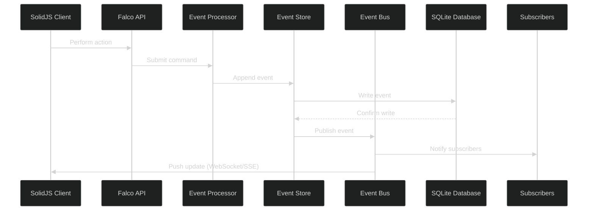

# Pub/Sub Mechanism for SQLite Event Sourcing in FlightDeck

## Overview

This memo outlines an approach for implementing a publish/subscribe (pub/sub) mechanism with SQLite for the FlightDeck event sourcing system. While SQLite lacks native pub/sub capabilities like PostgreSQL's LISTEN/NOTIFY, we can implement an efficient real-time solution that works well with the existing architecture, focusing on WebSockets and Server-Sent Events (SSE).

## Architecture



## Implementation Options

### Option 1: WebSockets with SQLite Change Notification

WebSockets provide full-duplex communication between client and server, allowing real-time updates:

```fsharp
// Server-side WebSocket handler in Falco
let webSocketHandler (webSocket: WebSocket) (context: HttpContext) = task {
    // Track active connection
    let connectionId = Guid.NewGuid().ToString()
    
    // Add to active connections
    EventBus.addConnection connectionId webSocket
    
    // Set up receiving loop to handle client messages
    let buffer = Array.zeroCreate<byte> 4096
    let mutable receiving = true
    
    while receiving do
        try
            let! result = webSocket.ReceiveAsync(
                ArraySegment(buffer), CancellationToken.None)
            
            if result.CloseStatus.HasValue then
                // Client closed connection
                receiving <- false
                EventBus.removeConnection connectionId
                
                let! _ = webSocket.CloseAsync(
                    result.CloseStatus.Value,
                    result.CloseStatusDescription,
                    CancellationToken.None)
                ()
            elif result.MessageType = WebSocketMessageType.Text then
                // Process client message if needed
                let message = Encoding.UTF8.GetString(buffer, 0, result.Count)
                // Handle client message if needed
        with
        | ex ->
            // Handle error
            receiving <- false
            EventBus.removeConnection connectionId
    }

// Event bus implementation
module EventBus =
    // Active WebSocket connections
    let private connections = ConcurrentDictionary<string, WebSocket>()
    
    // Add a new connection
    let addConnection id socket =
        connections.TryAdd(id, socket) |> ignore
    
    // Remove a connection
    let removeConnection id =
        connections.TryRemove(id) |> ignore
    
    // Publish event to all connections
    let publishEvent (event: Event<'T>) =
        let eventJson = JsonSerializer.Serialize(event)
        let eventBytes = Encoding.UTF8.GetBytes(eventJson)
        
        async {
            // Send to all connected clients
            for KeyValue(id, socket) in connections do
                if socket.State = WebSocketState.Open then
                    try
                        do! socket.SendAsync(
                            ArraySegment(eventBytes),
                            WebSocketMessageType.Text,
                            true,
                            CancellationToken.None) |> Async.AwaitTask
                    with
                    | _ ->
                        // Handle failed send, possibly remove connection
                        removeConnection id
        } |> Async.Start

// Modify event processor to publish events
let eventProcessor = MailboxProcessor<EventProcessingMessage>.Start(fun inbox ->
    let rec loop () = async {
        let! msg = inbox.Receive()
        
        match msg with
        | AppendEvent (streamId, event) ->
            use conn = getConnection()
            match appendEvent conn streamId (Some event.Version) event with
            | Ok newVersion -> 
                // Broadcast to all connected clients
                EventBus.publishEvent { event with Version = newVersion }
            | Error err -> 
                printfn "Error appending event: %s" err
                
        // Other message handlers...
        
        return! loop()
    }
    
    loop()
)
```

#### Client-side SolidJS implementation:

```typescript
// In your SolidJS component
import { createSignal, onMount, onCleanup } from 'solid-js';

function EventStreamComponent() {
  const [events, setEvents] = createSignal([]);
  let socket = null;
  
  onMount(() => {
    // Connect to WebSocket
    socket = new WebSocket(`ws://${window.location.host}/api/events`);
    
    // Handle incoming events
    socket.onmessage = (event) => {
      const newEvent = JSON.parse(event.data);
      setEvents(prev => [...prev, newEvent]);
      
      // Apply event to application state
      applyEvent(newEvent);
    };
    
    socket.onclose = () => {
      // Handle reconnection logic
      console.log('WebSocket connection closed');
    };
  });
  
  onCleanup(() => {
    if (socket && socket.readyState === WebSocket.OPEN) {
      socket.close();
    }
  });
  
  return (/* component rendering */);
}
```

#### Advantages:
- True real-time communication
- Bidirectional (client can send messages too)
- Efficient for frequent updates
- Reduced HTTP overhead

#### Disadvantages:
- More complex server implementation
- Requires managing WebSocket connections
- May require fallback for environments where WebSockets are blocked

### Option 2: Server-Sent Events (SSE)

Server-Sent Events provide a simpler one-way channel from server to client:

```fsharp
// In your Falco handler
let eventStreamHandler : HttpHandler =
    fun ctx ->
        // Set up SSE headers
        let response = ctx.Response
        response.Headers.Add("Content-Type", "text/event-stream")
        response.Headers.Add("Cache-Control", "no-cache")
        response.Headers.Add("Connection", "keep-alive")
        
        // Get the last event ID from request
        let lastEventId = 
            ctx.Request.Headers.["Last-Event-ID"] 
            |> Option.ofObj 
            |> Option.map int 
            |> Option.defaultValue 0
        
        // Create a connection ID
        let connectionId = Guid.NewGuid().ToString()
        
        // Create a cancellation token source
        let cts = new CancellationTokenSource()
        
        // Add this connection to the event bus
        EventBus.addConnection connectionId (fun event ->
            // Format event as SSE
            let serialized = JsonSerializer.Serialize(event)
            let data = $"id: {event.Id}\ndata: {serialized}\n\n"
            
            // Send event to client
            response.WriteAsync(data, cts.Token).ConfigureAwait(false).GetAwaiter().GetResult()
            response.Body.FlushAsync(cts.Token).ConfigureAwait(false).GetAwaiter().GetResult()
        )
        
        // Handle client disconnect
        ctx.RequestAborted.Register(fun () ->
            EventBus.removeConnection connectionId
            cts.Cancel()
        ) |> ignore
        
        // Keep connection alive until client disconnects
        TaskUtils.waitForever()

// Modified Event Bus for SSE
module EventBus =
    // Type for event callback
    type EventCallback = Event<obj> -> unit
    
    // Active SSE connections
    let private connections = ConcurrentDictionary<string, EventCallback>()
    
    // Add a new connection
    let addConnection id callback =
        connections.TryAdd(id, callback) |> ignore
    
    // Remove a connection
    let removeConnection id =
        connections.TryRemove(id) |> ignore
    
    // Publish event to all connections
    let publishEvent (event: Event<'T>) =
        // Convert to object event (type erasure)
        let objEvent = {
            Id = event.Id
            StreamId = event.StreamId
            Version = event.Version
            EventType = event.EventType
            Data = event.Data :> obj
            Metadata = event.Metadata
        }
        
        // Send to all connected clients
        for KeyValue(_, callback) in connections do
            try
                callback objEvent
            with
            | ex -> 
                // Log error but continue with other connections
                printfn "Error sending event: %s" ex.Message
```

#### Client-side SolidJS implementation:

```typescript
// In your SolidJS component
import { createSignal, onMount, onCleanup } from 'solid-js';

function EventStreamComponent() {
  const [events, setEvents] = createSignal([]);
  let eventSource = null;
  
  onMount(() => {
    // Connect to SSE endpoint
    eventSource = new EventSource('/api/events');
    
    // Handle incoming events
    eventSource.onmessage = (event) => {
      const newEvent = JSON.parse(event.data);
      setEvents(prev => [...prev, newEvent]);
      
      // Apply event to application state
      applyEvent(newEvent);
    };
    
    // Handle reconnection
    eventSource.onerror = (error) => {
      console.error('EventSource failed:', error);
      // EventSource will automatically try to reconnect
    };
  });
  
  onCleanup(() => {
    if (eventSource) {
      eventSource.close();
    }
  });
  
  return (/* component rendering */);
}
```

#### Advantages:
- Simpler than WebSockets
- Built-in reconnection handling
- Works through most proxies and firewalls
- Automatic event ID tracking for resuming

#### Disadvantages:
- One-way communication only (server to client)
- Limited to HTTP/1.1 connection limits per domain
- Slightly higher latency than WebSockets

## Recommended Approach

For FlightDeck, **Server-Sent Events (SSE)** offers the best balance of simplicity and functionality for your architecture. This approach:

1. Provides near real-time updates from server to client
2. Has simpler server implementation than WebSockets
3. Integrates well with SolidJS's reactive system
4. Features built-in reconnection support for network issues
5. Works through most proxy servers and firewalls

If bidirectional communication becomes a requirement, you can implement WebSockets instead or as a complement to SSE.

### Implementation Notes

1. **Connection Management:**
   - Track active SSE connections on the server
   - Handle client disconnections gracefully
   - Limit the number of events sent to prevent overwhelming clients

2. **Integration with Event Processor:**
   - Modify the event processor to publish events to the SSE bus
   - Ensure events are sent to clients after they're successfully stored

3. **Event Filtering:**
   - Allow clients to subscribe to specific event types or streams
   - Filter events on the server to reduce network traffic

4. **Error Handling:**
   - Implement robust error handling for SSE connections
   - Use try/catch blocks to prevent one failed connection from affecting others

## Integration with Current Architecture

The proposed pub/sub mechanism integrates cleanly with the existing FlightDeck architecture:

1. **Event Store remains unchanged** - SQLite continues to serve as the source of truth
2. **Event Processor notifies the SSE/WebSocket bus** - Events are broadcast after persistence
3. **SolidJS reactivity handles UI updates** - Fine-grained reactivity efficiently updates only changed parts
4. **Falco API serves SSE/WebSocket endpoints** - Simple endpoints provide event streams to clients

This approach maintains the benefits of event sourcing while adding real-time updates, creating a responsive and reactive architecture.