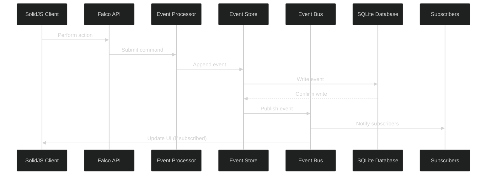

# Pub/Sub Mechanism for SQLite Event Sourcing in FlightDeck

## Overview

This memo outlines an approach for implementing a publish/subscribe (pub/sub) mechanism with SQLite for the FlightDeck event sourcing system. While SQLite lacks native pub/sub capabilities like PostgreSQL's LISTEN/NOTIFY, we can implement an efficient solution that works well with the existing architecture.

## Architecture



## Implementation Options

### Option 1: Client-Side Polling with SolidJS Signals

The simplest approach leverages SolidJS's reactive system with efficient polling:

```typescript
// In your SolidJS component
import { createSignal, createResource, createEffect } from 'solid-js';

function EventStreamComponent() {
  const [lastEventId, setLastEventId] = createSignal(0);
  
  // Resource that fetches new events
  const [events] = createResource(lastEventId, async (id) => {
    const response = await fetch(`/api/events?after=${id}`);
    const newEvents = await response.json();
    
    if (newEvents.length > 0) {
      // Update the last seen event ID
      setLastEventId(newEvents[newEvents.length - 1].id);
    }
    
    return newEvents;
  }, { 
    // Start polling immediately but back off when no new events
    refreshInterval: (info) => 
      info.value?.length > 0 ? 1000 : 5000  
  });
  
  // Effect that processes new events
  createEffect(() => {
    const currentEvents = events();
    if (currentEvents?.length) {
      // Apply events to local state
      applyEvents(currentEvents);
    }
  });
  
  return (/* component rendering */);
}
```

#### Advantages:
- Simple implementation
- No server-side changes needed
- Automatically adjusts polling frequency based on activity
- Leverages SolidJS's fine-grained reactivity

#### Disadvantages:
- Increased HTTP requests
- Slight delay in updates (bounded by polling interval)

### Option 2: WebSockets with SQLite Change Notification

For more real-time updates, we can implement a WebSocket server that monitors SQLite changes:

```fsharp
// Server-side code
let eventMonitor = MailboxProcessor<EventMonitorMessage>.Start(fun inbox ->
    // Track connected clients
    let clients = ResizeArray<WebSocket>()
    
    // Set up SQLite connection with change hooks
    let connection = new SQLiteConnection(connectionString)
    connection.Update += (sender, e) -> 
        match e.Table with
        | "events" -> 
            // Fetch the new event
            let event = getEvent connection e.RowId
            // Broadcast to all connected clients
            for client in clients do
                sendEventToClient client event
    
    let rec loop() = async {
        let! msg = inbox.Receive()
        
        match msg with
        | AddClient client -> 
            clients.Add(client)
        | RemoveClient client -> 
            clients.Remove(client) |> ignore
            
        return! loop()
    }
    
    loop()
)
```

#### Advantages:
- True real-time updates
- Reduced network traffic
- Better user experience

#### Disadvantages:
- More complex implementation
- Requires WebSocket server
- Challenges with SQLite's connection model

### Option 3: Server-Side Events (SSE)

A middle-ground approach using Server-Sent Events:

```fsharp
// In your Falco handler
let eventStreamHandler : HttpHandler =
    fun ctx ->
        // Set up SSE headers
        let response = ctx.Response
        response.Headers.Add("Content-Type", "text/event-stream")
        response.Headers.Add("Cache-Control", "no-cache")
        response.Headers.Add("Connection", "keep-alive")
        
        // Get the last event ID from request
        let lastEventId = 
            ctx.Request.Headers.["Last-Event-ID"] 
            |> Option.ofObj 
            |> Option.map int 
            |> Option.defaultValue 0
            
        // Create a cancellation token source
        let cts = new CancellationTokenSource()
        
        async {
            // Set up a polling loop
            while not cts.IsCancellationRequested do
                use conn = new SQLiteConnection(connectionString)
                conn.Open()
                
                // Get new events
                let events = getEventsAfter conn lastEventId
                
                if not (List.isEmpty events) then
                    // Send each event to the client
                    for event in events do
                        let serialized = JsonSerializer.Serialize(event)
                        let data = $"id: {event.Id}\ndata: {serialized}\n\n"
                        do! response.WriteAsync(data, cts.Token) |> Async.AwaitTask
                        
                    // Flush the response
                    do! response.Body.FlushAsync(cts.Token) |> Async.AwaitTask
                    
                // Wait before polling again
                do! Async.Sleep(1000)
        }
        |> Async.Start
        
        Task.CompletedTask
```

#### Advantages:
- Simpler than WebSockets
- Standard HTTP protocol
- Good browser support
- Works with proxies and firewalls

#### Disadvantages:
- One-way communication only
- Limited to HTTP/1.1 connection limits
- Still requires polling on the server side

## Recommended Approach

For FlightDeck, the **SolidJS polling with signals** (Option 1) offers the best balance of simplicity and functionality. This approach:

1. Requires no additional server infrastructure
2. Leverages SolidJS's fine-grained reactivity system
3. Can be implemented quickly without major architectural changes
4. Scales naturally with the number of active users
5. Adapts polling frequency based on activity

### Implementation Notes

1. **Efficient Polling:**
   - Only fetch events newer than the last seen event
   - Use exponential backoff when no new events are detected
   - Poll immediately after user actions that create events

2. **Optimistic UI Updates:**
   - Update the UI immediately in response to user actions
   - Confirm changes when the server acknowledges the event

3. **Connection Recovery:**
   - Implement reconnection logic for network interruptions
   - Cache pending changes locally if disconnected

4. **Event Batching:**
   - Group events on the server side to reduce HTTP requests
   - Process batches of events efficiently in the client

## Future Enhancements

As the system grows, you could consider:

1. Transitioning to Server-Sent Events for more efficient one-way communication
2. Implementing WebSockets for true real-time updates in heavily interactive scenarios
3. Using a hybrid approach where critical updates use WebSockets and routine updates use polling

## Integration with Current Architecture

The proposed pub/sub mechanism integrates cleanly with the existing FlightDeck architecture:

1. **Event Store remains unchanged** - SQLite continues to serve as the source of truth
2. **Event Processor maintains ordering** - MailboxProcessor ensures events are processed in order
3. **SolidJS reactivity handles UI updates** - Fine-grained reactivity efficiently updates only changed parts
4. **Falco API serves as the interface** - Simple endpoints provide events to clients

This approach maintains the benefits of event sourcing while adding near-real-time updates with minimal changes to the existing architecture.