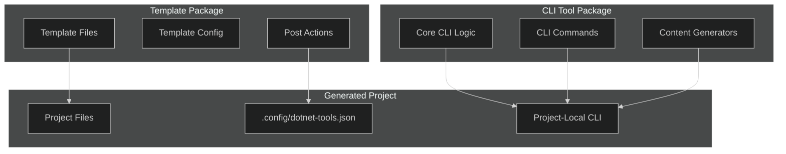

# Self-Installing CLI with Dotnet Template

## Introduction

This document outlines an approach for combining the structure and consistency of a dotnet template with the ongoing functionality of a CLI tool. The key innovation is having the template automatically install a project-local CLI tool during project creation, ensuring that the tool version is always in sync with the project's needs.

## Architectural Overview



## Implementation Details

### 1. Template Package Structure

The template package should be organized as follows:

```
FlightDeck.Templates/
├── content/                # Template content
│   └── FlightDeckSite/     # Root template directory
│       ├── .template.config/
│       │   ├── template.json
│       │   └── dotnetcli.host.json
│       ├── src/            # Project source code
│       ├── .config/        # Tool manifest directory
│       │   └── dotnet-tools.json
│       └── ...
├── FlightDeck.Templates.csproj
└── ...
```

### 2. Template Configuration

The `template.json` file should include post-actions to install the CLI tool:

```json
{
  "$schema": "http://json.schemastore.org/template",
  "author": "Your Company",
  "classifications": ["Web", "F#", "Oxpecker", "Blog"],
  "identity": "FlightDeck.Site",
  "name": "FlightDeck Site",
  "shortName": "flightdeck",
  "tags": {
    "language": "F#",
    "type": "project"
  },
  "sourceName": "FlightDeckSite",
  "preferNameDirectory": true,
  "postActions": [
    {
      "description": "Installing FlightDeck CLI tool...",
      "actionId": "3A7C4B45-1F5D-4A30-959A-51B88E82B5D2",
      "args": {
        "executable": "dotnet",
        "args": "tool restore"
      },
      "continueOnError": false,
      "manualInstructions": [
        {
          "text": "Run 'dotnet tool restore' to install the FlightDeck CLI"
        }
      ]
    }
  ]
}
```

### 3. Tool Manifest Configuration

Create a pre-configured tool manifest (`dotnet-tools.json`) that will be included in the template:

```json
{
  "version": 1,
  "isRoot": true,
  "tools": {
    "flightdeck-cli": {
      "version": "1.0.0",
      "commands": [
        "flightdeck"
      ]
    }
  }
}
```

This ensures that the CLI tool is installed locally to the project, avoiding version conflicts between projects.

### 4. CLI Tool Implementation

The CLI tool should be implemented as a .NET Global Tool. Here's a basic structure:

```
FlightDeck.CLI/
├── Commands/              # Command implementations
│   ├── NewPageCommand.cs
│   ├── NewPostCommand.cs
│   └── ...
├── Generators/            # Content generators
│   ├── PageGenerator.cs
│   ├── PostGenerator.cs
│   └── ...
├── Program.cs             # Entry point
├── FlightDeck.CLI.csproj
└── ...
```

The CLI project file (`FlightDeck.CLI.csproj`) should be configured as a tool:

```xml
<Project Sdk="Microsoft.NET.Sdk">
  <PropertyGroup>
    <OutputType>Exe</OutputType>
    <TargetFramework>net8.0</TargetFramework>
    <PackAsTool>true</PackAsTool>
    <ToolCommandName>flightdeck</ToolCommandName>
    <PackageId>flightdeck-cli</PackageId>
    <Version>1.0.0</Version>
  </PropertyGroup>
  
  <ItemGroup>
    <PackageReference Include="System.CommandLine" Version="2.0.0-beta*" />
    <!-- Other dependencies -->
  </ItemGroup>
</Project>
```

### 5. CLI Command Implementation

Using System.CommandLine for a modern CLI experience:

```csharp
// Program.cs
using System;
using System.CommandLine;
using System.CommandLine.Invocation;
using System.IO;
using System.Threading.Tasks;
using FlightDeck.CLI.Commands;

namespace FlightDeck.CLI
{
    class Program
    {
        static async Task<int> Main(string[] args)
        {
            var rootCommand = new RootCommand("FlightDeck site management tool");
            
            // New page command
            var newPageCommand = new Command("page", "Create a new page");
            newPageCommand.AddArgument(new Argument<string>("title", "Page title"));
            newPageCommand.AddOption(new Option<string>("--layout", "Page layout template"));
            newPageCommand.Handler = CommandHandler.Create<string, string>(NewPageCommand.Execute);
            
            // New post command
            var newPostCommand = new Command("post", "Create a new blog post");
            newPostCommand.AddArgument(new Argument<string>("title", "Post title"));
            newPostCommand.AddOption(new Option<string>("--author", "Post author"));
            newPostCommand.AddOption(new Option<DateTime>("--date", "Publication date"));
            newPostCommand.Handler = CommandHandler.Create<string, string, DateTime>(NewPostCommand.Execute);
            
            // Parent "new" command
            var newCommand = new Command("new", "Create new content");
            newCommand.AddCommand(newPageCommand);
            newCommand.AddCommand(newPostCommand);
            
            // Add commands to root
            rootCommand.AddCommand(newCommand);
            
            return await rootCommand.InvokeAsync(args);
        }
    }
}
```

### 6. Generator Implementation

For generating content with appropriate frontmatter:

```csharp
// Generators/PageGenerator.cs
using System;
using System.IO;
using System.Text;

namespace FlightDeck.CLI.Generators
{
    public static class PageGenerator
    {
        public static void GeneratePage(string title, string layout, string outputPath)
        {
            // Create slugified filename
            var slug = SlugifyTitle(title);
            var filename = Path.Combine(outputPath, $"{slug}.md");
            
            // Create frontmatter
            var frontmatter = new StringBuilder();
            frontmatter.AppendLine("---");
            frontmatter.AppendLine($"title: {title}");
            frontmatter.AppendLine($"slug: {slug}");
            
            if (!string.IsNullOrEmpty(layout))
            {
                frontmatter.AppendLine($"layout: {layout}");
            }
            
            frontmatter.AppendLine($"date: {DateTime.Now:yyyy-MM-dd}");
            
            // Add telemetry configuration
            frontmatter.AppendLine("telemetry:");
            frontmatter.AppendLine("  trackPageView: true");
            frontmatter.AppendLine("  trackElements:");
            frontmatter.AppendLine("    - selector: \".contact-button\"");
            frontmatter.AppendLine("      id: \"contact-button\"");
            frontmatter.AppendLine("      interaction: \"click\"");
            
            frontmatter.AppendLine("---");
            frontmatter.AppendLine();
            frontmatter.AppendLine($"# {title}");
            frontmatter.AppendLine();
            frontmatter.AppendLine("Enter page content here...");
            
            // Write to file
            File.WriteAllText(filename, frontmatter.ToString());
            
            Console.WriteLine($"Created page at: {filename}");
        }
        
        private static string SlugifyTitle(string title)
        {
            return title.ToLowerInvariant()
                .Replace(" ", "-")
                .Replace(".", "")
                .Replace(",", "")
                .Replace(":", "")
                .Replace(";", "")
                .Replace("!", "")
                .Replace("?", "");
        }
    }
}
```

## User Experience

The user experience with this approach is seamless:

1. **Create a new project:**

```bash
# Install the template
dotnet new -i FlightDeck.Templates

# Create a new project
dotnet new flightdeck -o MyCompanyBlog
cd MyCompanyBlog

# CLI tool is automatically installed
```

2. **Use the CLI to generate content:**

```bash
# Create a new page
dotnet flightdeck new page "About Us"

# Create a new blog post
dotnet flightdeck new post "Launching Our New Product" --author "Jane Smith"

# See available commands
dotnet flightdeck --help
```

3. **Start the development server:**

```bash
dotnet run
```

## CLI Capabilities

The CLI tool should support several key operations:

1. **Content Management:**
   - Create new pages, posts, and other content types
   - Draft and publish content
   - Manage content metadata

2. **Asset Management:**
   - Upload and organize images
   - Manage other media assets

3. **Development Tools:**
   - Start development server
   - Build for production
   - Deploy to hosting environments

4. **Data Operations:**
   - Import/export content
   - Backup and restore
   - Migrate between versions

## Versioning Strategy

The close coupling between the template and CLI requires a careful versioning strategy:

1. **Version Matching:** The template should install a CLI version that is compatible with the generated project structure.

2. **Version Constraints:** The tool manifest can specify version constraints to ensure compatibility.

3. **Update Mechanism:** Include a CLI command to update the tool to the latest compatible version.

```csharp
// Update command implementation
public static class UpdateCommand
{
    public static void Execute()
    {
        // Check current project version
        var projectVersion = GetProjectVersion();
        
        // Find latest compatible CLI version
        var latestCompatibleVersion = FindLatestCompatibleVersion(projectVersion);
        
        // Update tool manifest
        UpdateToolManifest(latestCompatibleVersion);
        
        // Run dotnet tool update
        var process = Process.Start("dotnet", "tool update flightdeck-cli");
        process.WaitForExit();
        
        Console.WriteLine($"Updated FlightDeck CLI to version {latestCompatibleVersion}");
    }
}
```

## F# Implementation Notes

While the examples above use C# for clarity, implementing the CLI in F# would provide additional benefits:

```fsharp
// Program.fs
open System
open System.CommandLine
open System.CommandLine.Invocation
open FlightDeck.CLI.Commands

[<EntryPoint>]
let main argv =
    let rootCommand = RootCommand("FlightDeck site management tool")
    
    // New page command
    let newPageCommand = Command("page", "Create a new page")
    newPageCommand.AddArgument(Argument<string>("title", "Page title"))
    newPageCommand.AddOption(Option<string>("--layout", "Page layout template"))
    newPageCommand.Handler <- CommandHandler.Create<string, string>(NewPageCommand.execute)
    
    // New post command
    let newPostCommand = Command("post", "Create a new blog post")
    newPostCommand.AddArgument(Argument<string>("title", "Post title"))
    newPostCommand.AddOption(Option<string>("--author", "Post author"))
    newPostCommand.AddOption(Option<DateTime>("--date", "Publication date"))
    newPostCommand.Handler <- CommandHandler.Create<string, string, DateTime>(NewPostCommand.execute)
    
    // Parent "new" command
    let newCommand = Command("new", "Create new content")
    newCommand.AddCommand(newPageCommand)
    newCommand.AddCommand(newPostCommand)
    
    // Add commands to root
    rootCommand.AddCommand(newCommand)
    
    rootCommand.InvokeAsync(argv).Result
```

## Conclusion

The self-installing CLI approach provides the best of both worlds: the structure and consistency of a template with the ongoing functionality of a CLI tool. By installing the CLI locally to each project, we ensure version compatibility and provide a seamless experience for developers.

This approach is particularly well-suited for FlightDeck's needs, as it provides a consistent way to generate content with the appropriate telemetry configuration and other project-specific settings. As the platform evolves to include more advanced features like analytics, visualization, and AI capabilities, the CLI can be extended to support these features while maintaining backward compatibility with existing projects.
