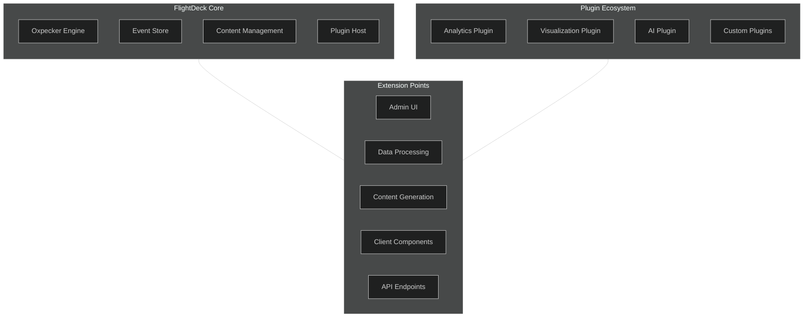

# Plugin Architecture for FlightDeck

## Introduction

This document outlines a plugin architecture for FlightDeck, enabling the platform to be extended with additional functionality such as analytics, visualizations, AI features, and more. The design focuses on creating a flexible, type-safe system that maintains FlightDeck's F# and Oxpecker foundations while allowing for modular extensions.

## Architectural Vision

The plugin architecture allows FlightDeck to evolve from a simple blog platform into a comprehensive customer portal with advanced capabilities, without compromising the core codebase or requiring extensive modifications to existing sites.



## Plugin System Design

### Core Components

1. **Plugin Host**: Loads and manages plugins, providing lifecycle hooks and dependency injection.
2. **Plugin Interface**: Defines the contract that all plugins must implement.
3. **Extension Points**: Well-defined locations where plugins can add functionality.
4. **Plugin Registry**: Maintains information about installed plugins and their capabilities.
5. **Plugin Configuration**: System for configuring plugins on a per-site basis.

### Plugin Interface

The core interface that all plugins must implement:

```fsharp
/// Represents a FlightDeck plugin
type IFlightDeckPlugin =
    /// Unique identifier for the plugin
    abstract Id: string
    /// Display name of the plugin
    abstract Name: string
    /// Plugin version
    abstract Version: string
    /// Description of the plugin's functionality
    abstract Description: string
    /// Initialize the plugin
    abstract Initialize: IServiceProvider -> Task
    /// Register services with DI container
    abstract ConfigureServices: IServiceCollection -> unit
    /// Configure application components
    abstract ConfigureApplication: WebApplication -> unit
    /// Teardown and cleanup when application shuts down
    abstract Shutdown: unit -> Task
```

### Extension Points

Extension points define where plugins can integrate with the core system:

```fsharp
/// Types of extension points in the FlightDeck system
type ExtensionPointType =
    | AdminUIComponent // Add components to the admin UI
    | DataProcessor    // Process data (e.g., analytics)
    | ContentGenerator // Generate content programmatically
    | APIEndpoint      // Add new API endpoints
    | EventHandler     // Handle system events
    | ClientComponent  // Add client-side components

/// Extension registration information
type ExtensionRegistration = {
    ExtensionType: ExtensionPointType
    Name: string
    Priority: int
    Factory: IServiceProvider -> obj
}

/// Extension point registration interface
type IExtensionPointRegistry =
    abstract RegisterExtension: ExtensionRegistration -> unit
    abstract GetExtensions: ExtensionPointType -> (string * (IServiceProvider -> obj)) seq
```

### Plugin Manifest

Every plugin must include a manifest that describes its capabilities:

```fsharp
/// Plugin manifest defining metadata and requirements
type PluginManifest = {
    Id: string
    Name: string
    Version: string
    Description: string
    Author: string
    ProjectUrl: string option
    RequiredPermissions: string list
    Dependencies: (string * string) list // (pluginId, version constraint)
}
```

## Implementation Example

### Plugin Host Implementation

The plugin host manages plugin lifecycle and dependencies:

```fsharp
/// Plugin host implementation
type PluginHost(services: IServiceProvider) =
    let plugins = Dictionary<string, IFlightDeckPlugin>()
    let extensionRegistry = services.GetRequiredService<IExtensionPointRegistry>()
    
    /// Load plugins from the specified directory
    member this.LoadPlugins(pluginsDirectory: string) = task {
        // Ensure directory exists
        if not (Directory.Exists pluginsDirectory) then
            Directory.CreateDirectory pluginsDirectory |> ignore
            
        // Load each plugin assembly
        let pluginAssemblies =
            Directory.GetFiles(pluginsDirectory, "*.dll")
            |> Array.map (fun path -> Assembly.LoadFrom(path))
            
        // Find and instantiate plugin types
        for assembly in pluginAssemblies do
            try
                // Find types implementing IFlightDeckPlugin
                let pluginTypes =
                    assembly.GetTypes()
                    |> Array.filter (fun t -> 
                        t.IsClass && 
                        not t.IsAbstract && 
                        typeof<IFlightDeckPlugin>.IsAssignableFrom(t))
                
                // Create instances and register
                for pluginType in pluginTypes do
                    let plugin = Activator.CreateInstance(pluginType) :?> IFlightDeckPlugin
                    plugins.Add(plugin.Id, plugin)
                    
                    // Log successful loading
                    printfn "Loaded plugin: %s v%s" plugin.Name plugin.Version
            with
            | ex -> 
                // Log plugin loading error
                printfn "Error loading plugin from assembly %s: %s" 
                    assembly.GetName().Name ex.Message
    }
    
    /// Initialize all loaded plugins
    member this.InitializePlugins() = task {
        // Initialize in order of dependencies
        let pluginsInOrder = resolvePluginDependencies plugins
        
        for plugin in pluginsInOrder do
            try
                // Initialize plugin
                do! plugin.Initialize(services)
                printfn "Initialized plugin: %s" plugin.Name
            with
            | ex -> 
                // Log initialization failure
                printfn "Failed to initialize plugin %s: %s" 
                    plugin.Name ex.Message
    }
    
    /// Get all loaded plugins
    member this.GetPlugins() = plugins.Values |> Seq.toArray
    
    /// Get plugin by ID
    member this.GetPlugin(pluginId: string) =
        if plugins.ContainsKey(pluginId) then
            Some plugins.[pluginId]
        else
            None
    
    /// Shutdown all plugins
    member this.ShutdownPlugins() = task {
        // Shutdown in reverse order of initialization
        let pluginsInOrder = resolvePluginDependencies plugins |> Array.rev
        
        for plugin in pluginsInOrder do
            try
                do! plugin.Shutdown()
                printfn "Shutdown plugin: %s" plugin.Name
            with
            | ex -> 
                printfn "Error shutting down plugin %s: %s" 
                    plugin.Name ex.Message
    }
    
    /// Helper to resolve plugin dependencies
    static member private resolvePluginDependencies(plugins: Dictionary<string, IFlightDeckPlugin>) =
        // Implement topological sort based on dependencies
        // This ensures plugins are initialized in the correct order
        failwith "Not implemented"
```

### Extension Point Registry

The registry manages extension points:

```fsharp
/// Implementation of extension point registry
type ExtensionPointRegistry() =
    let extensions = 
        [
            ExtensionPointType.AdminUIComponent
            ExtensionPointType.DataProcessor
            ExtensionPointType.ContentGenerator
            ExtensionPointType.APIEndpoint
            ExtensionPointType.EventHandler
            ExtensionPointType.ClientComponent
        ]
        |> List.map (fun t -> t, ResizeArray<ExtensionRegistration>())
        |> Map.ofList
    
    interface IExtensionPointRegistry with
        /// Register a new extension
        member this.RegisterExtension(registration) =
            let typeExtensions = extensions.[registration.ExtensionType]
            typeExtensions.Add(registration)
            // Sort by priority
            typeExtensions.Sort(fun a b -> a.Priority.CompareTo(b.Priority))
        
        /// Get all extensions of a specific type
        member this.GetExtensions(extensionType) =
            if extensions.ContainsKey(extensionType) then
                extensions.[extensionType]
                |> Seq.map (fun reg -> reg.Name, reg.Factory)
            else
                Seq.empty
```

## Plugin Examples

### Analytics Plugin

A simple analytics plugin that tracks page views and user interactions:

```fsharp
/// Analytics plugin implementation
type AnalyticsPlugin() =
    interface IFlightDeckPlugin with
        member this.Id = "flightdeck.analytics"
        member this.Name = "FlightDeck Analytics"
        member this.Version = "1.0.0"
        member this.Description = "Tracks user behavior and provides analytics reports"
        
        member this.Initialize(services) = task {
            let logger = services.GetRequiredService<ILogger<AnalyticsPlugin>>()
            logger.LogInformation("Initializing analytics plugin")
            
            // Set up analytics database if needed
            let dbContext = services.GetRequiredService<AnalyticsDbContext>()
            do! dbContext.Database.MigrateAsync()
        }
        
        member this.ConfigureServices(services) =
            // Register analytics services
            services.AddDbContext<AnalyticsDbContext>()
            services.AddScoped<IAnalyticsService, AnalyticsService>()
            services.AddScoped<IAnalyticsRepository, AnalyticsRepository>()
            
            // Register extensions
            let registry = services.GetRequiredService<IExtensionPointRegistry>()
            
            // Register admin UI component
            registry.RegisterExtension {
                ExtensionType = ExtensionPointType.AdminUIComponent
                Name = "analytics-dashboard"
                Priority = 100
                Factory = fun sp -> 
                    let service = sp.GetRequiredService<IAnalyticsService>()
                    AnalyticsDashboardComponent(service) :> obj
            }
            
            // Register data processor
            registry.RegisterExtension {
                ExtensionType = ExtensionPointType.DataProcessor
                Name = "analytics-processor"
                Priority = 50
                Factory = fun sp -> 
                    let repo = sp.GetRequiredService<IAnalyticsRepository>()
                    AnalyticsProcessor(repo) :> obj
            }
            
            // Register API endpoints
            registry.RegisterExtension {
                ExtensionType = ExtensionPointType.APIEndpoint
                Name = "analytics-api"
                Priority = 100
                Factory = fun _ -> AnalyticsEndpoints() :> obj
            }
        
        member this.ConfigureApplication(app) =
            // Configure middleware
            app.UseMiddleware<AnalyticsTrackingMiddleware>()
        
        member this.Shutdown() = task {
            // Cleanup analytics resources
            ()
        }
```

### AI Plugin for Smart Content Generation

A plugin that leverages AI to generate content suggestions:

```fsharp
/// AI-powered content generation plugin
type AIContentPlugin() =
    interface IFlightDeckPlugin with
        member this.Id = "flightdeck.ai-content"
        member this.Name = "FlightDeck AI Content Assistant"
        member this.Version = "1.0.0"
        member this.Description = "Uses AI to generate and enhance content"
        
        member this.Initialize(services) = task {
            // Initialize AI services
            let aiService = services.GetRequiredService<IAIService>()
            do! aiService.LoadModels()
        }
        
        member this.ConfigureServices(services) =
            // Register AI services
            services.AddSingleton<IAIService, OpenAIService>()
            services.AddScoped<IContentSuggestionService, ContentSuggestionService>()
            
            // Register extensions
            let registry = services.GetRequiredService<IExtensionPointRegistry>()
            
            // Register admin UI component
            registry.RegisterExtension {
                ExtensionType = ExtensionPointType.AdminUIComponent
                Name = "ai-content-assistant"
                Priority = 200
                Factory = fun sp -> 
                    let service = sp.GetRequiredService<IContentSuggestionService>()
                    AIContentAssistantComponent(service) :> obj
            }
            
            // Register content generator
            registry.RegisterExtension {
                ExtensionType = ExtensionPointType.ContentGenerator
                Name = "ai-content-generator"
                Priority = 100
                Factory = fun sp -> 
                    let aiService = sp.GetRequiredService<IAIService>()
                    AIContentGenerator(aiService) :> obj
            }
        
        member this.ConfigureApplication(app) =
            // Configure API endpoints for AI features
            app.MapGroup("/api/ai")
               .MapAIEndpoints()
               .RequireAuthorization()
        
        member this.Shutdown() = task {
            // Cleanup AI resources
            ()
        }
```

## Integration with Oxpecker

Integrating the plugin system with Oxpecker involves several key components:

### 1. Extension Points in Oxpecker Views

Enable plugins to inject components into views:

```fsharp
// Extension point in layout view
let layoutView (title: string) (content: Node list) =
    html [ _lang "en" ] [
        head [] [
            title [] [ rawText title ]
            // Allow plugins to inject head elements
            yield! renderExtensions ExtensionPointType.HeadElements
        ]
        body [] [
            header [] [
                // Header content
            ]
            main [] content
            footer [] [
                // Footer content
            ]
            // Allow plugins to inject scripts
            yield! renderExtensions ExtensionPointType.Scripts
        ]
    ]

// Helper to render extensions
let renderExtensions extensionType =
    let registry = getService<IExtensionPointRegistry>()
    registry.GetExtensions(extensionType)
    |> Seq.map (fun (_, factory) -> 
        let component = factory(getServiceProvider()) :?> IViewComponent
        component.Render())
    |> Seq.toList
```

### 2. API Endpoint Registration

Allow plugins to register new API endpoints:

```fsharp
// Configure Oxpecker endpoints
let configureEndpoints (app: WebApplication) =
    // Register core endpoints
    app.MapGroup("/api")
       .MapCoreEndpoints()
       
    // Register plugin endpoints
    let registry = app.Services.GetRequiredService<IExtensionPointRegistry>()
    let endpointExtensions = 
        registry.GetExtensions(ExtensionPointType.APIEndpoint)
        |> Seq.map (fun (_, factory) -> factory(app.Services) :?> IAPIEndpointProvider)
        
    for extension in endpointExtensions do
        extension.RegisterEndpoints(app)
```

### 3. Event Sourcing Integration

Plugins can tap into the event stream:

```fsharp
// Event sourcing service with plugin integration
type EventSourceService(eventStore: IEventStore, registry: IExtensionPointRegistry) =
    // Get event handlers from plugins
    let eventHandlers = 
        registry.GetExtensions(ExtensionPointType.EventHandler)
        |> Seq.map (fun (_, factory) -> factory(serviceProvider) :?> IEventHandler)
        |> Seq.toList
    
    // Record an event
    member this.RecordEvent<'T>(streamId: string, event: 'T) = task {
        // Store the event
        do! eventStore.AppendToStream(streamId, event)
        
        // Notify all plugin event handlers
        for handler in eventHandlers do
            do! handler.HandleEvent(streamId, event)
    }
```

## Plugin Management

### Plugin Discovery and Loading

The system uses a combination of convention and configuration to discover plugins:

```fsharp
// Plugin discovery service
type PluginDiscoveryService(configuration: IConfiguration) =
    // Get plugin directory from config
    let pluginsDirectory = 
        configuration.GetValue<string>("Plugins:Directory")
        |> Option.ofObj
        |> Option.defaultValue (Path.Combine(AppContext.BaseDirectory, "plugins"))
    
    // Load plugins from directory
    member this.DiscoverPlugins() = task {
        let pluginHost = PluginHost(serviceProvider)
        
        // Load built-in plugins
        do! pluginHost.LoadBuiltInPlugins()
        
        // Load external plugins
        do! pluginHost.LoadPlugins(pluginsDirectory)
        
        // Initialize all discovered plugins
        do! pluginHost.InitializePlugins()
        
        return pluginHost
    }
```

### Plugin Configuration

Plugins can be configured through a unified configuration system:

```fsharp
// Plugin configuration extension methods
module PluginConfiguration =
    // Get configuration for a specific plugin
    let getPluginConfig (configuration: IConfiguration) (pluginId: string) =
        configuration.GetSection($"Plugins:Config:{pluginId}")
    
    // Get plugin-specific database connection string
    let getPluginConnectionString (configuration: IConfiguration) (pluginId: string) =
        configuration.GetConnectionString(pluginId)
        |> Option.ofObj
        |> Option.defaultWith (fun () -> 
            configuration.GetConnectionString("Default"))
```

### Plugin Installation/Uninstallation

The CLI tool should support plugin management:

```fsharp
// Plugin management commands
let pluginCommands = [
    Command("install", "Install a plugin", 
        handler = (fun (pluginPath: string) ->
            // Copy plugin to plugins directory
            let pluginFileName = Path.GetFileName(pluginPath)
            let targetPath = Path.Combine(pluginsDirectory, pluginFileName)
            File.Copy(pluginPath, targetPath, true)
            printfn "Plugin installed successfully"
        ))
        
    Command("uninstall", "Uninstall a plugin",
        handler = (fun (pluginId: string) ->
            // Find plugin file
            let pluginFile = findPluginFile pluginId
            if File.Exists(pluginFile) then
                File.Delete(pluginFile)
                printfn "Plugin uninstalled successfully"
            else
                printfn "Plugin not found"
        ))
        
    Command("list", "List installed plugins",
        handler = (fun () ->
            // Load plugins without initializing
            let plugins = loadPluginsInfo()
            
            // Display plugin info
            for plugin in plugins do
                printfn "%s v%s - %s" plugin.Name plugin.Version plugin.Description
        ))
]
```

## Security Considerations

The plugin system includes security measures to prevent malicious plugins:

### 1. Permission System

Plugins must declare required permissions in their manifest:

```fsharp
// Plugin permissions
type PluginPermission =
    | ReadContent       // Read content items
    | WriteContent      // Create/update content
    | ReadUserData      // Access user information
    | ExecuteScripts    // Run client-side scripts
    | AccessFileSystem  // Access file system
    | CallExternalAPIs  // Make external API calls

// Permission validator
let validatePluginPermissions (manifest: PluginManifest) (allowedPermissions: PluginPermission list) =
    let requiredPermissions = 
        manifest.RequiredPermissions 
        |> List.map parsePermission
    
    // Check if plugin requests any disallowed permissions
    let disallowedPermissions =
        requiredPermissions
        |> List.filter (fun p -> not (List.contains p allowedPermissions))
    
    if List.isEmpty disallowedPermissions then
        Ok ()
    else
        Error $"Plugin requests disallowed permissions: {String.concat ", " (disallowedPermissions |> List.map string)}"
```

### 2. Sandboxing

Plugins are executed in a controlled environment:

```fsharp
// Plugin execution sandbox
type PluginSandbox(plugin: IFlightDeckPlugin, permissions: PluginPermission list) =
    // Create restricted service provider
    let restrictedServices = ServiceCollection()
    
    // Add services based on permissions
    do
        // Base services available to all plugins
        restrictedServices.AddLogging() |> ignore
        
        // Permission-specific services
        if List.contains ReadContent permissions then
            restrictedServices.AddScoped<IContentReader, ContentReader>() |> ignore
            
        if List.contains WriteContent permissions then
            restrictedServices.AddScoped<IContentWriter, ContentWriter>() |> ignore
            
        if List.contains ReadUserData permissions then
            restrictedServices.AddScoped<IUserDataReader, UserDataReader>() |> ignore
    
    // Create services provider with restrictions
    let serviceProvider = restrictedServices.BuildServiceProvider()
    
    // Execute plugin in sandbox
    member this.ExecutePlugin() = task {
        try
            // Initialize plugin with restricted services
            do! plugin.Initialize(serviceProvider)
            return Ok ()
        with
        | ex -> return Error ex.Message
    }
```

## Example Integration Scenarios

### Analytics Dashboard

A complete example of an analytics dashboard plugin:

```fsharp
// Analytics dashboard component (admin UI extension)
type AnalyticsDashboardComponent(analyticsService: IAnalyticsService) =
    interface IViewComponent with
        member this.Render() =
            div [ _class "analytics-dashboard" ] [
                h2 [] [ rawText "Site Analytics" ]
                
                div [ _class "analytics-summary" ] [
                    div [ _class "analytics-card" ] [
                        h3 [] [ rawText "Page Views" ]
                        p [ _class "analytics-number" ] [ 
                            rawText (analyticsService.GetTotalPageViews().ToString("N0"))
                        ]
                    ]
                    
                    div [ _class "analytics-card" ] [
                        h3 [] [ rawText "Unique Visitors" ]
                        p [ _class "analytics-number" ] [ 
                            rawText (analyticsService.GetUniqueVisitors().ToString("N0"))
                        ]
                    ]
                    
                    div [ _class "analytics-card" ] [
                        h3 [] [ rawText "Avg. Time on Site" ]
                        p [ _class "analytics-number" ] [ 
                            rawText (formatTimeSpan(analyticsService.GetAverageTimeOnSite()))
                        ]
                    ]
                ]
                
                // Visitor trend chart (using client-side component)
                div [ 
                    _id "visitor-trend-chart"
                    _data_endpoint "/api/analytics/visitors/trend"
                ] []
                
                // Popular pages table
                div [ _class "popular-pages" ] [
                    h3 [] [ rawText "Popular Pages" ]
                    table [] [
                        thead [] [
                            tr [] [
                                th [] [ rawText "Page" ]
                                th [] [ rawText "Views" ]
                                th [] [ rawText "Avg. Time" ]
                            ]
                        ]
                        tbody [] [
                            for page in analyticsService.GetPopularPages(10) do
                                tr [] [
                                    td [] [ rawText page.Title ]
                                    td [] [ rawText (page.Views.ToString("N0")) ]
                                    td [] [ rawText (formatTimeSpan(page.AverageTimeOnPage)) ]
                                ]
                        ]
                    ]
                ]
            ]
```

### Visualization API Extension

Adding data visualization capabilities:

```fsharp
// Visualization API endpoints
type VisualizationEndpoints() =
    interface IAPIEndpointProvider with
        member this.RegisterEndpoints(app: WebApplication) =
            let visualizationGroup = app.MapGroup("/api/visualizations")
            
            // Get available visualizations
            visualizationGroup.MapGet("/", fun (visualizationService: IVisualizationService) ->
                visualizationService.GetAvailableVisualizations()
            )
            
            // Get visualization data
            visualizationGroup.MapGet("/{id}", fun (id: string) (visualizationService: IVisualizationService) -> task {
                let! visualization = visualizationService.GetVisualization(id)
                return visualization
            })
            
            // Create new visualization
            visualizationGroup.MapPost("/", fun (request: CreateVisualizationRequest) 
                                           (visualizationService: IVisualizationService) -> task {
                let! visualization = visualizationService.CreateVisualization(request)
                return visualization
            })
```

## Considerations for Future Growth

As the plugin ecosystem grows, consider these strategies:

### 1. Plugin Marketplace

Create a central repository for discovering and sharing plugins:

```fsharp
// Plugin marketplace client
type PluginMarketplaceClient(httpClient: HttpClient) =
    // Search marketplace for plugins
    member this.SearchPlugins(query: string) = task {
        let! response = httpClient.GetFromJsonAsync<PluginSearchResponse>($"/api/plugins/search?q={query}")
        return response.Results
    }
    
    // Get plugin details
    member this.GetPluginDetails(pluginId: string) = task {
        let! details = httpClient.GetFromJsonAsync<PluginDetails>($"/api/plugins/{pluginId}")
        return details
    }
    
    // Download plugin
    member this.DownloadPlugin(pluginId: string, version: string) = task {
        let response = 
            httpClient.GetAsync($"/api/plugins/{pluginId}/versions/{version}/download")
        
        use fileStream = File.Create(Path.GetTempFileName())
        do! response.Result.Content.CopyToAsync(fileStream)
        fileStream.Position <- 0L
        
        return fileStream
    }
```

### 2. Versioned Plugin API

Maintain compatibility across versions:

```fsharp
// Versioned plugin API
type IPluginAPIv1 =
    abstract RegisterExtension: ExtensionRegistration -> unit
    abstract GetService<'T> : unit -> 'T

type IPluginAPIv2 =
    inherit IPluginAPIv1
    abstract RegisterAsyncExtension: AsyncExtensionRegistration -> Task
    abstract GetConfiguration: unit -> IConfiguration

// Plugin API factory
let getPluginAPI (plugin: IFlightDeckPlugin) =
    match plugin.Version.Split('.') with
    | [| major; _; _ |] when int major >= 2 ->
        PluginAPIv2(serviceProvider) :> obj
    | _ ->
        PluginAPIv1(serviceProvider) :> obj
```

### 3. Plugin Dependency Management

Handle plugin dependencies gracefully:

```fsharp
// Plugin dependency resolver
let resolvePluginDependencies (plugins: PluginManifest list) =
    // Create dependency graph
    let graph = DirectedGraph<string, string>()
    
    // Add nodes for each plugin
    for plugin in plugins do
        graph.AddNode(plugin.Id)
        
    // Add edges for dependencies
    for plugin in plugins do
        for (depId, _) in plugin.Dependencies do
            graph.AddEdge(plugin.Id, depId)
    
    // Perform topological sort
    let sortedIds = graph.TopologicalSort() |> Seq.toList
    
    // Map back to original plugins
    sortedIds
    |> List.choose (fun id -> 
        plugins |> List.tryFind (fun p -> p.Id = id))
```

## Conclusion

This plugin architecture provides FlightDeck with a flexible, extensible foundation for growth. By creating well-defined extension points and a robust plugin system, FlightDeck can evolve from a simple blog platform into a comprehensive customer portal with advanced analytics, visualization, and AI capabilities.

The architecture maintains FlightDeck's F# and Oxpecker foundations while allowing for seamless integration of new functionality. As plugins are developed, they can be shared and reused across multiple FlightDeck installations, creating a rich ecosystem of extensions.

With this plugin system, FlightDeck can adapt to changing requirements and incorporate cutting-edge features without requiring major rewrites or disrupting existing sites. This approach ensures that FlightDeck remains a versatile, future-proof platform for years to come.
