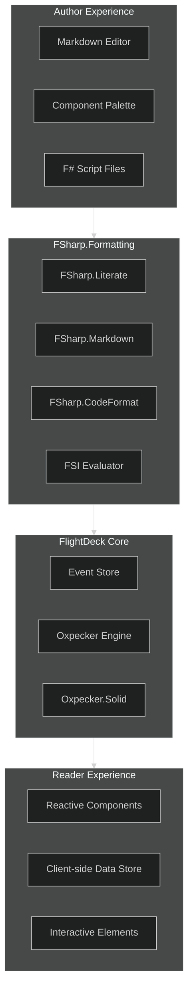

# Interactive Content Authoring for FlightDeck: Integrating FSharp.Formatting

## Executive Summary

This document outlines a premium plugin architecture for FlightDeck that leverages FSharp.Formatting's literate programming capabilities to create interactive content experiences. By combining FSharp.Formatting's mature evaluation and documentation tools with Oxpecker's reactive UI capabilities, we create a powerful platform for literate computing where narrative, computation, and visualization work together seamlessly.

## Architectural Vision

The vision integrates three key inspirations:
- **PageLines-style visual editing** for intuitive component arrangement
- **FSharp.Formatting's literate programming** for code evaluation and documentation
- **FlightDeck's event-sourced architecture** for reliable state management

This creates a system where authors can craft data-driven interactive content without coding expertise, while developers can extend the system with type-safe components.

## Core Architecture



## FSharp.Formatting Integration

FSharp.Formatting provides several essential capabilities for our interactive content system:

### 1. Script Evaluation and Documentation

FSharp.Formatting's literate programming tools evaluate F# scripts and capture outputs automatically:

```fsharp
// Process a script file and capture evaluated results
let processScript (scriptPath: string) =
    // Use FSharp.Literate to parse and evaluate the script
    let options = Literate.LiterateOptions.Default
    let doc = Literate.ParseScriptFile(scriptPath, options)
    
    // Extract evaluation results
    let results = 
        doc.Paragraphs 
        |> Seq.choose (function
            | Paragraph.EvaluationResult(expr, result) -> 
                Some (expr, result)
            | _ -> None)
            
    // Return results mapped to IDs for component binding
    results |> Seq.toArray
```

### 2. Markdown Processing with Embedded Code

The markdown parser handles content with embedded code blocks:

```fsharp
// Process markdown with embedded code and component blocks
let processMarkdown (content: string) =
    // Parse markdown content
    let doc = Literate.ParseMarkdownString(content, "", Literate.LiterateOptions.Default)
    
    // Extract custom component blocks (non-standard code blocks)
    let componentBlocks =
        doc.Paragraphs
        |> Seq.choose (function
            | Paragraph.CodeBlock(code, fence, language, _) when 
                language.StartsWith("component:") ->
                    Some (language.Substring("component:".Length), code, fence)
            | _ -> None)
    
    // Return processed content and component blocks
    doc, componentBlocks
```

### 3. Type Provider Integration

We can use F# type providers to connect components to data sources:

```fsharp
// Type provider for CSV data
type CsvProvider = FSharp.Data.CsvProvider<Sample="Date,Value\n2023-01-01,100">

// Process a CSV file for visualization
let processCsvForVisualization (filePath: string) =
    let data = CsvProvider.Load(filePath)
    // Transform for component consumption
    data.Rows |> Seq.map (fun row -> {| Date = row.Date; Value = row.Value |})
```

## TOML Frontmatter Implementation

All content configuration uses TOML frontmatter:

```fsharp
// Sample TOML frontmatter parser
let parseTomlFrontmatter (content: string) =
    let frontmatterPattern = @"^\+\+\+\s*$(.*?)^\+\+\+\s*$"
    let regex = System.Text.RegularExpressions.Regex(frontmatterPattern, 
        System.Text.RegularExpressions.RegexOptions.Singleline)
    
    let bodyContent, frontmatter =
        match regex.Match(content) with
        | m when m.Success ->
            let frontmatterStr = m.Groups.[1].Value
            let remaining = content.Substring(m.Value.Length).TrimStart()
            remaining, Tomlyn.Toml.Parse(frontmatterStr).ToModel()
        | _ -> content, Map.empty
    
    bodyContent, frontmatter
```

Example content file with TOML frontmatter:

```markdown
+++
title = "Sales Dashboard"
description = "Interactive dashboard for exploring sales data"
date = 2023-04-20

[interactive]
enabled = true
requires_computation = true

[interactive.components]
enabled = ["charts", "inputs", "tables"]

[interactive.scripts]
files = ["sales-analysis.fsx"]

[interactive.data_sources]
files = ["sales-data.csv", "product-catalog.json"]
+++

# Sales Dashboard

This dashboard shows our company's quarterly sales performance.

```component:chart
id = "revenue-chart"
type = "bar"
data-source = "sales-data.csv"
x-field = "Quarter" 
y-field = "Revenue"
height = 400
```

As you can see from the chart above, Q3 showed a significant increase in revenue.

```component:input-slider
id = "forecast-confidence"
label = "Confidence Level"
min = 50
max = 99
default = 80
```

```component:table
id = "forecast-table"
data-source = "sales-forecast"
parameters = ["forecast-confidence"]
columns = ["Product", "Q4 (Projected)", "Confidence Interval"]
```
```

## Component Model with FSharp.Formatting

Our component model is streamlined by FSharp.Formatting's evaluation capabilities:

```fsharp
// Component definition
type InteractiveComponent = {
    // Component type identifier
    Type: string
    
    // Component ID in document
    Id: string
    
    // Component configuration
    Config: Map<string, obj>
    
    // Data source (can be script result ID)
    DataSource: string option
    
    // Parameter dependencies
    ParameterDependencies: string list
}

// Component registry
type ComponentRegistry() =
    let components = Dictionary<string, IComponentProvider>()
    
    // Register component provider
    member this.RegisterComponent(provider: IComponentProvider) =
        components.Add(provider.ComponentType, provider)
    
    // Get component provider
    member this.GetComponentProvider(componentType: string) =
        match components.TryGetValue(componentType) with
        | true, provider -> Some provider
        | _ -> None
        
    // Create component from definition
    member this.CreateComponent(componentType: string, id: string, config: Map<string, obj>) =
        match this.GetComponentProvider(componentType) with
        | Some provider -> provider.CreateComponent(id, config)
        | None -> failwithf "Unknown component type: %s" componentType
```

## Content Processing Pipeline

The content processing pipeline integrates FSharp.Formatting:

```fsharp
// Process interactive content
let processInteractiveContent (content: string, contentDir: string) = task {
    // Parse content with frontmatter
    let bodyContent, frontmatter = parseTomlFrontmatter content
    
    // Process any referenced script files
    let scriptFiles = 
        match frontmatter.TryFind("interactive.scripts.files") with
        | Some files -> files :?> string[]
        | None -> [||]
        
    // Evaluate scripts with FSharp.Literate
    let! scriptResults = 
        scriptFiles
        |> Array.map (fun scriptFile ->
            let scriptPath = Path.Combine(contentDir, scriptFile)
            evaluateScript scriptPath)
        |> Task.WhenAll
    
    // Create script results map
    let scriptResultsMap = 
        scriptResults
        |> Array.collect (fun (scriptFile, results) ->
            results |> Array.map (fun (name, value) -> $"{scriptFile}.{name}", value))
        |> Map.ofArray
    
    // Process markdown with FSharp.Literate
    let doc, componentBlocks = processMarkdown bodyContent
    
    // Process component blocks
    let components =
        componentBlocks
        |> Seq.map (fun (componentType, code, _) ->
            let config = Tomlyn.Toml.Parse(code).ToModel() :?> Map<string, obj>
            let id = config.["id"] :?> string
            
            // Create component definition
            {
                Type = componentType
                Id = id
                Config = config
                DataSource = 
                    match config.TryFind("data-source") with
                    | Some src -> Some (src :?> string)
                    | None -> None
                ParameterDependencies =
                    match config.TryFind("parameters") with
                    | Some params -> params :?> string[]
                    | None -> [||]
            })
        |> Seq.toArray
    
    // Generate final HTML
    let html = Literate.ToHtml(doc)
    
    // Generate client-side initialization
    let clientConfig = generateClientConfig components scriptResultsMap
    
    // Return processed content package
    return {|
        Html = html
        Components = components
        ScriptResults = scriptResultsMap
        ClientConfig = clientConfig
    |}
}
```

## Example: Interactive Financial Calculator

Here's an example F# script (`investment-calculator.fsx`) that would be integrated with an interactive component:

```fsharp
(** 
# Investment Growth Calculation
This script provides functions for projecting investment growth over time.
*)

#r "nuget: MathNet.Numerics, 5.0.0"
open MathNet.Numerics.Statistics
open MathNet.Numerics.Distributions
open System

(** 
## Growth Projection
Calculate growth of an investment with regular contributions 
*)
let calculateGrowth initialInvestment annualContribution years expectedReturn volatility =
    // Convert percentages to decimals
    let returnRate = expectedReturn / 100.0
    let stdDev = volatility / 100.0
    
    // Calculate median growth projection
    [|
        for year in 0 .. years do
            let contributions = float(year) * annualContribution
            let growthFactor = Math.Pow(1.0 + returnRate, float(year))
            let value = initialInvestment * growthFactor + 
                       contributions * (growthFactor - 1.0) / returnRate
            
            {| Year = year; Value = value; Scenario = "Expected" |}
    |]

(** 
Let's test with a sample calculation:
*)

let testGrowth = calculateGrowth 10000.0 5000.0 10 7.0 15.0
testGrowth |> Array.take 5
```

The output of this script would be captured by FSharp.Formatting and made available to components referencing it.

## Client-Side Integration

The client-side runtime integrates script evaluation results with interactive components:

```typescript
// client-side runtime (TypeScript)
class InteractiveContent {
    private components: Map<string, InteractiveComponent> = new Map();
    private parameters: Map<string, any> = new Map();
    private scriptResults: Map<string, any> = new Map();
    
    constructor(config: InteractiveContentConfig) {
        // Initialize script results
        for (const [id, result] of Object.entries(config.scriptResults)) {
            this.scriptResults.set(id, result);
        }
        
        // Initialize parameters with defaults
        for (const [id, value] of Object.entries(config.parameters)) {
            this.parameters.set(id, value);
        }
        
        // Initialize components
        for (const componentConfig of config.components) {
            const element = document.getElementById(`component-${componentConfig.id}`);
            if (!element) continue;
            
            // Create component
            const componentType = componentConfig.type;
            const ComponentClass = COMPONENT_REGISTRY.get(componentType);
            
            if (!ComponentClass) {
                console.error(`Unknown component type: ${componentType}`);
                continue;
            }
            
            // Resolve data source if specified
            let data = null;
            if (componentConfig.dataSource) {
                data = this.resolveDataSource(componentConfig.dataSource);
            }
            
            // Create component instance
            const component = new ComponentClass({
                element,
                config: componentConfig.config,
                data,
                parameters: this.parameters
            });
            
            this.components.set(componentConfig.id, component);
            
            // Initialize component
            component.initialize();
        }
        
        // Set up parameter change listeners
        for (const [id, component] of this.components.entries()) {
            if (!component.parameterDependencies) continue;
            
            for (const paramId of component.parameterDependencies) {
                this.addParameterListener(paramId, id);
            }
        }
    }
    
    // Resolve data source (file or script result)
    private resolveDataSource(source: string): any {
        // Check if it's a script result
        if (this.scriptResults.has(source)) {
            return this.scriptResults.get(source);
        }
        
        // Assume it's a file reference
        // In real implementation, would load from URL
        console.warn(`Data source not found: ${source}`);
        return null;
    }
    
    // Handle parameter changes
    public setParameter(paramId: string, value: any): void {
        const oldValue = this.parameters.get(paramId);
        if (value === oldValue) return;
        
        this.parameters.set(paramId, value);
        
        // Notify dependent components
        this.notifyParameterChanged(paramId, value, oldValue);
    }
    
    // Add parameter change listener
    private addParameterListener(paramId: string, componentId: string): void {
        // Implementation omitted for brevity
    }
    
    // Notify components of parameter changes
    private notifyParameterChanged(paramId: string, newValue: any, oldValue: any): void {
        // Implementation omitted for brevity
    }
}
```

## Plugin Implementation for FlightDeck

Implementation as a premium FlightDeck plugin:

```fsharp
/// Interactive Content plugin for FlightDeck
type InteractiveContentPlugin() =
    interface IFlightDeckPlugin with
        member this.Id = "flightdeck.interactive-content"
        member this.Name = "Interactive Content Authoring"
        member this.Version = "1.0.0"
        member this.Description = "Advanced authoring tools for interactive content powered by FSharp.Formatting"
        
        member this.Initialize(services) = task {
            // Initialize FSharp.Formatting
            let fsiEvaluator = FsiEvaluator()
            
            // Add references to common libraries
            fsiEvaluator.EvaluationSession.AddReferences([|
                typeof<System.Math>.Assembly
                typeof<Newtonsoft.Json.JsonConvert>.Assembly
                typeof<MathNet.Numerics.Constants>.Assembly
            |])
            
            // Register with service provider
            services.GetRequiredService<IServiceCollection>()
                .AddSingleton<IFsiEvaluator>(fsiEvaluator)
                .AddSingleton<ILiterateEngine, FSharpFormattingEngine>()
        }
        
        member this.ConfigureServices(services) =
            // Register core services
            services.AddSingleton<IComponentRegistry, ComponentRegistry>()
            services.AddScoped<IInteractiveContentService, InteractiveContentService>()
            
            // Register built-in components
            services.AddTransient<IComponentProvider, ChartComponentProvider>()
            services.AddTransient<IComponentProvider, TableComponentProvider>()
            services.AddTransient<IComponentProvider, InputComponentProvider>()
            services.AddTransient<IComponentProvider, DisplayComponentProvider>()
            
            // Register processing pipeline
            services.AddScoped<IContentProcessor, InteractiveContentProcessor>()
            
            // Register extension points
            let registry = services.GetRequiredService<IExtensionPointRegistry>()
            
            // Register admin UI extension
            registry.RegisterExtension(
                ExtensionPointType.AdminUI, 
                "interactive-content-editor", 
                fun sp -> InteractiveContentEditorComponent(sp) :> obj)
        
        member this.ConfigureApplication(app) =
            // Serve FSharp.Formatting assets
            app.UseStaticFiles(StaticFileOptions(
                FileProvider = new PhysicalFileProvider(
                    Path.Combine(app.Environment.ContentRootPath, "fs-formatting-assets")),
                RequestPath = "/fs-formatting"
            ))
            
            // Configure API endpoints
            app.MapGroup("/api/interactive-content")
               .AddInteractiveContentAPI()
               .RequireAuthorization("ContentEditor")
```

## Example: Interactive Dashboard

This example creates a sales dashboard with interactive filtering:

**Content File (`sales-dashboard.md`):**

```markdown
+++
title = "Quarterly Sales Dashboard"
description = "Interactive dashboard for sales performance analysis"
date = 2023-04-20

[interactive]
enabled = true
requires_computation = true

[interactive.components]
enabled = ["charts", "inputs", "tables"]

[interactive.scripts]
files = ["sales-analysis.fsx"]

[interactive.data_sources]
files = ["quarterly-sales.csv", "regional-sales.csv"]
+++

# Quarterly Sales Dashboard

## Overview

This dashboard presents our sales performance across product lines and regions.

```component:select
id = "region-filter"
label = "Region"
default = "All"
options = ["All", "North America", "Europe", "Asia Pacific", "Latin America"]
```

```component:multi-select
id = "product-filter"
label = "Product Lines"
default = ["All"]
options = ["All", "Hardware", "Software", "Services", "Support"]
```

## Sales by Product Line

```component:chart
id = "product-sales-chart"
type = "bar"
data-source = "quarterly-sales.csv"
x-field = "Product Line"
y-field = "Revenue (Millions)"
filters = [
    { parameter = "region-filter", field = "Region" }
]
parameters = ["product-filter"]
```

## Regional Performance

```component:geo-map
id = "regional-map"
data-source = "regional-sales.csv"
region-field = "Region"
value-field = "Revenue (Millions)"
filters = [
    { parameter = "product-filter", field = "Product Line" }
]
```

## Sales Trends

```component:chart
id = "sales-trend"
type = "line"
data-source = "sales-analysis.fsx.calculateTrend"
x-field = "Month"
y-field = "Revenue (Millions)"
series-field = "Product Line"
parameters = ["region-filter", "product-filter"]
```

## Detailed Analysis

When examining the chart above, we can see that ```component:dynamic-text
id = "trend-analysis"
data-source = "sales-analysis.fsx.analyzeTrend"
parameters = ["region-filter", "product-filter"]
```
```

**F# Analysis Script (`sales-analysis.fsx`):**

```fsharp
(** 
# Sales Data Analysis Functions
*)

#r "nuget: FSharp.Data, 5.0.2"
open FSharp.Data
open System

(** ## Data Types *)

// Sales data type
type SalesData = CsvProvider<"quarterly-sales.csv">

// Load data
let salesData = SalesData.Load("quarterly-sales.csv")

(** ## Analysis Functions *)

// Calculate sales trend by month
let calculateTrend (region: string) (products: string[]) =
    // Filter data based on parameters
    let filteredData =
        salesData.Rows
        |> Seq.filter (fun row ->
            (region = "All" || row.Region = region) &&
            (Array.contains "All" products || Array.contains row.``Product Line`` products))
        |> Seq.toArray
    
    // Generate monthly trend data
    [|
        for month in 1 .. 12 do
            for productLine in 
                if Array.contains "All" products then 
                    [|"Hardware"; "Software"; "Services"; "Support"|] 
                else products do
                
                let revenue = 
                    // Simplified calculation for example purposes
                    let baseRevenue = 
                        filteredData 
                        |> Array.filter (fun r -> r.``Product Line`` = productLine)
                        |> Array.sumBy (fun r -> r.``Revenue (Millions)``)
                        
                    // Distribute across months with some seasonality
                    let seasonality = 1.0 + 0.1 * sin(float(month) * Math.PI / 6.0)
                    float baseRevenue * seasonality / 12.0
                
                {| 
                    Month = DateTime(2023, month, 1).ToString("MMM")
                    ``Revenue (Millions)`` = revenue
                    ``Product Line`` = productLine 
                |}
    |]

// Generate analysis text based on trend data
let analyzeTrend (region: string) (products: string[]) =
    let trend = calculateTrend region products
    
    // Calculate growth rates
    let productGroups = 
        trend 
        |> Array.groupBy (fun d -> d.``Product Line``)
        |> Array.map (fun (product, data) ->
            let ordered = data |> Array.sortBy (fun d -> 
                match d.Month with
                | "Jan" -> 1 | "Feb" -> 2 | "Mar" -> 3 | "Apr" -> 4
                | "May" -> 5 | "Jun" -> 6 | "Jul" -> 7 | "Aug" -> 8
                | "Sep" -> 9 | "Oct" -> 10 | "Nov" -> 11 | "Dec" -> 12
                | _ -> 0)
            
            let firstValue = ordered |> Array.head |> fun d -> d.``Revenue (Millions)``
            let lastValue = ordered |> Array.last |> fun d -> d.``Revenue (Millions)``
            
            let growthRate = (lastValue - firstValue) / firstValue * 100.0
            product, growthRate)
    
    // Find fastest growing product
    let fastestGrowing =
        productGroups |> Array.maxBy snd |> fst
        
    // Find region-specific insights
    let regionText = 
        if region = "All" then "across all regions"
        else $"in the {region} region"
        
    // Generate insight text
    $"{fastestGrowing} shows the strongest growth trend {regionText} with particularly strong performance in the second half of the year."
```

## Pricing and License Strategy

The Interactive Content Authoring plugin would be offered as a premium extension for FlightDeck:

### Pricing Tiers

1. **Basic ($19/month):**
   - Core interactive components (charts, tables, inputs)
   - Basic F# script integration
   - Limited to 5 interactive elements per page

2. **Professional ($49/month):**
   - Full component library
   - Advanced F# script evaluation
   - Custom component creation
   - Up to 25 interactive elements per page

3. **Enterprise ($129/month):**
   - Unlimited interactive components
   - Custom visualization development
   - Private NPM registry for components
   - Technical support
   - White-labeling options

## Conclusion

By integrating FSharp.Formatting's literate programming capabilities with FlightDeck's Oxpecker-based architecture, we create a powerful platform for interactive content that combines the best of both worlds:

- **Type Safety**: From F# script evaluation to client-side rendering
- **Mature Evaluation Engine**: FSharp.Formatting's battle-tested script processing
- **Visual Editing**: PageLines-inspired component manipulation
- **Reactive UI**: Seamless updates as readers interact with content

This integration transforms FlightDeck from a traditional CMS into a platform for computational storytelling and data-driven communication. The TOML-based configuration and F# script integration provide a clean, maintainable approach that leverages the F# ecosystem's strengths while providing an accessible experience for content creators.

Whether creating financial calculators, scientific simulations, or business dashboards, this premium plugin enables a new class of interactive content that was previously only possible with custom application development.
