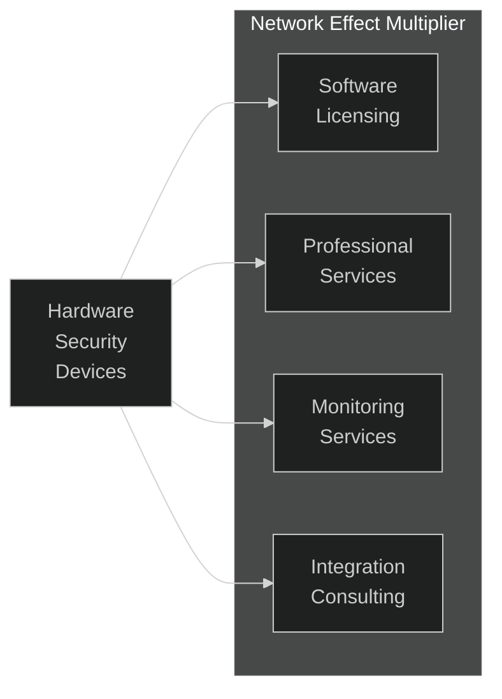
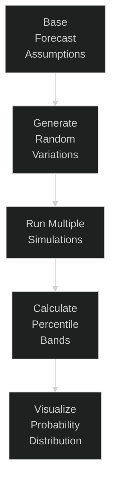
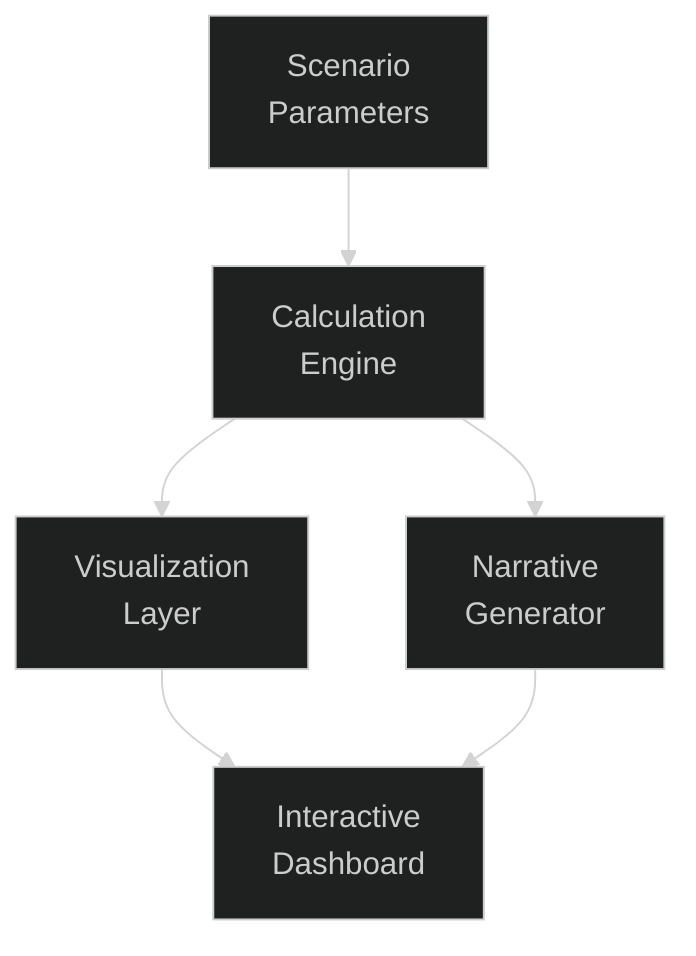
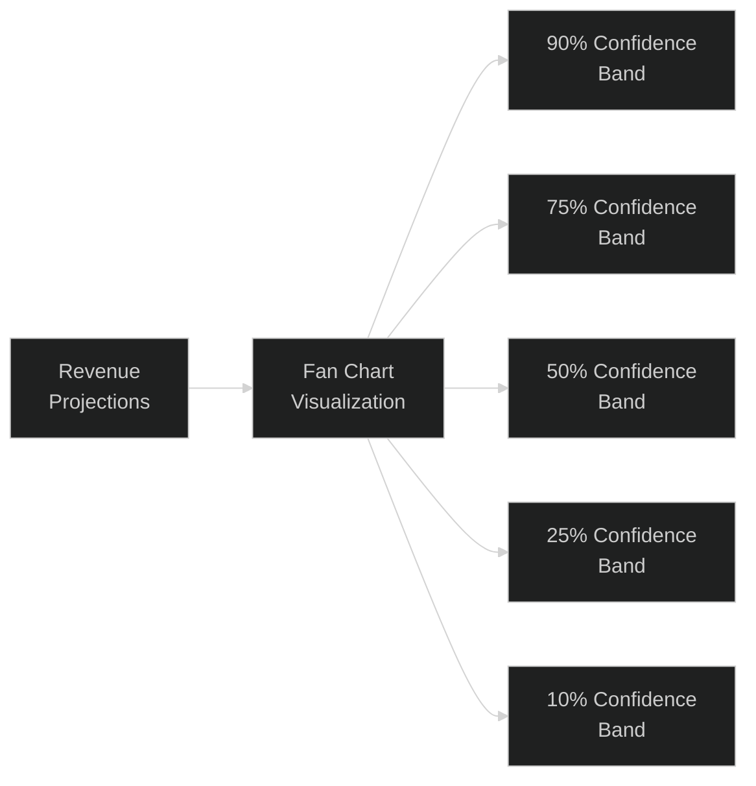
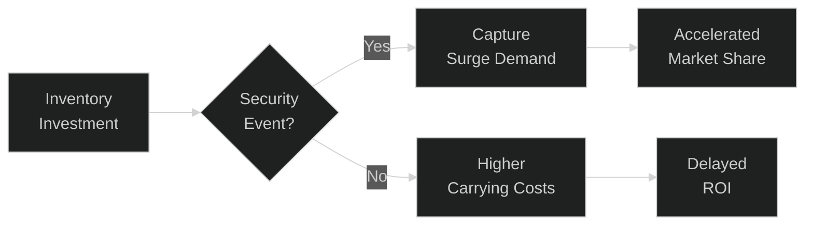
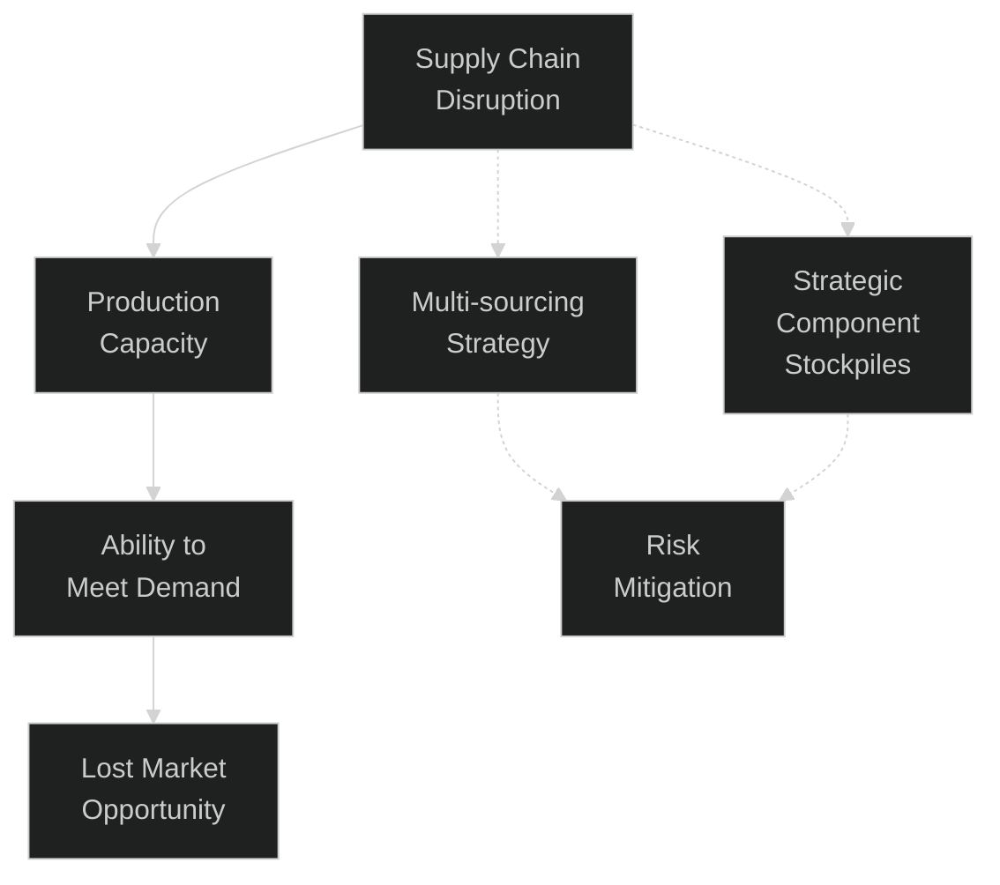
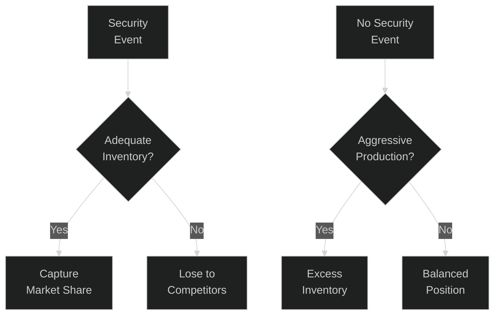

# Post-Quantum Security Hardware: Financial Analysis & Risk Assessment

## Executive Summary

This memo presents a sophisticated financial analysis model for our post-quantum security hardware business, designed to communicate both the growth potential and risk factors to potential investors. The model enables interactive scenario exploration through advanced stochastic modeling techniques and provides realistic representations of market dynamics, including competitive pressures, supply chain disruptions, and potential quantum security catalysts.

Unlike traditional "hockey stick" projections, our approach embraces the inherent uncertainty in the quantum security market while demonstrating our strategic preparedness for various contingencies. This modeling approach serves a dual purpose: as a strategic planning tool for management and as a transparent communication vehicle for prospective investors.

## Market Opportunity Overview

Our product line consists of two distinct hardware security offerings:

1. **USB Security Token** ($129-$149): A consumer and enterprise-grade device providing post-quantum cryptographic capabilities in a portable form factor
2. **Enterprise Security Appliance** ($4,999): Rack-mounted, air-gapped post-quantum key generation for enterprise security infrastructure

These devices generate significant follow-on revenue through:
- Software licensing
- Professional services
- Ongoing security monitoring services
- Integration consulting



## Modeling Approach

Our financial model incorporates several sophisticated mathematical techniques to provide a nuanced view of potential outcomes:

### Network Effect Dynamics

The value of our security ecosystem increases with the number of deployed devices. We model this using a sigmoid function modified by market saturation factors:

$$NetworkEffect(D, TAM) = 1 + \frac{\sigma(D) \cdot \max(0.2, 1 - \frac{D}{TAM}) \cdot 2.5}{\beta}$$

Where:
- $D$ = Total deployed devices
- $TAM$ = Total addressable market
- $\sigma(D) = \frac{1}{1 + e^{-\alpha(D-D_0)}}$ (sigmoid function)
- $\alpha$ = Scaling parameter
- $D_0$ = Inflection point
- $\beta$ = Normalization factor

This function captures how our software and services revenue accelerates as the installed base grows, with diminishing returns as we approach market saturation.

### Monte Carlo Simulation for Uncertainty Quantification

Rather than presenting single-point estimates, our model employs Monte Carlo simulation to generate probability distributions of outcomes:



For each simulation run, we sample from probability distributions for key parameters:

$$Revenue_i = f(BaselineRevenue, \epsilon_{economic}, \epsilon_{supply}, \epsilon_{events})$$

Where:
- $\epsilon_{economic} \sim \mathcal{N}(0, \sigma_{economic})$ 
- $\epsilon_{supply} \sim \mathcal{N}(0, \sigma_{supply})$
- $\epsilon_{events} \sim$ custom distribution for security events

This approach provides a much richer view of potential outcomes than traditional sensitivity analysis.

### Stochastic Security Event Modeling

Security breaches and quantum computing advances follow fat-tailed distributions where rare events have outsized impacts. We model this using:

```fsharp
// Generate security-related stochastic events
let generateSecurityEvents (
        months: int, 
        baselineProbability: float,
        geopoliticalTension: float, // 0.0-1.0 scale
        rand: Random) =
    
    [| 
        for month in 1..months do
            // Higher probability during times of geopolitical tension
            let adjustedProbability = baselineProbability * (1.0 + geopoliticalTension * 2.0)
            
            if rand.NextDouble() < adjustedProbability then
                // Model severity of incident
                let severityScore = rand.NextDouble() * 0.9 + 0.1  // 0.1 to 1.0
                
                // Calculate impacts based on severity
                let marketImpact = {
                    AdoptionMultiplier = 1.0 + (severityScore * 5.0)  // 1.5x to 6x adoption
                    Duration = int (Math.Ceiling(severityScore * 18.0)) + 3  // 3 to 21 months
                    CompetitorAcceleration = severityScore * 0.8  // Up to 80% acceleration
                    PriceElasticity = Math.Max(0.0, 0.8 - (severityScore * 0.5))  // Lower elasticity for severe events
                }
                
                yield (month, severityScore, marketImpact)
    |]
```

This generates realistic scenarios where major security incidents create step-changes in market demand with varying intensity and duration.

## Competitive Response Dynamics

A critical aspect of our model is the realistic simulation of incumbent responses (e.g., Yubikey, Thales, Entrust) to post-quantum market entry.

We model competitor entry timing and market impact as follows:

$$EntryTime = BaseEntryTime \times (1 - Acceleration \times Readiness \times EventImpact)$$

$$MarketShareImpact(t) = \min(0.7, 0.1 + 0.05t) \times (0.5 + 0.5 \times Readiness)$$

Where:
- $BaseEntryTime$ = Expected months until competitor entry without catalysts
- $Acceleration$ = Factor by which security events accelerate competitor entry (0-0.6)
- $Readiness$ = Competitor preparedness factor (0-1)
- $EventImpact$ = Impact of security event (0-1)
- $t$ = Months since competitor entry

This provides a sophisticated view of how quickly market share might erode after competing solutions enter the market.

## Supply Chain and Inventory Management

Our model treats inventory as a real option rather than a pure cost center:

$$OptionValue = E[ExtraSales] \times UnitContribution - CarryingCost$$

Where:
- $E[ExtraSales] = \min(Inventory, ExpectedDemandSpike)$
- $ExpectedDemandSpike = Volatility \times EventProbability \times SpikeFactor$
- $CarryingCost = Inventory \times UnitCost \times CarryingRate$

This quantifies the trade-off between inventory holding costs and the ability to capture surge demand during security events.

## Visual Interface and Interactivity

The financial model is presented through an interactive dashboard that allows investors to manipulate key parameters and see the resulting impact on financial projections:



### Uncertainty Visualization with Fan Charts

Rather than traditional error bars, we employ fan charts that show multiple confidence intervals, providing a richer view of potential outcomes:



This visualization approach emphasizes that uncertainty increases over time, with wider bands in later projection periods.

### Dynamic Narrative Generation

The model generates tailored narratives based on the selected scenario parameters:

```fsharp
// Sample of narrative generation logic
let economicNarrative =
    if economicFactor < 0.2 then
        "This scenario assumes <strong>favorable economic conditions</strong> with minimal downturn pressure on purchases of security hardware."
    elif economicFactor < 0.5 then
        "This scenario models <strong>moderate economic headwinds</strong> that create some hesitation in security hardware purchasing decisions."
    else
        "This scenario reflects <strong>significant economic challenges</strong> that substantially impact budgets for security hardware acquisitions."
```

This creates a coherent story around the numbers that helps investors understand the implications of different parameter combinations.

## Key Financial Metrics

The model calculates several sophisticated financial metrics beyond simple revenue projections:

1. **Expected IRR (Internal Rate of Return)**:
   $$IRR = r \text{ such that } \sum_{t=0}^{T} \frac{CF_t}{(1+r)^t} = 0$$

2. **Downside Risk Metrics**:
   - Value at Risk (VaR): The maximum loss with 95% confidence
   - Conditional Value at Risk (CVaR): The expected loss given that the loss exceeds VaR

3. **Cash Runway Analysis**:
   $$Runway = \frac{CashBalance}{BurnRate}$$

4. **Breakeven Timing**:
   $$BreakevenMonth = \min\{t \mid CumulativeCashFlow_t \geq 0\}$$

## Strategic Insights from the Model

The model reveals several non-obvious strategic insights:

### 1. Inventory Optionality Value

Our analysis shows that maintaining higher inventory levels than traditional JIT approaches would suggest creates substantial option value in the event of security incidents:



The expected value of this optionality justifies carrying 2-3 months of inventory despite the associated costs.

### 2. Competitor Response Window

The model demonstrates that we have a limited window before major incumbents enter the market:

* Without security incidents: 18-24 months
* With major security catalyst: 9-12 months

This creates urgency around rapid market penetration strategies to establish a defensible market position before competitor entry.

### 3. Network Effect Threshold

Our modeling reveals a critical threshold at approximately 10,000 deployed devices where network effects begin accelerating software and services revenue:

$$\frac{d(NetworkEffect)}{dDevices} \approx 0.25\% \text{ at } 10,000 \text{ devices}$$

This suggests prioritizing hardware deployment even at lower margins to reach this inflection point more rapidly.

## Risk Factors and Mitigations

The model explicitly addresses several key risk factors:

### 1. Supply Chain Disruptions



The model quantifies the impact of various disruption scenarios and demonstrates the value of our multi-sourcing strategy and strategic component stockpiles.

### 2. Rapid Competitor Entry

The potential for competitors to be quietly developing quantum-resistant solutions is explicitly modeled through the "Competitor Readiness" parameter:

* High readiness (0.7-1.0): Competitors have nearly complete solutions they can rapidly bring to market
* Medium readiness (0.3-0.7): Competitors have active development but need time for certification
* Low readiness (0.0-0.3): Competitors are still in early research stages

The model shows that even with high competitor readiness, our first-mover advantage creates a substantial window for establishing market position.

### 3. Demand Volatility

The stochastic nature of security incidents creates potential for both under and over-production:



Our balanced inventory approach optimizes for this uncertainty by maintaining sufficient buffer stock to capture a significant portion of demand spikes without overextending in the absence of catalyzing events.

## Conclusion: A Differentiated Investment Opportunity

This rigorous modeling approach demonstrates three key differentiators of our business:

1. **Market Timing Advantage**: Our products are positioned at the inflection point of post-quantum security adoption, with significant first-mover advantage potential.

2. **Network Effect Moat**: As our installed base grows, the increasing value of our software ecosystem creates a defensible position that becomes harder for competitors to overcome.

3. **Optionality Value**: Our strategy creates embedded real options that have substantial value in an uncertain security landscape:
   - Option to scale rapidly if quantum threats accelerate
   - Option to pivot toward higher-margin software if hardware commoditizes
   - Option to expand enterprise offerings if consumer adoption lags

By presenting this sophisticated model rather than simplistic growth projections, we demonstrate our nuanced understanding of market dynamics and commitment to transparent risk assessment—qualities that sophisticated investors value above unfounded optimism.

The interactive nature of the model further allows investors to test their own assumptions and develop conviction based on scenarios they find most credible, creating a foundation for productive ongoing strategic dialogue.
